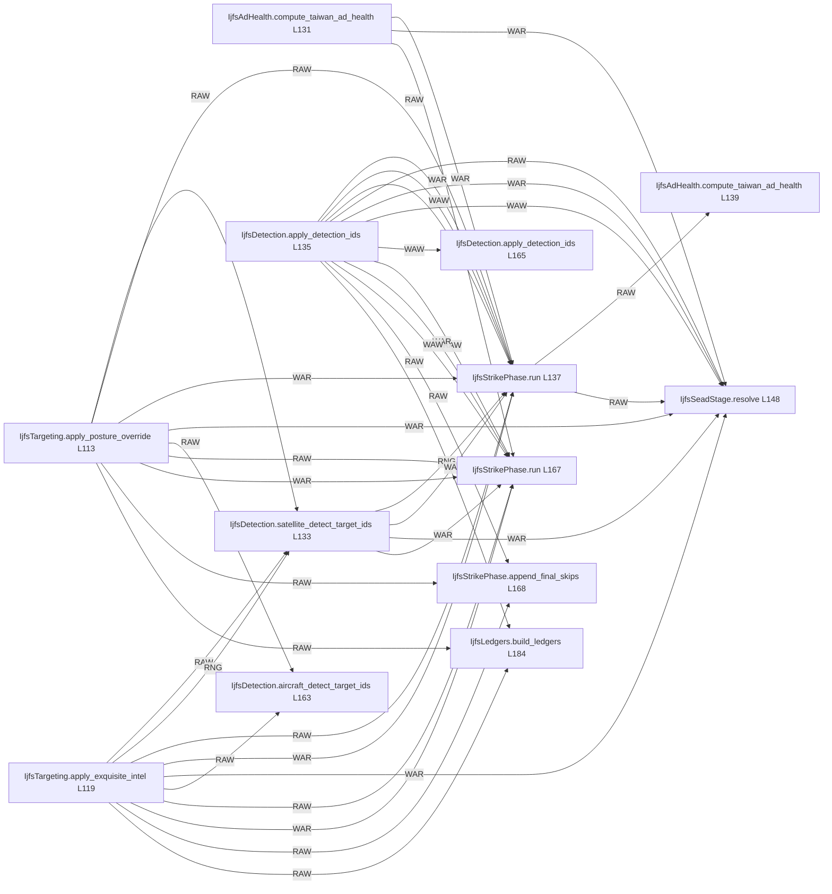

# Ordering: `IjfsEngine.run_daily`

> **Reading aid, not an execution contract.** No detected edge is not permission to reorder.
> GDScript reads and writes are conservative source analysis; transition writes are also
> checked against the mutation manifest. Potential conflicts may refer to different object
> instances or conditional branches.

Generator format v1; scan scope `scripts/**/*.gd` plus `project.godot` autoload aliases.
Generated from commit `7bbf08693b44`; input SHA-256 `c879af92cf7693c7df1119a11083764377c92a9410144e7b95f361f509613378`;
tool/manifest/fixture SHA-256 `ea366ecafdb8f5cc7ecae22bb7554cd8802d1ed3433c5a903ecc07bbb7230f6c`; stable generation time `2026-08-02T17:09:31-04:00`.
Unresolved-analysis diagnostics on this page: **102**.

Source: `scripts/interleaved/IjfsEngine.gd:82`

## Lexical call-site map (CALL edges)

> Source order is not an execution count: loop calls repeat, branch calls may be skipped
> or mutually exclusive, and nested arguments execute before their outer call.

```mermaid
flowchart TD
  n_63e5ac174099["1. IjfsEngine.make_run_context (line 91)"]
  n_ee07d0880640["2. IjfsStrikePhaseContext.new (line 98)"]
  n_477ec1444b50["3. IjfsAttritionProfile.build (line 103)"]
  n_d869bdbbf2ea["4. Dice.derive (line 107)"]
  n_1cb23bfe444f["5. IjfsEngine.unknown_warmup_keys (line 111)"]
  n_605056601cb5["6. IjfsTargeting.apply_posture_override (line 113)"]
  n_57dfefeddba3["7. IjfsTargeting.apply_exquisite_intel (line 119)"]
  n_1b1139924a87["8. IjfsFiringCapacity.FiringCapacityBudget.new (line 123)"]
  n_dc0faba1312a["9. IjfsFiringCapacity.FiringCapacityBudget.new (line 129)"]
  n_8fc923ee55e8["10. IjfsAdHealth.compute_taiwan_ad_health (line 131)"]
  n_8cc151198db8["11. IjfsDetection.satellite_detect_target_ids (line 133)"]
  n_af86ab92e957["12. IjfsDetection.apply_detection_ids (line 135)"]
  n_c06327bc9d6f["13. IjfsStrikePhase.run (line 137)"]
  n_56b9d9feee63["14. IjfsAdHealth.compute_taiwan_ad_health (line 139)"]
  n_c7e8eea32635["15. IjfsSeadStage.resolve (line 148)"]
  n_043e80dff75e["16. IjfsEngagement.resolve_package_return_fire (line 153)"]
  n_62adb69e4a2b["17. IjfsAdHealth.compute_taiwan_ad_health (line 156)"]
  n_48ad51814ff8["18. IjfsFiringCapacity.OrganicStrikeBudget.new (line 161)"]
  n_c69e899fb7ec["19. IjfsDetection.aircraft_detect_target_ids (line 163)"]
  n_d674362694ab["20. IjfsDetection.apply_detection_ids (line 165)"]
  n_37f084d4c751["21. IjfsStrikePhase.run (line 167)"]
  n_bade846ad561["22. IjfsStrikePhase.append_final_skips (line 168)"]
  n_2a27c925ee5a["23. IjfsAdHealth.compute_taiwan_ad_health (line 170)"]
  n_6fd505435bec["24. IjfsEngagement.apply_post_phase_2_free_shot (line 172)"]
  n_d369e1147663["25. IjfsLedgers.summarize_run (line 180)"]
  n_85bd7c5dacbe["26. IjfsLedgers.build_ledgers (line 184)"]
  n_477ec1444b50 -->|CALL| n_d869bdbbf2ea
  n_d869bdbbf2ea -->|CALL| n_1cb23bfe444f
  n_1cb23bfe444f -->|CALL| n_605056601cb5
  n_605056601cb5 -->|CALL| n_57dfefeddba3
  n_57dfefeddba3 -->|CALL| n_1b1139924a87
  n_1b1139924a87 -->|CALL| n_dc0faba1312a
  n_dc0faba1312a -->|CALL| n_8fc923ee55e8
  n_8fc923ee55e8 -->|CALL| n_8cc151198db8
  n_8cc151198db8 -->|CALL| n_af86ab92e957
  n_af86ab92e957 -->|CALL| n_c06327bc9d6f
  n_c06327bc9d6f -->|CALL| n_56b9d9feee63
  n_56b9d9feee63 -->|CALL| n_c7e8eea32635
  n_c7e8eea32635 -->|CALL| n_043e80dff75e
  n_043e80dff75e -->|CALL| n_62adb69e4a2b
  n_62adb69e4a2b -->|CALL| n_48ad51814ff8
  n_48ad51814ff8 -->|CALL| n_c69e899fb7ec
  n_c69e899fb7ec -->|CALL| n_d674362694ab
  n_d674362694ab -->|CALL| n_37f084d4c751
  n_37f084d4c751 -->|CALL| n_bade846ad561
  n_bade846ad561 -->|CALL| n_2a27c925ee5a
  n_2a27c925ee5a -->|CALL| n_6fd505435bec
  n_6fd505435bec -->|CALL| n_d369e1147663
  n_d369e1147663 -->|CALL| n_85bd7c5dacbe
  n_63e5ac174099 -->|CALL| n_ee07d0880640
  n_ee07d0880640 -->|CALL| n_477ec1444b50
```

## State and RNG constraints

| Earlier node | Later node | Kinds | Shared evidence |
|---|---|---|---|
| `IjfsAttritionProfile.build` (L103) | `IjfsStrikePhase.run` (L137) | **RAW** | `IjfsStrikePhaseContext.attrition` |
| `IjfsAttritionProfile.build` (L103) | `IjfsSeadStage.resolve` (L148) | **RAW** | `IjfsStrikePhaseContext.attrition` |
| `IjfsAttritionProfile.build` (L103) | `IjfsEngagement.resolve_package_return_fire` (L153) | **RAW** | `IjfsStrikePhaseContext.attrition` |
| `IjfsAttritionProfile.build` (L103) | `IjfsStrikePhase.run` (L167) | **RAW** | `IjfsStrikePhaseContext.attrition` |
| `IjfsAttritionProfile.build` (L103) | `IjfsEngagement.apply_post_phase_2_free_shot` (L172) | **RAW** | `IjfsStrikePhaseContext.attrition` |
| `Dice.derive` (L107) | `IjfsStrikePhase.run` (L137) | **RAW** | `IjfsStrikePhaseContext.air_engagement_dice` |
| `Dice.derive` (L107) | `IjfsSeadStage.resolve` (L148) | **RAW** | `IjfsStrikePhaseContext.air_engagement_dice` |
| `Dice.derive` (L107) | `IjfsEngagement.resolve_package_return_fire` (L153) | **RAW** | `IjfsStrikePhaseContext.air_engagement_dice` |
| `Dice.derive` (L107) | `IjfsStrikePhase.run` (L167) | **RAW** | `IjfsStrikePhaseContext.air_engagement_dice` |
| `IjfsTargeting.apply_posture_override` (L113) | `IjfsDetection.satellite_detect_target_ids` (L133) | **RAW** | `IjfsTarget.posture` |
| `IjfsTargeting.apply_posture_override` (L113) | `IjfsStrikePhase.run` (L137) | **RAW**, **WAR** | `IjfsTarget.destroyed`, `IjfsTarget.posture` |
| `IjfsTargeting.apply_posture_override` (L113) | `IjfsSeadStage.resolve` (L148) | **WAR** | `IjfsTarget.destroyed` |
| `IjfsTargeting.apply_posture_override` (L113) | `IjfsDetection.aircraft_detect_target_ids` (L163) | **RAW** | `IjfsTarget.posture` |
| `IjfsTargeting.apply_posture_override` (L113) | `IjfsStrikePhase.run` (L167) | **RAW**, **WAR** | `IjfsTarget.destroyed`, `IjfsTarget.posture` |
| `IjfsTargeting.apply_posture_override` (L113) | `IjfsStrikePhase.append_final_skips` (L168) | **RAW** | `IjfsTarget.posture` |
| `IjfsTargeting.apply_posture_override` (L113) | `IjfsLedgers.build_ledgers` (L184) | **RAW** | `IjfsTarget.posture` |
| `IjfsTargeting.apply_exquisite_intel` (L119) | `IjfsDetection.satellite_detect_target_ids` (L133) | **RAW**, **RNG** | `IjfsTarget.intel_locked`, `dice` |
| `IjfsTargeting.apply_exquisite_intel` (L119) | `IjfsStrikePhase.run` (L137) | **RAW**, **WAR** | `IjfsTarget.destroyed`, `IjfsTarget.intel_locked` |
| `IjfsTargeting.apply_exquisite_intel` (L119) | `IjfsSeadStage.resolve` (L148) | **WAR** | `IjfsTarget.destroyed` |
| `IjfsTargeting.apply_exquisite_intel` (L119) | `IjfsDetection.aircraft_detect_target_ids` (L163) | **RAW** | `IjfsTarget.intel_locked` |
| `IjfsTargeting.apply_exquisite_intel` (L119) | `IjfsStrikePhase.run` (L167) | **RAW**, **WAR** | `IjfsTarget.destroyed`, `IjfsTarget.intel_locked` |
| `IjfsTargeting.apply_exquisite_intel` (L119) | `IjfsStrikePhase.append_final_skips` (L168) | **RAW** | `IjfsTarget.intel_locked` |
| `IjfsTargeting.apply_exquisite_intel` (L119) | `IjfsLedgers.build_ledgers` (L184) | **RAW** | `IjfsTarget.intel_locked` |
| `IjfsFiringCapacity.FiringCapacityBudget.new` (L123) | `IjfsFiringCapacity.FiringCapacityBudget.new` (L129) | **WAW** | `IjfsStrikePhaseContext.capacity_budget` |
| `IjfsFiringCapacity.FiringCapacityBudget.new` (L123) | `IjfsStrikePhase.run` (L137) | **RAW** | `IjfsStrikePhaseContext.capacity_budget` |
| `IjfsFiringCapacity.FiringCapacityBudget.new` (L123) | `IjfsStrikePhase.run` (L167) | **RAW** | `IjfsStrikePhaseContext.capacity_budget` |
| `IjfsFiringCapacity.FiringCapacityBudget.new` (L129) | `IjfsStrikePhase.run` (L137) | **RAW** | `IjfsStrikePhaseContext.capacity_budget` |
| `IjfsFiringCapacity.FiringCapacityBudget.new` (L129) | `IjfsStrikePhase.run` (L167) | **RAW** | `IjfsStrikePhaseContext.capacity_budget` |
| `IjfsAdHealth.compute_taiwan_ad_health` (L131) | `IjfsStrikePhase.run` (L137) | **WAR** | `IjfsTarget.destroyed`, `IjfsTarget.suppressed` |
| `IjfsAdHealth.compute_taiwan_ad_health` (L131) | `IjfsSeadStage.resolve` (L148) | **WAR** | `IjfsTarget.destroyed`, `IjfsTarget.suppressed` |
| `IjfsAdHealth.compute_taiwan_ad_health` (L131) | `IjfsStrikePhase.run` (L167) | **WAR** | `IjfsTarget.destroyed`, `IjfsTarget.suppressed` |
| `IjfsAdHealth.compute_taiwan_ad_health` (L131) | `IjfsLedgers.summarize_run` (L180) | **RAW** | `IjfsDailyState.taiwan_ad_health_before` |
| `IjfsDetection.satellite_detect_target_ids` (L133) | `IjfsStrikePhase.run` (L137) | **RNG**, **WAR** | `IjfsTarget.destroyed`, `dice` |
| `IjfsDetection.satellite_detect_target_ids` (L133) | `IjfsSeadStage.resolve` (L148) | **WAR** | `IjfsTarget.destroyed` |
| `IjfsDetection.satellite_detect_target_ids` (L133) | `IjfsStrikePhase.run` (L167) | **WAR** | `IjfsTarget.destroyed` |
| `IjfsDetection.apply_detection_ids` (L135) | `IjfsStrikePhase.run` (L137) | **RAW**, **WAR**, **WAW** | `IjfsTarget.destroyed`, `IjfsTarget.detected_this_turn`, `IjfsTarget.known_to_red` |
| `IjfsDetection.apply_detection_ids` (L135) | `IjfsSeadStage.resolve` (L148) | **RAW**, **WAR**, **WAW** | `IjfsTarget.destroyed`, `IjfsTarget.detected_this_turn`, `IjfsTarget.known_to_red` |
| `IjfsDetection.apply_detection_ids` (L135) | `IjfsDetection.apply_detection_ids` (L165) | **WAW** | `IjfsTarget.detected_this_turn`, `IjfsTarget.known_to_red`, `IjfsTarget.last_detected_day` |
| `IjfsDetection.apply_detection_ids` (L135) | `IjfsStrikePhase.run` (L167) | **RAW**, **WAR**, **WAW** | `IjfsTarget.destroyed`, `IjfsTarget.detected_this_turn`, `IjfsTarget.known_to_red` |
| `IjfsDetection.apply_detection_ids` (L135) | `IjfsStrikePhase.append_final_skips` (L168) | **RAW** | `IjfsTarget.detected_this_turn`, `IjfsTarget.known_to_red`, `IjfsTarget.last_detected_day` |
| `IjfsDetection.apply_detection_ids` (L135) | `IjfsLedgers.build_ledgers` (L184) | **RAW** | `IjfsTarget.detected_this_turn`, `IjfsTarget.known_to_red`, `IjfsTarget.last_detected_day` |
| `IjfsStrikePhase.run` (L137) | `IjfsAdHealth.compute_taiwan_ad_health` (L139) | **RAW** | `IjfsTarget.destroyed`, `IjfsTarget.suppressed` |
| `IjfsStrikePhase.run` (L137) | `IjfsSeadStage.resolve` (L148) | **RAW**, **RNG**, **WAR**, **WAW** | `IjfsAirPackage.dedicated_size`, `IjfsAirPackage.initial_size`, `IjfsAirPackage.kind`, `IjfsAirPackage.members`, `IjfsAirPackage.package_id`, `IjfsMunition.inventory_remaining`, `IjfsSquadron.alive`, `IjfsSquadron.rtb_today`; _+7 more_ |
| `IjfsStrikePhase.run` (L137) | `IjfsEngagement.resolve_package_return_fire` (L153) | **RAW**, **WAR**, **WAW** | `IjfsAirPackage.dedicated_size`, `IjfsAirPackage.kind`, `IjfsAirPackage.members`, `IjfsAirPackage.munition_id`, `IjfsAirPackage.package_id`, `IjfsAirPackage.to_number`, `IjfsDailyState.contest_log`, `IjfsSquadron.alive`; _+6 more_ |
| `IjfsStrikePhase.run` (L137) | `IjfsAdHealth.compute_taiwan_ad_health` (L156) | **RAW** | `IjfsTarget.destroyed`, `IjfsTarget.suppressed` |
| `IjfsStrikePhase.run` (L137) | `IjfsFiringCapacity.OrganicStrikeBudget.new` (L161) | **WAR** | `IjfsStrikePhaseContext.organic_budget` |
| `IjfsStrikePhase.run` (L137) | `IjfsDetection.aircraft_detect_target_ids` (L163) | **RAW**, **RNG** | `IjfsSquadron.alive`, `IjfsTarget.destroyed`, `dice` |
| `IjfsStrikePhase.run` (L137) | `IjfsDetection.apply_detection_ids` (L165) | **RAW**, **WAR**, **WAW** | `IjfsTarget.destroyed`, `IjfsTarget.detected_this_turn`, `IjfsTarget.known_to_red` |
| `IjfsStrikePhase.run` (L137) | `IjfsStrikePhase.run` (L167) | **RAW**, **WAR**, **WAW** | `IjfsAirPackage.dedicated_size`, `IjfsAirPackage.initial_size`, `IjfsAirPackage.kind`, `IjfsAirPackage.members`, `IjfsAirPackage.munition_id`, `IjfsAirPackage.package_id`, `IjfsAirPackage.target_id`, `IjfsAirPackage.to_number`; _+23 more_ |
| `IjfsStrikePhase.run` (L137) | `IjfsStrikePhase.append_final_skips` (L168) | **RAW**, **WAR**, **WAW** | `IjfsDailyState.strike_log`, `IjfsStrikePhaseContext.attacked`, `IjfsStrikePhaseContext.skip_reasons`, `IjfsTarget.destroyed`, `IjfsTarget.known_to_red`, `IjfsTarget.suppressed`, `IjfsTarget.suppressed_this_turn` |
| `IjfsStrikePhase.run` (L137) | `IjfsAdHealth.compute_taiwan_ad_health` (L170) | **RAW** | `IjfsTarget.destroyed`, `IjfsTarget.suppressed` |
| `IjfsStrikePhase.run` (L137) | `IjfsEngagement.apply_post_phase_2_free_shot` (L172) | **RAW**, **WAR**, **WAW** | `IjfsSquadron.alive`, `IjfsSquadron.losses_campaign`, `IjfsSquadron.losses_today`, `IjfsSquadron.rtb_today`, `IjfsSquadron.sead_assigned_today` |
| `IjfsStrikePhase.run` (L137) | `IjfsLedgers.summarize_run` (L180) | **RAW** | `IjfsDailyState.contest_log`, `IjfsDailyState.manpads_intercept_log`, `IjfsDailyState.strike_log`, `IjfsTarget.destroyed`, `IjfsTarget.manpads_remaining`, `IjfsTarget.suppressed` |
| `IjfsStrikePhase.run` (L137) | `IjfsLedgers.build_ledgers` (L184) | **RAW** | `IjfsDailyState.contest_log`, `IjfsDailyState.manpads_intercept_log`, `IjfsDailyState.strike_log`, `IjfsMunition.inventory_remaining`, `IjfsSquadron.alive`, `IjfsSquadron.losses_campaign`, `IjfsSquadron.losses_today`, `IjfsSquadron.rtb_today`; _+5 more_ |
| `IjfsAdHealth.compute_taiwan_ad_health` (L139) | `IjfsSeadStage.resolve` (L148) | **WAR** | `IjfsTarget.destroyed`, `IjfsTarget.suppressed` |
| `IjfsAdHealth.compute_taiwan_ad_health` (L139) | `IjfsStrikePhase.run` (L167) | **WAR** | `IjfsTarget.destroyed`, `IjfsTarget.suppressed` |
| `IjfsAdHealth.compute_taiwan_ad_health` (L139) | `IjfsLedgers.summarize_run` (L180) | **RAW** | `IjfsDailyState.taiwan_ad_health_after_missile_phase` |
| `IjfsSeadStage.resolve` (L148) | `IjfsEngagement.resolve_package_return_fire` (L153) | **RAW**, **RNG**, **WAR**, **WAW** | `IjfsAirPackage.dedicated_size`, `IjfsAirPackage.kind`, `IjfsAirPackage.members`, `IjfsAirPackage.package_id`, `IjfsSquadron.alive`, `IjfsSquadron.rtb_today`, `IjfsSquadron.sead_assigned_today`, `IjfsTarget.destroyed`; _+2 more_ |
| `IjfsSeadStage.resolve` (L148) | `IjfsAdHealth.compute_taiwan_ad_health` (L156) | **RAW** | `IjfsTarget.destroyed`, `IjfsTarget.suppressed` |
| `IjfsSeadStage.resolve` (L148) | `IjfsDetection.aircraft_detect_target_ids` (L163) | **RAW** | `IjfsTarget.destroyed` |
| `IjfsSeadStage.resolve` (L148) | `IjfsDetection.apply_detection_ids` (L165) | **RAW**, **WAR**, **WAW** | `IjfsTarget.destroyed`, `IjfsTarget.detected_this_turn`, `IjfsTarget.known_to_red` |
| `IjfsSeadStage.resolve` (L148) | `IjfsStrikePhase.run` (L167) | **RAW**, **WAR**, **WAW** | `IjfsAirPackage.dedicated_size`, `IjfsAirPackage.initial_size`, `IjfsAirPackage.kind`, `IjfsAirPackage.members`, `IjfsAirPackage.package_id`, `IjfsMunition.inventory_remaining`, `IjfsSquadron.alive`, `IjfsSquadron.rtb_today`; _+6 more_ |
| `IjfsSeadStage.resolve` (L148) | `IjfsStrikePhase.append_final_skips` (L168) | **RAW** | `IjfsTarget.destroyed`, `IjfsTarget.detected_this_turn`, `IjfsTarget.known_to_red`, `IjfsTarget.sead_result`, `IjfsTarget.suppressed`, `IjfsTarget.suppressed_this_turn` |
| `IjfsSeadStage.resolve` (L148) | `IjfsAdHealth.compute_taiwan_ad_health` (L170) | **RAW** | `IjfsTarget.destroyed`, `IjfsTarget.suppressed` |
| `IjfsSeadStage.resolve` (L148) | `IjfsEngagement.apply_post_phase_2_free_shot` (L172) | **RAW**, **WAR**, **WAW** | `IjfsSquadron.alive`, `IjfsSquadron.rtb_today`, `IjfsSquadron.sead_assigned_today` |
| `IjfsSeadStage.resolve` (L148) | `IjfsLedgers.summarize_run` (L180) | **RAW** | `IjfsTarget.destroyed`, `IjfsTarget.suppressed` |
| `IjfsSeadStage.resolve` (L148) | `IjfsLedgers.build_ledgers` (L184) | **RAW** | `IjfsMunition.inventory_remaining`, `IjfsSquadron.sead_assigned_today`, `IjfsTarget.destroyed`, `IjfsTarget.detected_this_turn`, `IjfsTarget.known_to_red`, `IjfsTarget.sead_result`, `IjfsTarget.suppressed`, `IjfsTarget.suppressed_this_turn` |
| `IjfsEngagement.resolve_package_return_fire` (L153) | `IjfsDetection.aircraft_detect_target_ids` (L163) | **RAW** | `IjfsSquadron.alive` |
| `IjfsEngagement.resolve_package_return_fire` (L153) | `IjfsStrikePhase.run` (L167) | **RAW**, **RNG**, **WAR**, **WAW** | `IjfsAirPackage.dedicated_size`, `IjfsAirPackage.kind`, `IjfsAirPackage.members`, `IjfsAirPackage.munition_id`, `IjfsAirPackage.package_id`, `IjfsAirPackage.to_number`, `IjfsDailyState.contest_log`, `IjfsSquadron.alive`; _+7 more_ |
| `IjfsEngagement.resolve_package_return_fire` (L153) | `IjfsEngagement.apply_post_phase_2_free_shot` (L172) | **RAW**, **WAR**, **WAW** | `IjfsSquadron.alive`, `IjfsSquadron.losses_campaign`, `IjfsSquadron.losses_today`, `IjfsSquadron.rtb_today`, `IjfsSquadron.sead_assigned_today` |
| `IjfsEngagement.resolve_package_return_fire` (L153) | `IjfsLedgers.summarize_run` (L180) | **RAW** | `IjfsDailyState.contest_log` |
| `IjfsEngagement.resolve_package_return_fire` (L153) | `IjfsLedgers.build_ledgers` (L184) | **RAW** | `IjfsDailyState.contest_log`, `IjfsSquadron.alive`, `IjfsSquadron.losses_campaign`, `IjfsSquadron.losses_today`, `IjfsSquadron.rtb_today`, `IjfsSquadron.sead_assigned_today` |
| `IjfsAdHealth.compute_taiwan_ad_health` (L156) | `IjfsStrikePhase.run` (L167) | **WAR** | `IjfsTarget.destroyed`, `IjfsTarget.suppressed` |
| `IjfsAdHealth.compute_taiwan_ad_health` (L156) | `IjfsLedgers.summarize_run` (L180) | **RAW** | `IjfsDailyState.taiwan_ad_health_after_sead` |
| `IjfsFiringCapacity.OrganicStrikeBudget.new` (L161) | `IjfsStrikePhase.run` (L167) | **RAW** | `IjfsStrikePhaseContext.organic_budget` |
| `IjfsDetection.aircraft_detect_target_ids` (L163) | `IjfsStrikePhase.run` (L167) | **RNG**, **WAR** | `IjfsSquadron.alive`, `IjfsTarget.destroyed`, `dice` |
| `IjfsDetection.aircraft_detect_target_ids` (L163) | `IjfsEngagement.apply_post_phase_2_free_shot` (L172) | **WAR** | `IjfsSquadron.alive` |
| `IjfsDetection.apply_detection_ids` (L165) | `IjfsStrikePhase.run` (L167) | **RAW**, **WAR**, **WAW** | `IjfsTarget.destroyed`, `IjfsTarget.detected_this_turn`, `IjfsTarget.known_to_red` |
| `IjfsDetection.apply_detection_ids` (L165) | `IjfsStrikePhase.append_final_skips` (L168) | **RAW** | `IjfsTarget.detected_this_turn`, `IjfsTarget.known_to_red`, `IjfsTarget.last_detected_day` |
| `IjfsDetection.apply_detection_ids` (L165) | `IjfsLedgers.build_ledgers` (L184) | **RAW** | `IjfsTarget.detected_this_turn`, `IjfsTarget.known_to_red`, `IjfsTarget.last_detected_day` |
| `IjfsStrikePhase.run` (L167) | `IjfsStrikePhase.append_final_skips` (L168) | **RAW**, **WAR**, **WAW** | `IjfsDailyState.strike_log`, `IjfsStrikePhaseContext.attacked`, `IjfsStrikePhaseContext.skip_reasons`, `IjfsTarget.destroyed`, `IjfsTarget.known_to_red`, `IjfsTarget.suppressed`, `IjfsTarget.suppressed_this_turn` |
| `IjfsStrikePhase.run` (L167) | `IjfsAdHealth.compute_taiwan_ad_health` (L170) | **RAW** | `IjfsTarget.destroyed`, `IjfsTarget.suppressed` |
| `IjfsStrikePhase.run` (L167) | `IjfsEngagement.apply_post_phase_2_free_shot` (L172) | **RAW**, **RNG**, **WAR**, **WAW** | `IjfsSquadron.alive`, `IjfsSquadron.losses_campaign`, `IjfsSquadron.losses_today`, `IjfsSquadron.rtb_today`, `IjfsSquadron.sead_assigned_today`, `dice` |
| `IjfsStrikePhase.run` (L167) | `IjfsLedgers.summarize_run` (L180) | **RAW** | `IjfsDailyState.contest_log`, `IjfsDailyState.manpads_intercept_log`, `IjfsDailyState.strike_log`, `IjfsTarget.destroyed`, `IjfsTarget.manpads_remaining`, `IjfsTarget.suppressed` |
| `IjfsStrikePhase.run` (L167) | `IjfsLedgers.build_ledgers` (L184) | **RAW** | `IjfsDailyState.contest_log`, `IjfsDailyState.manpads_intercept_log`, `IjfsDailyState.strike_log`, `IjfsMunition.inventory_remaining`, `IjfsSquadron.alive`, `IjfsSquadron.losses_campaign`, `IjfsSquadron.losses_today`, `IjfsSquadron.rtb_today`; _+5 more_ |
| `IjfsStrikePhase.append_final_skips` (L168) | `IjfsLedgers.summarize_run` (L180) | **RAW** | `IjfsDailyState.strike_log` |
| `IjfsStrikePhase.append_final_skips` (L168) | `IjfsLedgers.build_ledgers` (L184) | **RAW** | `IjfsDailyState.strike_log` |
| `IjfsAdHealth.compute_taiwan_ad_health` (L170) | `IjfsEngagement.apply_post_phase_2_free_shot` (L172) | **RAW** | `IjfsDailyState.taiwan_ad_health_after` |
| `IjfsAdHealth.compute_taiwan_ad_health` (L170) | `IjfsLedgers.summarize_run` (L180) | **RAW** | `IjfsDailyState.taiwan_ad_health_after` |
| `IjfsEngagement.apply_post_phase_2_free_shot` (L172) | `IjfsLedgers.summarize_run` (L180) | **RAW** | `IjfsDailyState.free_shot_log` |
| `IjfsEngagement.apply_post_phase_2_free_shot` (L172) | `IjfsLedgers.build_ledgers` (L184) | **RAW** | `IjfsDailyState.free_shot_log`, `IjfsSquadron.alive`, `IjfsSquadron.losses_campaign`, `IjfsSquadron.losses_today`, `IjfsSquadron.rtb_today`, `IjfsSquadron.sead_assigned_today` |

## Detected campaign-state/RNG overview

This compact diagram shows up to 40 detected RAW/WAR/WAW/RNG constraints involving protected
campaign fields. The table above remains the complete conservative evidence.

_70 additional visual edges are kept in the table above._

## Call-site detail

Effects include the called method and every statically resolved helper beneath it.

| # | Call site | Reads | Writes | RNG streams |
|---:|---|---|---|---|
| 1 | `IjfsEngine.make_run_context` at `scripts/interleaved/IjfsEngine.gd:91` | — | — | — |
| 2 | `IjfsStrikePhaseContext.new` at `scripts/interleaved/IjfsEngine.gd:98` | — | — | — |
| 3 | `IjfsAttritionProfile.build` at `scripts/interleaved/IjfsEngine.gd:103` | `IjfsDailyState.scenario` | `IjfsStrikePhaseContext.attrition` | — |
| 4 | `Dice.derive` at `scripts/interleaved/IjfsEngine.gd:107` | — | `IjfsStrikePhaseContext.air_engagement_dice` | — |
| 5 | `IjfsEngine.unknown_warmup_keys` at `scripts/interleaved/IjfsEngine.gd:111` | — | — | — |
| 6 | `IjfsTargeting.apply_posture_override` at `scripts/interleaved/IjfsEngine.gd:113` | `IjfsDailyState.targets`, `IjfsTarget.destroyed`, `IjfsTarget.mobility` | `IjfsTarget.posture` | — |
| 7 | `IjfsTargeting.apply_exquisite_intel` at `scripts/interleaved/IjfsEngine.gd:119` | `IjfsDailyState.targets`, `IjfsTarget.category`, `IjfsTarget.destroyed`, `IjfsTarget.metadata`, `IjfsTarget.mobility`, `IjfsTarget.target_id` | `IjfsTarget.intel_locked` | `dice` |
| 8 | `IjfsFiringCapacity.FiringCapacityBudget.new` at `scripts/interleaved/IjfsEngine.gd:123` | `IjfsDailyState.munitions` | `IjfsStrikePhaseContext.capacity_budget` | — |
| 9 | `IjfsFiringCapacity.FiringCapacityBudget.new` at `scripts/interleaved/IjfsEngine.gd:129` | `IjfsDailyState.munitions`, `IjfsDailyState.scenario` | `IjfsStrikePhaseContext.capacity_budget` | — |
| 10 | `IjfsAdHealth.compute_taiwan_ad_health` at `scripts/interleaved/IjfsEngine.gd:131` | `IjfsDailyState.scenario`, `IjfsDailyState.targets`, `IjfsTarget.category`, `IjfsTarget.destroyed`, `IjfsTarget.suppressed` | `IjfsDailyState.taiwan_ad_health_before` | — |
| 11 | `IjfsDetection.satellite_detect_target_ids` at `scripts/interleaved/IjfsEngine.gd:133` | `IjfsDailyState.scenario`, `IjfsDailyState.targets`, `IjfsTarget.category`, `IjfsTarget.destroyed`, `IjfsTarget.detectability_active`, `IjfsTarget.detectability_hiding`, `IjfsTarget.intel_locked`, `IjfsTarget.metadata`, `IjfsTarget.mobility`, `IjfsTarget.posture`; _+3 more_ | — | `dice` |
| 12 | `IjfsDetection.apply_detection_ids` at `scripts/interleaved/IjfsEngine.gd:135` | `IjfsDailyState.targets`, `IjfsStrikePhaseContext.current_day`, `IjfsTarget.destroyed`, `IjfsTarget.target_id` | `IjfsTarget.detected_this_turn`, `IjfsTarget.known_to_red`, `IjfsTarget.last_detected_day` | — |
| 13 | `IjfsStrikePhase.run` at `scripts/interleaved/IjfsEngine.gd:137` | `IjfsAirPackage.dedicated_size`, `IjfsAirPackage.initial_size`, `IjfsAirPackage.kind`, `IjfsAirPackage.members`, `IjfsAirPackage.munition_id`, `IjfsAirPackage.package_id`, `IjfsAirPackage.to_number`, `IjfsDailyState.contest_log`, `IjfsDailyState.manpads_intercept_log`, `IjfsDailyState.munitions`; _+58 more_ | `IjfsAirPackage.dedicated_size`, `IjfsAirPackage.initial_size`, `IjfsAirPackage.kind`, `IjfsAirPackage.members`, `IjfsAirPackage.munition_id`, `IjfsAirPackage.package_id`, `IjfsAirPackage.target_id`, `IjfsAirPackage.to_number`, `IjfsDailyState.contest_log`, `IjfsDailyState.manpads_intercept_log`; _+21 more_ | `ctx.air_engagement_dice`, `dice` |
| 14 | `IjfsAdHealth.compute_taiwan_ad_health` at `scripts/interleaved/IjfsEngine.gd:139` | `IjfsDailyState.scenario`, `IjfsDailyState.targets`, `IjfsTarget.category`, `IjfsTarget.destroyed`, `IjfsTarget.suppressed` | `IjfsDailyState.taiwan_ad_health_after_missile_phase` | — |
| 15 | `IjfsSeadStage.resolve` at `scripts/interleaved/IjfsEngine.gd:148` | `IjfsAirPackage.dedicated_size`, `IjfsAirPackage.members`, `IjfsDailyState.scenario`, `IjfsDailyState.squadron_force`, `IjfsDailyState.targets`, `IjfsMunition.inventory_remaining`, `IjfsMunition.munition_id`, `IjfsSquadron.aircraft_class`, `IjfsSquadron.alive`, `IjfsSquadron.role`; _+13 more_ | `IjfsAirPackage.dedicated_size`, `IjfsAirPackage.initial_size`, `IjfsAirPackage.kind`, `IjfsAirPackage.members`, `IjfsAirPackage.package_id`, `IjfsMunition.inventory_remaining`, `IjfsSquadron.sead_assigned_today`, `IjfsTarget.destroyed`, `IjfsTarget.detected_this_turn`, `IjfsTarget.known_to_red`; _+3 more_ | `ctx.air_engagement_dice` |
| 16 | `IjfsEngagement.resolve_package_return_fire` at `scripts/interleaved/IjfsEngine.gd:153` | `IjfsAirPackage.dedicated_size`, `IjfsAirPackage.kind`, `IjfsAirPackage.members`, `IjfsAirPackage.munition_id`, `IjfsAirPackage.package_id`, `IjfsAirPackage.to_number`, `IjfsDailyState.scenario`, `IjfsDailyState.targets`, `IjfsSquadron.aircraft_class`, `IjfsSquadron.alive`; _+14 more_ | `IjfsAirPackage.dedicated_size`, `IjfsAirPackage.members`, `IjfsDailyState.contest_log`, `IjfsSquadron.alive`, `IjfsSquadron.losses_campaign`, `IjfsSquadron.losses_today`, `IjfsSquadron.rtb_today`, `IjfsSquadron.sead_assigned_today` | `ctx.air_engagement_dice` |
| 17 | `IjfsAdHealth.compute_taiwan_ad_health` at `scripts/interleaved/IjfsEngine.gd:156` | `IjfsDailyState.scenario`, `IjfsDailyState.targets`, `IjfsTarget.category`, `IjfsTarget.destroyed`, `IjfsTarget.suppressed` | `IjfsDailyState.taiwan_ad_health_after_sead` | — |
| 18 | `IjfsFiringCapacity.OrganicStrikeBudget.new` at `scripts/interleaved/IjfsEngine.gd:161` | `IjfsDailyState.munitions`, `IjfsDailyState.scenario` | `IjfsStrikePhaseContext.organic_budget` | — |
| 19 | `IjfsDetection.aircraft_detect_target_ids` at `scripts/interleaved/IjfsEngine.gd:163` | `IjfsDailyState.scenario`, `IjfsDailyState.targets`, `IjfsSquadron.aircraft_class`, `IjfsSquadron.alive`, `IjfsSquadron.role`, `IjfsTarget.category`, `IjfsTarget.destroyed`, `IjfsTarget.detectability_active`, `IjfsTarget.detectability_hiding`, `IjfsTarget.intel_locked`; _+6 more_ | — | `dice` |
| 20 | `IjfsDetection.apply_detection_ids` at `scripts/interleaved/IjfsEngine.gd:165` | `IjfsDailyState.targets`, `IjfsStrikePhaseContext.current_day`, `IjfsTarget.destroyed`, `IjfsTarget.target_id` | `IjfsTarget.detected_this_turn`, `IjfsTarget.known_to_red`, `IjfsTarget.last_detected_day` | — |
| 21 | `IjfsStrikePhase.run` at `scripts/interleaved/IjfsEngine.gd:167` | `IjfsAirPackage.dedicated_size`, `IjfsAirPackage.initial_size`, `IjfsAirPackage.kind`, `IjfsAirPackage.members`, `IjfsAirPackage.munition_id`, `IjfsAirPackage.package_id`, `IjfsAirPackage.to_number`, `IjfsDailyState.contest_log`, `IjfsDailyState.manpads_intercept_log`, `IjfsDailyState.munitions`; _+58 more_ | `IjfsAirPackage.dedicated_size`, `IjfsAirPackage.initial_size`, `IjfsAirPackage.kind`, `IjfsAirPackage.members`, `IjfsAirPackage.munition_id`, `IjfsAirPackage.package_id`, `IjfsAirPackage.target_id`, `IjfsAirPackage.to_number`, `IjfsDailyState.contest_log`, `IjfsDailyState.manpads_intercept_log`; _+21 more_ | `ctx.air_engagement_dice`, `dice` |
| 22 | `IjfsStrikePhase.append_final_skips` at `scripts/interleaved/IjfsEngine.gd:168` | `IjfsDailyState.strike_log`, `IjfsDailyState.targets`, `IjfsStrikePhaseContext.attacked`, `IjfsStrikePhaseContext.current_day`, `IjfsStrikePhaseContext.release_rules`, `IjfsStrikePhaseContext.skip_reasons`, `IjfsStrikePhaseContext.z_day`, `IjfsTarget.category`, `IjfsTarget.destroyed`, `IjfsTarget.detectability_active`; _+18 more_ | `IjfsDailyState.strike_log` | — |
| 23 | `IjfsAdHealth.compute_taiwan_ad_health` at `scripts/interleaved/IjfsEngine.gd:170` | `IjfsDailyState.scenario`, `IjfsDailyState.targets`, `IjfsTarget.category`, `IjfsTarget.destroyed`, `IjfsTarget.suppressed` | `IjfsDailyState.taiwan_ad_health_after` | — |
| 24 | `IjfsEngagement.apply_post_phase_2_free_shot` at `scripts/interleaved/IjfsEngine.gd:172` | `IjfsDailyState.taiwan_ad_health_after`, `IjfsSquadron.aircraft_class`, `IjfsSquadron.alive`, `IjfsSquadron.losses_campaign`, `IjfsSquadron.losses_today`, `IjfsSquadron.role`, `IjfsSquadron.rtb_today`, `IjfsSquadron.sead_assigned_today`, `IjfsSquadron.squadron_id`, `IjfsStrikePhaseContext.attrition` | `IjfsDailyState.free_shot_log`, `IjfsSquadron.alive`, `IjfsSquadron.losses_campaign`, `IjfsSquadron.losses_today`, `IjfsSquadron.rtb_today`, `IjfsSquadron.sead_assigned_today` | `dice` |
| 25 | `IjfsLedgers.summarize_run` at `scripts/interleaved/IjfsEngine.gd:180` | `IjfsDailyState.contest_log`, `IjfsDailyState.detection_log`, `IjfsDailyState.engagement_log`, `IjfsDailyState.exquisite_intel_overrides`, `IjfsDailyState.free_shot_log`, `IjfsDailyState.manpads_intercept_log`, `IjfsDailyState.strike_log`, `IjfsDailyState.taiwan_ad_health_after`, `IjfsDailyState.taiwan_ad_health_after_missile_phase`, `IjfsDailyState.taiwan_ad_health_after_sead`; _+8 more_ | — | — |
| 26 | `IjfsLedgers.build_ledgers` at `scripts/interleaved/IjfsEngine.gd:184` | `IjfsDailyState.air_classes`, `IjfsDailyState.contest_log`, `IjfsDailyState.detection_log`, `IjfsDailyState.engagement_log`, `IjfsDailyState.free_shot_log`, `IjfsDailyState.manpads_intercept_log`, `IjfsDailyState.munitions`, `IjfsDailyState.seed`, `IjfsDailyState.source_files`, `IjfsDailyState.squadron_force`; _+38 more_ | — | — |

## Analysis limits found here

Showing 30 of 102 diagnostics; class pages provide the narrower context.

| Kind | Source | Why it matters |
|---|---|---|
| `multi_call_statement` | `scripts/calc/IjfsAttritionProfile.gd:71` `return clampf(base_rate * role_exposure(role) * rcs_survival(aircraft_class), 0.0, 1.0)` | Multiple calls share one statement; the map preserves lexical sites, not nested evaluation order. |
| `untyped_iteration` | `scripts/calc/IjfsLedgers.gd:30` `for entry in state.detection_log:` | The collection element type could not be proven. |
| `untyped_iteration` | `scripts/calc/IjfsLedgers.gd:37` `for entry in state.strike_log:` | The collection element type could not be proven. |
| `untyped_iteration` | `scripts/calc/IjfsLedgers.gd:42` `for entry in state.engagement_log:` | The collection element type could not be proven. |
| `multi_call_statement` | `scripts/calc/IjfsLedgers.gd:50` `return { "target_counts_by_category_status": target_counts, "detections_by_mobility": detections_by_mobility, "detections_by_category": detections_by_category, "attacks": attack…` | Multiple calls share one statement; the map preserves lexical sites, not nested evaluation order. |
| `untyped_iteration` | `scripts/calc/IjfsLedgers.gd:106` `for entry in state.manpads_intercept_log:` | The collection element type could not be proven. |
| `multi_call_statement` | `scripts/calc/IjfsLedgers.gd:111` `return { "ready_systems_by_to": IjfsManpads.ready_systems_by_to(state.targets), "attempts": state.manpads_intercept_log.size(), "kills": kills, "aborts": aborts, "unaffected": i…` | Multiple calls share one statement; the map preserves lexical sites, not nested evaluation order. |
| `callable_or_lambda` | `scripts/calc/IjfsLedgers.gd:126` `sorted_targets.sort_custom(func(a: IjfsTarget, b: IjfsTarget) -> bool: return a.target_id < b.target_id)` | Callable/lambda dataflow is outside this analyser. |
| `unresolved_receiver` | `scripts/calc/IjfsLedgers.gd:126` `sorted_targets.sort_custom(func(a: IjfsTarget, b: IjfsTarget) -> bool: return a.target_id < b.target_id)` | A protected field name appeared on an unresolved receiver. |
| `multi_call_statement` | `scripts/calc/IjfsLedgers.gd:131` `return { "metadata": { "current_day": current_day, "seed": state.seed, "source_files": state.source_files.duplicate(), "created_by": "ijfs_standalone", }, "detection_log": state…` | Multiple calls share one statement; the map preserves lexical sites, not nested evaluation order. |
| `untyped_alias` | `scripts/calc/IjfsStrikePhase.gd:43` `var pairing: Variant = selection["selected"]` | The receiver type could not be proven. |
| `untyped_alias` | `scripts/calc/IjfsStrikePhase.gd:47` `var reason: Variant = selection["reason"]` | The receiver type could not be proven. |
| `unresolved_receiver` | `scripts/calc/IjfsStrikePhase.gd:50` `var munition: Variant = state.munitions.get(pairing.munition_id, null)` | A protected field name appeared on an unresolved receiver. |
| `untyped_alias` | `scripts/calc/IjfsStrikePhase.gd:50` `var munition: Variant = state.munitions.get(pairing.munition_id, null)` | The receiver type could not be proven. |
| `unresolved_receiver` | `scripts/calc/IjfsStrikePhase.gd:51` `var is_organic: bool = munition != null and munition.category == "Organic"` | A protected field name appeared on an unresolved receiver. |
| `untyped_alias` | `scripts/calc/IjfsStrikePhase.gd:52` `var budget: Variant = ctx.organic_budget if is_organic else ctx.capacity_budget` | The receiver type could not be proven. |
| `unresolved_receiver` | `scripts/calc/IjfsStrikePhase.gd:53` `if budget != null and not budget.has_capacity(pairing.munition_id):` | A protected field name appeared on an unresolved receiver. |
| `unresolved_receiver` | `scripts/calc/IjfsStrikePhase.gd:63` `package = IjfsPackageIngress.assemble( state, pairing.munition_id, target, ctx.packages_launched, ctx.air_engagement_dice)` | A protected field name appeared on an unresolved receiver. |
| `unresolved_receiver` | `scripts/calc/IjfsStrikePhase.gd:69` `budget.try_consume(pairing.munition_id)` | A protected field name appeared on an unresolved receiver. |
| `untyped_alias` | `scripts/calc/IjfsStrikePhase.gd:107` `var row := target.to_dict()` | The receiver type could not be proven. |
| `untyped_alias` | `scripts/interleaved/IjfsDetection.gd:12` `var override: Variant = source.get("runtime_capability_override", null)` | The receiver type could not be proven. |
| `untyped_alias` | `scripts/interleaved/IjfsDetection.gd:118` `var components := { "detectability_label": label, "satellite_floor": float(satellite_by_mobility.get(posture, 0.0)), "base_probability": float(detectability_label_base_probabili…` | The receiver type could not be proven. |
| `untyped_alias` | `scripts/interleaved/IjfsDetection.gd:147` `var method := "intel_locked" if target.intel_locked and target.mobility != "static" else "static_known"` | The receiver type could not be proven. |
| `untyped_alias` | `scripts/interleaved/IjfsDetection.gd:191` `var entry := { "phase": phase, "target_id": target.target_id, "source_target_id": target.source_target_id, "category": target.category, "subcategory": target.subcategory, "mobil…` | The receiver type could not be proven. |
| `callable_or_lambda` | `scripts/interleaved/IjfsDetection.gd:219` `sorted.sort_custom(func(a: IjfsTarget, b: IjfsTarget) -> bool: return a.target_id < b.target_id)` | Callable/lambda dataflow is outside this analyser. |
| `unresolved_receiver` | `scripts/interleaved/IjfsDetection.gd:219` `sorted.sort_custom(func(a: IjfsTarget, b: IjfsTarget) -> bool: return a.target_id < b.target_id)` | A protected field name appeared on an unresolved receiver. |
| `untyped_alias` | `scripts/interleaved/IjfsDetection.gd:228` `var from_object: Variant = force.get("squadrons")` | The receiver type could not be proven. |
| `untyped_alias` | `scripts/interleaved/IjfsEngagement.gd:84` `var factor := float(state.scenario.get(IjfsLoaders.SAM_RETURN_FIRE_KNOB, 0.0))` | The receiver type could not be proven. |
| `untyped_alias` | `scripts/interleaved/IjfsEngagement.gd:100` `var members_before := package.size()` | The receiver type could not be proven. |
| `untyped_alias` | `scripts/interleaved/IjfsEngagement.gd:106` `var score := maxi(1, target.sam_score)` | The receiver type could not be proven. |
| _…_ | _72 additional diagnostics omitted from this page_ | See the called class pages. |
