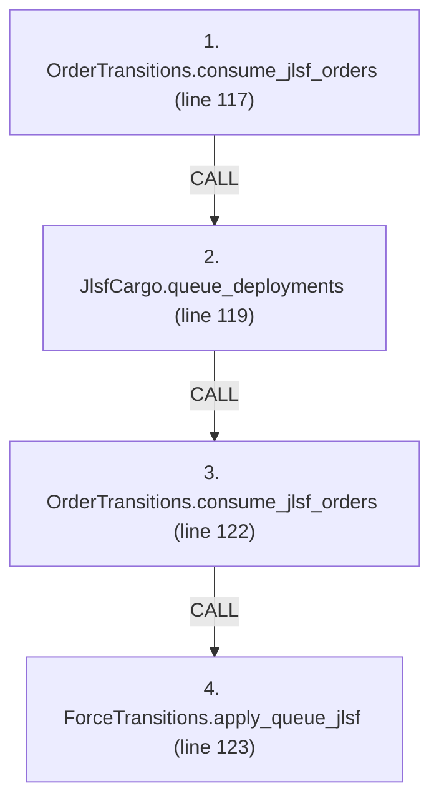
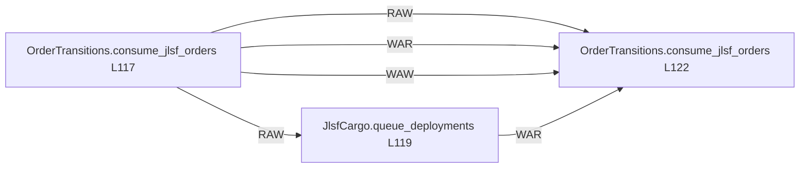

# Ordering: `ReinforcementPhases.consume_jlsf_orders`

> **Reading aid, not an execution contract.** No detected edge is not permission to reorder.
> GDScript reads and writes are conservative source analysis; transition writes are also
> checked against the mutation manifest. Potential conflicts may refer to different object
> instances or conditional branches.

Generator format v1; scan scope `scripts/**/*.gd` plus `project.godot` autoload aliases.
Generated from commit `7bbf08693b44`; input SHA-256 `c879af92cf7693c7df1119a11083764377c92a9410144e7b95f361f509613378`;
tool/manifest/fixture SHA-256 `ea366ecafdb8f5cc7ecae22bb7554cd8802d1ed3433c5a903ecc07bbb7230f6c`; stable generation time `2026-08-02T17:09:31-04:00`.
Unresolved-analysis diagnostics on this page: **2**.

Source: `scripts/phases/ReinforcementPhases.gd:115`

## Lexical call-site map (CALL edges)

> Source order is not an execution count: loop calls repeat, branch calls may be skipped
> or mutually exclusive, and nested arguments execute before their outer call.

## State and RNG constraints

| Earlier node | Later node | Kinds | Shared evidence |
|---|---|---|---|
| `OrderTransitions.consume_jlsf_orders` (L117) | `JlsfCargo.queue_deployments` (L119) | **RAW** | `GameStateData.jlsf_orders` |
| `OrderTransitions.consume_jlsf_orders` (L117) | `OrderTransitions.consume_jlsf_orders` (L122) | **RAW**, **WAR**, **WAW** | `GameStateData.jlsf_orders` |
| `JlsfCargo.queue_deployments` (L119) | `OrderTransitions.consume_jlsf_orders` (L122) | **WAR** | `GameStateData.jlsf_orders` |

## Detected campaign-state/RNG overview

This compact diagram shows up to 40 detected RAW/WAR/WAW/RNG constraints involving protected
campaign fields. The table above remains the complete conservative evidence.

## Call-site detail

Effects include the called method and every statically resolved helper beneath it.

| # | Call site | Reads | Writes | RNG streams |
|---:|---|---|---|---|
| 1 | `OrderTransitions.consume_jlsf_orders` at `scripts/phases/ReinforcementPhases.gd:117` | `GameStateData.jlsf_orders` | `GameStateData.jlsf_orders` | — |
| 2 | `JlsfCargo.queue_deployments` at `scripts/phases/ReinforcementPhases.gd:119` | `GameDataStore.auto_jlsf`, `GameDataStore.beach_to_to`, `GameDataStore.beaches`, `GameDataStore.infrastructure`, `GameDataStore.jlsf_lift_bn_equiv`, `GameStateData.infrastructure_state`, `GameStateData.jlsf_orders`, `InfrastructureDef.hex_id`, `InfrastructureDef.id`, `InfrastructureDef.to_number`; _+4 more_ | `InfrastructureNodeState.jlsf` | — |
| 3 | `OrderTransitions.consume_jlsf_orders` at `scripts/phases/ReinforcementPhases.gd:122` | `GameStateData.jlsf_orders` | `GameStateData.jlsf_orders` | — |
| 4 | `ForceTransitions.apply_queue_jlsf` at `scripts/phases/ReinforcementPhases.gd:123` | `GameStateData.sealift_state`, `SealiftState.mainland_pool` | `SealiftState.mainland_pool` | — |

## Analysis limits found here

Showing 2 of 2 diagnostics; class pages provide the narrower context.

| Kind | Source | Why it matters |
|---|---|---|
| `untyped_alias` | `scripts/model/InfrastructureState.gd:43` `var node_val: Variant = nodes[id]` | The receiver type could not be proven. |
| `untyped_alias` | `scripts/transitions/InfrastructureTransitions.gd:144` `var node_value: Variant = state.nodes.get(port_id)` | The receiver type could not be proven. |
