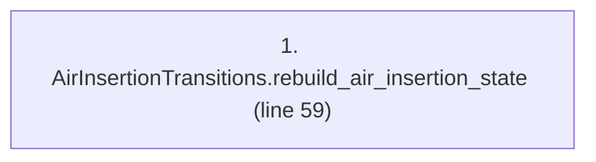
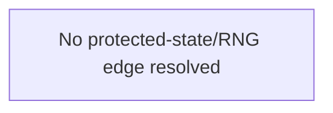

# Ordering: `ReinforcementPhases.rebuild_air_insertion_state`

> **Reading aid, not an execution contract.** No detected edge is not permission to reorder.
> GDScript reads and writes are conservative source analysis; transition writes are also
> checked against the mutation manifest. Potential conflicts may refer to different object
> instances or conditional branches.

Generator format v1; scan scope `scripts/**/*.gd` plus `project.godot` autoload aliases.
Generated from commit `7bbf08693b44`; input SHA-256 `c879af92cf7693c7df1119a11083764377c92a9410144e7b95f361f509613378`;
tool/manifest/fixture SHA-256 `ea366ecafdb8f5cc7ecae22bb7554cd8802d1ed3433c5a903ecc07bbb7230f6c`; stable generation time `2026-08-02T17:09:31-04:00`.
Unresolved-analysis diagnostics on this page: **1**.

Source: `scripts/phases/ReinforcementPhases.gd:57`

## Lexical call-site map (CALL edges)

> Source order is not an execution count: loop calls repeat, branch calls may be skipped
> or mutually exclusive, and nested arguments execute before their outer call.

## State and RNG constraints

| Earlier node | Later node | Kinds | Shared evidence |
|---|---|---|---|
| _No constraint edge resolved_ | | | This is not evidence that calls are reorderable. |

## Detected campaign-state/RNG overview

This compact diagram shows up to 40 detected RAW/WAR/WAW/RNG constraints involving protected
campaign fields. The table above remains the complete conservative evidence.

## Call-site detail

Effects include the called method and every statically resolved helper beneath it.

| # | Call site | Reads | Writes | RNG streams |
|---:|---|---|---|---|
| 1 | `AirInsertionTransitions.rebuild_air_insertion_state` at `scripts/phases/ReinforcementPhases.gd:59` | `AirInsertionState.caps`, `AirInsertionState.pool`, `Battalion.qty`, `Battalion.type`, `Brigade.composition`, `Brigade.hex_id`, `Brigade.id`, `Brigade.nato_type`, `Brigade.team` | `AirInsertionState.caps`, `AirInsertionState.first_turn`, `AirInsertionState.initial_caps`, `AirInsertionState.pool`, `GameStateData.air_insertion_state` | — |

## Analysis limits found here

Showing 1 of 1 diagnostics; class pages provide the narrower context.

| Kind | Source | Why it matters |
|---|---|---|
| `untyped_iteration` | `scripts/model/PendingBattalions.gd:68` `for _qty_index in range(battalion.qty):` | The collection element type could not be proven. |
