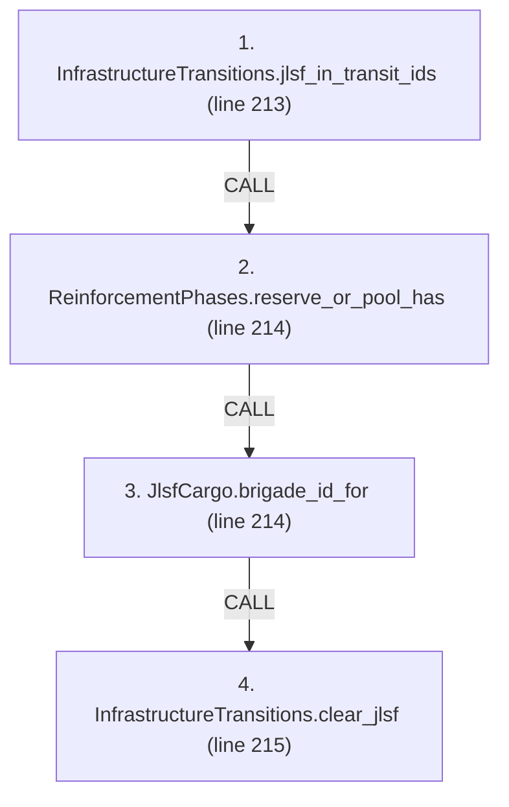
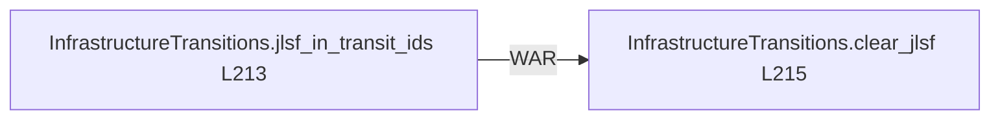

# Ordering: `ReinforcementPhases.reconcile_lost_jlsf`

> **Reading aid, not an execution contract.** No detected edge is not permission to reorder.
> GDScript reads and writes are conservative source analysis; transition writes are also
> checked against the mutation manifest. Potential conflicts may refer to different object
> instances or conditional branches.

Generator format v1; scan scope `scripts/**/*.gd` plus `project.godot` autoload aliases.
Generated from commit `7bbf08693b44`; input SHA-256 `c879af92cf7693c7df1119a11083764377c92a9410144e7b95f361f509613378`;
tool/manifest/fixture SHA-256 `ea366ecafdb8f5cc7ecae22bb7554cd8802d1ed3433c5a903ecc07bbb7230f6c`; stable generation time `2026-08-02T17:09:31-04:00`.
Unresolved-analysis diagnostics on this page: **7**.

Source: `scripts/phases/ReinforcementPhases.gd:210`

## Lexical call-site map (CALL edges)

> Source order is not an execution count: loop calls repeat, branch calls may be skipped
> or mutually exclusive, and nested arguments execute before their outer call.

## State and RNG constraints

| Earlier node | Later node | Kinds | Shared evidence |
|---|---|---|---|
| `InfrastructureTransitions.jlsf_in_transit_ids` (L213) | `InfrastructureTransitions.clear_jlsf` (L215) | **WAR** | `InfrastructureNodeState.jlsf` |

## Detected campaign-state/RNG overview

This compact diagram shows up to 40 detected RAW/WAR/WAW/RNG constraints involving protected
campaign fields. The table above remains the complete conservative evidence.

## Call-site detail

Effects include the called method and every statically resolved helper beneath it.

| # | Call site | Reads | Writes | RNG streams |
|---:|---|---|---|---|
| 1 | `InfrastructureTransitions.jlsf_in_transit_ids` at `scripts/phases/ReinforcementPhases.gd:213` | `GameStateData.infrastructure_state`, `InfrastructureNodeState.jlsf`, `InfrastructureState.nodes` | — | — |
| 2 | `ReinforcementPhases.reserve_or_pool_has` at `scripts/phases/ReinforcementPhases.gd:214` | `GameStateData.sealift_state`, `GameStateData.ship_reserve`, `SealiftState.mainland_pool` | — | — |
| 3 | `JlsfCargo.brigade_id_for` at `scripts/phases/ReinforcementPhases.gd:214` | — | — | — |
| 4 | `InfrastructureTransitions.clear_jlsf` at `scripts/phases/ReinforcementPhases.gd:215` | `GameStateData.infrastructure_state`, `InfrastructureNodeState.jlsf`, `InfrastructureNodeState.node_status`, `InfrastructureNodeState.repair_turns_remaining`, `InfrastructureState.nodes` | `InfrastructureNodeState.jlsf` | — |

## Analysis limits found here

Showing 7 of 7 diagnostics; class pages provide the narrower context.

| Kind | Source | Why it matters |
|---|---|---|
| `untyped_alias` | `scripts/model/InfrastructureState.gd:43` `var node_val: Variant = nodes[id]` | The receiver type could not be proven. |
| `multi_call_statement` | `scripts/phases/ReinforcementPhases.gd:214` `if not reserve_or_pool_has(state, JlsfCargo.brigade_id_for(port_id)):` | Multiple calls share one statement; the map preserves lexical sites, not nested evaluation order. |
| `untyped_iteration` | `scripts/phases/ReinforcementPhases.gd:219` `for entry_value in state.ship_reserve:` | The collection element type could not be proven. |
| `untyped_iteration` | `scripts/phases/ReinforcementPhases.gd:223` `for entry_value in state.sealift_state.mainland_pool:` | The collection element type could not be proven. |
| `untyped_iteration` | `scripts/transitions/InfrastructureTransitions.gd:117` `for id_value in state.nodes.keys():` | The collection element type could not be proven. |
| `untyped_alias` | `scripts/transitions/InfrastructureTransitions.gd:118` `var node_value: Variant = state.nodes[id_value]` | The receiver type could not be proven. |
| `untyped_alias` | `scripts/transitions/InfrastructureTransitions.gd:144` `var node_value: Variant = state.nodes.get(port_id)` | The receiver type could not be proven. |
