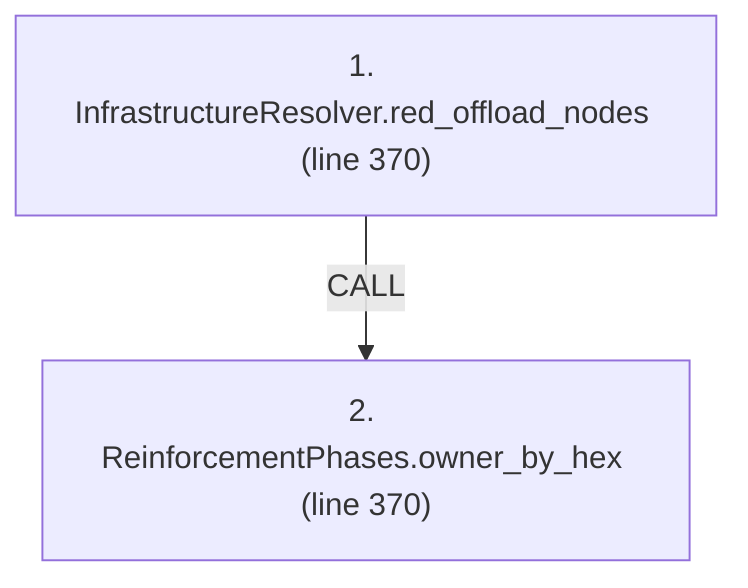
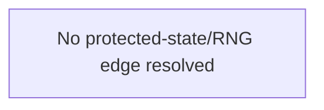

# Ordering: `ReinforcementPhases.red_lodgement_hexes`

> **Reading aid, not an execution contract.** No detected edge is not permission to reorder.
> GDScript reads and writes are conservative source analysis; transition writes are also
> checked against the mutation manifest. Potential conflicts may refer to different object
> instances or conditional branches.

Generator format v1; scan scope `scripts/**/*.gd` plus `project.godot` autoload aliases.
Generated from commit `8829181ae4b6`; input SHA-256 `1c5ff5483615f0cca5b2767540c56e9a13e1387c4c1a3c66db909a97ad2e94fb`;
tool/manifest/fixture SHA-256 `ea366ecafdb8f5cc7ecae22bb7554cd8802d1ed3433c5a903ecc07bbb7230f6c`; stable generation time `2026-08-02T09:03:12-04:00`.
Unresolved-analysis diagnostics on this page: **4**.

Source: `scripts/phases/ReinforcementPhases.gd:364`

## Lexical call-site map (CALL edges)

> Source order is not an execution count: loop calls repeat, branch calls may be skipped
> or mutually exclusive, and nested arguments execute before their outer call.

## State and RNG constraints

| Earlier node | Later node | Kinds | Shared evidence |
|---|---|---|---|
| _No constraint edge resolved_ | | | This is not evidence that calls are reorderable. |

## Detected campaign-state/RNG overview

This compact diagram shows up to 40 detected RAW/WAR/WAW/RNG constraints involving protected
campaign fields. The table above remains the complete conservative evidence.

## Call-site detail

Effects include the called method and every statically resolved helper beneath it.

| # | Call site | Reads | Writes | RNG streams |
|---:|---|---|---|---|
| 1 | `InfrastructureResolver.red_offload_nodes` at `scripts/phases/ReinforcementPhases.gd:370` | `GameDataStore.infrastructure`, `GameStateData.infrastructure_state`, `InfrastructureDef.hex_id`, `InfrastructureDef.kind`, `InfrastructureDef.to_number`, `InfrastructureNodeState.node_status`, `InfrastructureState.nodes` | — | — |
| 2 | `ReinforcementPhases.owner_by_hex` at `scripts/phases/ReinforcementPhases.gd:370` | `GameDataStore.hex_states`, `HexState.hex_owner` | — | — |

## Analysis limits found here

Showing 4 of 4 diagnostics; class pages provide the narrower context.

| Kind | Source | Why it matters |
|---|---|---|
| `untyped_alias` | `scripts/calc/InfrastructureResolver.gd:86` `var def_val: Variant = infra_defs.get(id)` | The receiver type could not be proven. |
| `untyped_iteration` | `scripts/phases/ReinforcementPhases.gd:203` `for hex_id in GameData.hex_states.keys():` | The collection element type could not be proven. |
| `multi_call_statement` | `scripts/phases/ReinforcementPhases.gd:370` `for node_value in InfrastructureResolver.red_offload_nodes( state.infrastructure_state, GameData.infrastructure, owner_by_hex()):` | Multiple calls share one statement; the map preserves lexical sites, not nested evaluation order. |
| `untyped_iteration` | `scripts/phases/ReinforcementPhases.gd:370` `for node_value in InfrastructureResolver.red_offload_nodes( state.infrastructure_state, GameData.infrastructure, owner_by_hex()):` | The collection element type could not be proven. |
