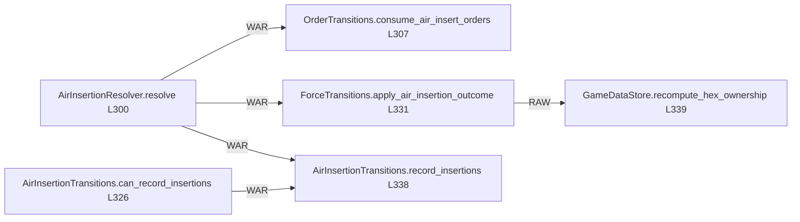

# Ordering: `ReinforcementPhases.resolve_air_insertion_turn`

> **Reading aid, not an execution contract.** No detected edge is not permission to reorder.
> GDScript reads and writes are conservative source analysis; transition writes are also
> checked against the mutation manifest. Potential conflicts may refer to different object
> instances or conditional branches.

Generator format v1; scan scope `scripts/**/*.gd` plus `project.godot` autoload aliases.
Generated from commit `8829181ae4b6`; input SHA-256 `1c5ff5483615f0cca5b2767540c56e9a13e1387c4c1a3c66db909a97ad2e94fb`;
tool/manifest/fixture SHA-256 `ea366ecafdb8f5cc7ecae22bb7554cd8802d1ed3433c5a903ecc07bbb7230f6c`; stable generation time `2026-08-02T09:03:12-04:00`.
Unresolved-analysis diagnostics on this page: **23**.

Source: `scripts/phases/ReinforcementPhases.gd:299`

## Lexical call-site map (CALL edges)

> Source order is not an execution count: loop calls repeat, branch calls may be skipped
> or mutually exclusive, and nested arguments execute before their outer call.

```mermaid
flowchart TD
  n_8cea653919f0["1. AirInsertionResolver.resolve (line 300)"]
  n_07e585bdac0d["2. AirInsertionResolver.threat_from_ijfs_summary (line 300)"]
  n_400defa58b99["3. GameDataStore.air_insertion_attrition_config (line 300)"]
  n_c17ab42262a6["4. ReinforcementPhases.hex_can_receive_insertion (line 300)"]
  n_3ee4296afc3b["5. OrderTransitions.consume_air_insert_orders (line 307)"]
  n_2cfdb7fdb3b6["6. AirInsertionSummary.to_dict (line 310)"]
  n_411271a98307["7. AirInsertionSummary.to_dict (line 322)"]
  n_643055134a04["8. AirInsertionTransitions.lift_request (line 325)"]
  n_40c09b5b8a4f["9. AirInsertionTransitions.can_record_insertions (line 326)"]
  n_fca66869d866["10. AirInsertionSummary.to_dict (line 328)"]
  n_23a21fafd0df["11. ForceTransitions.apply_air_insertion_outcome (line 331)"]
  n_c80b17063364["12. AirInsertionSummary.to_dict (line 335)"]
  n_1a255d18fb81["13. AirInsertionTransitions.record_insertions (line 338)"]
  n_831670400d06["14. GameDataStore.recompute_hex_ownership (line 339)"]
  n_0728f9c2fe34["15. AirInsertionSummary.to_dict (line 340)"]
  n_8cea653919f0 -->|CALL| n_07e585bdac0d
  n_07e585bdac0d -->|CALL| n_400defa58b99
  n_400defa58b99 -->|CALL| n_c17ab42262a6
  n_c17ab42262a6 -->|CALL| n_3ee4296afc3b
  n_3ee4296afc3b -->|CALL| n_2cfdb7fdb3b6
  n_2cfdb7fdb3b6 -->|CALL| n_411271a98307
  n_411271a98307 -->|CALL| n_643055134a04
  n_643055134a04 -->|CALL| n_40c09b5b8a4f
  n_40c09b5b8a4f -->|CALL| n_fca66869d866
  n_fca66869d866 -->|CALL| n_23a21fafd0df
  n_23a21fafd0df -->|CALL| n_c80b17063364
  n_c80b17063364 -->|CALL| n_1a255d18fb81
  n_1a255d18fb81 -->|CALL| n_831670400d06
  n_831670400d06 -->|CALL| n_0728f9c2fe34
```

## State and RNG constraints

| Earlier node | Later node | Kinds | Shared evidence |
|---|---|---|---|
| `AirInsertionResolver.resolve` (L300) | `OrderTransitions.consume_air_insert_orders` (L307) | **WAR** | `GameStateData.air_insert_orders` |
| `AirInsertionResolver.resolve` (L300) | `AirInsertionSummary.to_dict` (L310) | **RAW** | `AirInsertionSummary.attrition_by_class`, `AirInsertionSummary.battalions_landed`, `AirInsertionSummary.battalions_lost`, `AirInsertionSummary.caps_after`, `AirInsertionSummary.caps_before`, `AirInsertionSummary.drops`, `AirInsertionSummary.pending_battalions`, `AirInsertionSummary.pending_brigades`; _+1 more_ |
| `AirInsertionResolver.resolve` (L300) | `AirInsertionSummary.to_dict` (L322) | **RAW** | `AirInsertionSummary.attrition_by_class`, `AirInsertionSummary.battalions_landed`, `AirInsertionSummary.battalions_lost`, `AirInsertionSummary.caps_after`, `AirInsertionSummary.caps_before`, `AirInsertionSummary.drops`, `AirInsertionSummary.pending_battalions`, `AirInsertionSummary.pending_brigades`; _+1 more_ |
| `AirInsertionResolver.resolve` (L300) | `AirInsertionTransitions.lift_request` (L325) | **RAW** | `AirInsertionSummary.drops` |
| `AirInsertionResolver.resolve` (L300) | `AirInsertionSummary.to_dict` (L328) | **RAW** | `AirInsertionSummary.attrition_by_class`, `AirInsertionSummary.battalions_landed`, `AirInsertionSummary.battalions_lost`, `AirInsertionSummary.caps_after`, `AirInsertionSummary.caps_before`, `AirInsertionSummary.drops`, `AirInsertionSummary.pending_battalions`, `AirInsertionSummary.pending_brigades`; _+1 more_ |
| `AirInsertionResolver.resolve` (L300) | `ForceTransitions.apply_air_insertion_outcome` (L331) | **RAW**, **WAR** | `AirInsertionState.landed`, `AirInsertionState.pool`, `ForceAirInsertionRequest.landings` |
| `AirInsertionResolver.resolve` (L300) | `AirInsertionSummary.to_dict` (L335) | **RAW** | `AirInsertionSummary.attrition_by_class`, `AirInsertionSummary.battalions_landed`, `AirInsertionSummary.battalions_lost`, `AirInsertionSummary.caps_after`, `AirInsertionSummary.caps_before`, `AirInsertionSummary.drops`, `AirInsertionSummary.pending_battalions`, `AirInsertionSummary.pending_brigades`; _+1 more_ |
| `AirInsertionResolver.resolve` (L300) | `AirInsertionTransitions.record_insertions` (L338) | **WAR** | `AirInsertionState.caps` |
| `AirInsertionResolver.resolve` (L300) | `AirInsertionSummary.to_dict` (L340) | **RAW** | `AirInsertionSummary.attrition_by_class`, `AirInsertionSummary.battalions_landed`, `AirInsertionSummary.battalions_lost`, `AirInsertionSummary.caps_after`, `AirInsertionSummary.caps_before`, `AirInsertionSummary.drops`, `AirInsertionSummary.pending_battalions`, `AirInsertionSummary.pending_brigades`; _+1 more_ |
| `AirInsertionTransitions.lift_request` (L325) | `AirInsertionTransitions.can_record_insertions` (L326) | **RAW** | `AirLiftRequest.drops` |
| `AirInsertionTransitions.lift_request` (L325) | `AirInsertionTransitions.record_insertions` (L338) | **RAW** | `AirLiftRequest.drops`, `AirLiftRequest.turn_number` |
| `AirInsertionTransitions.can_record_insertions` (L326) | `AirInsertionTransitions.record_insertions` (L338) | **WAR** | `AirInsertionState.caps` |
| `ForceTransitions.apply_air_insertion_outcome` (L331) | `GameDataStore.recompute_hex_ownership` (L339) | **RAW** | `Brigade.destroyed`, `GameDataStore.brigades_by_hex` |

## Detected campaign-state/RNG overview

This compact diagram shows up to 40 detected RAW/WAR/WAW/RNG constraints involving protected
campaign fields. The table above remains the complete conservative evidence.

## Call-site detail

Effects include the called method and every statically resolved helper beneath it.

| # | Call site | Reads | Writes | RNG streams |
|---:|---|---|---|---|
| 1 | `AirInsertionResolver.resolve` at `scripts/phases/ReinforcementPhases.gd:300` | `AirInsertionResolutionPlan.budget`, `AirInsertionResolutionPlan.caps_after`, `AirInsertionResolutionPlan.config`, `AirInsertionResolutionPlan.dice`, `AirInsertionResolutionPlan.hex_can_receive`, `AirInsertionResolutionPlan.landings`, `AirInsertionResolutionPlan.orders`, `AirInsertionResolutionPlan.pool_sent`, `AirInsertionResolutionPlan.state`, `AirInsertionResolutionPlan.substream`; _+15 more_ | `AirInsertionResolutionPlan.budget`, `AirInsertionResolutionPlan.caps_after`, `AirInsertionResolutionPlan.config`, `AirInsertionResolutionPlan.dice`, `AirInsertionResolutionPlan.hex_can_receive`, `AirInsertionResolutionPlan.landings`, `AirInsertionResolutionPlan.orders`, `AirInsertionResolutionPlan.pool_sent`, `AirInsertionResolutionPlan.state`, `AirInsertionResolutionPlan.substream`; _+14 more_ | `plan.substream` |
| 2 | `AirInsertionResolver.threat_from_ijfs_summary` at `scripts/phases/ReinforcementPhases.gd:300` | — | — | — |
| 3 | `GameDataStore.air_insertion_attrition_config` at `scripts/phases/ReinforcementPhases.gd:300` | `GameDataStore.red_air_insertion` | — | — |
| 4 | `ReinforcementPhases.hex_can_receive_insertion` at `scripts/phases/ReinforcementPhases.gd:300` | `GameDataStore.hex_lookup`, `GameDataStore.hex_states`, `GameDataStore.terrain_types`, `TerrainType.impassable` | — | — |
| 5 | `OrderTransitions.consume_air_insert_orders` at `scripts/phases/ReinforcementPhases.gd:307` | — | `GameStateData.air_insert_orders` | — |
| 6 | `AirInsertionSummary.to_dict` at `scripts/phases/ReinforcementPhases.gd:310` | `AirInsertionSummary.attrition_by_class`, `AirInsertionSummary.battalions_landed`, `AirInsertionSummary.battalions_lost`, `AirInsertionSummary.caps_after`, `AirInsertionSummary.caps_before`, `AirInsertionSummary.drops`, `AirInsertionSummary.pending_battalions`, `AirInsertionSummary.pending_brigades`, `AirInsertionSummary.rejected` | — | — |
| 7 | `AirInsertionSummary.to_dict` at `scripts/phases/ReinforcementPhases.gd:322` | `AirInsertionSummary.attrition_by_class`, `AirInsertionSummary.battalions_landed`, `AirInsertionSummary.battalions_lost`, `AirInsertionSummary.caps_after`, `AirInsertionSummary.caps_before`, `AirInsertionSummary.drops`, `AirInsertionSummary.pending_battalions`, `AirInsertionSummary.pending_brigades`, `AirInsertionSummary.rejected` | — | — |
| 8 | `AirInsertionTransitions.lift_request` at `scripts/phases/ReinforcementPhases.gd:325` | `AirInsertionSummary.drops`, `GameStateData.turn_number` | `AirLiftRequest.drops`, `AirLiftRequest.turn_number` | — |
| 9 | `AirInsertionTransitions.can_record_insertions` at `scripts/phases/ReinforcementPhases.gd:326` | `AirInsertionState.caps`, `AirLiftRequest.drops`, `GameStateData.air_insertion_state` | — | — |
| 10 | `AirInsertionSummary.to_dict` at `scripts/phases/ReinforcementPhases.gd:328` | `AirInsertionSummary.attrition_by_class`, `AirInsertionSummary.battalions_landed`, `AirInsertionSummary.battalions_lost`, `AirInsertionSummary.caps_after`, `AirInsertionSummary.caps_before`, `AirInsertionSummary.drops`, `AirInsertionSummary.pending_battalions`, `AirInsertionSummary.pending_brigades`, `AirInsertionSummary.rejected` | — | — |
| 11 | `ForceTransitions.apply_air_insertion_outcome` at `scripts/phases/ReinforcementPhases.gd:331` | `AirInsertionState.landed`, `AirInsertionState.pool`, `Battalion.qty`, `Battalion.type`, `Brigade.composition`, `Brigade.destroyed`, `Brigade.hex_id`, `Brigade.id`, `ForceAirInsertionRequest.landings`, `ForceCasualtyRequest.battalion_type`; _+16 more_ | `AirInsertionState.landed`, `AirInsertionState.pool`, `Battalion.qty`, `Brigade.composition`, `Brigade.destroyed`, `Brigade.entry_bearing`, `Brigade.hex_id`, `ForceAirInsertionReceipt.battalions_landed`, `ForceAirInsertionReceipt.battalions_lost`, `ForceAirInsertionReceipt.casualty_receipts`; _+29 more_ | — |
| 12 | `AirInsertionSummary.to_dict` at `scripts/phases/ReinforcementPhases.gd:335` | `AirInsertionSummary.attrition_by_class`, `AirInsertionSummary.battalions_landed`, `AirInsertionSummary.battalions_lost`, `AirInsertionSummary.caps_after`, `AirInsertionSummary.caps_before`, `AirInsertionSummary.drops`, `AirInsertionSummary.pending_battalions`, `AirInsertionSummary.pending_brigades`, `AirInsertionSummary.rejected` | — | — |
| 13 | `AirInsertionTransitions.record_insertions` at `scripts/phases/ReinforcementPhases.gd:338` | `AirInsertionState.caps`, `AirInsertionState.history`, `AirLiftRequest.drops`, `AirLiftRequest.turn_number`, `GameStateData.air_insertion_state` | `AirInsertionState.caps`, `AirInsertionState.history` | — |
| 14 | `GameDataStore.recompute_hex_ownership` at `scripts/phases/ReinforcementPhases.gd:339` | `Brigade.destroyed`, `Brigade.team`, `GameDataStore.brigades`, `GameDataStore.brigades_by_hex`, `GameDataStore.hex_lookup`, `GameDataStore.hex_states` | `HexState.hex_owner` | — |
| 15 | `AirInsertionSummary.to_dict` at `scripts/phases/ReinforcementPhases.gd:340` | `AirInsertionSummary.attrition_by_class`, `AirInsertionSummary.battalions_landed`, `AirInsertionSummary.battalions_lost`, `AirInsertionSummary.caps_after`, `AirInsertionSummary.caps_before`, `AirInsertionSummary.drops`, `AirInsertionSummary.pending_battalions`, `AirInsertionSummary.pending_brigades`, `AirInsertionSummary.rejected` | — | — |

## Analysis limits found here

Showing 23 of 23 diagnostics; class pages provide the narrower context.

| Kind | Source | Why it matters |
|---|---|---|
| `untyped_iteration` | `scripts/calc/AirInsertionResolver.gd:157` `for order_value in plan.orders:` | The collection element type could not be proven. |
| `untyped_alias` | `scripts/calc/AirInsertionResolver.gd:164` `var entry := plan.state.entry_for(brigade_id)` | The receiver type could not be proven. |
| `dynamic_dispatch` | `scripts/calc/AirInsertionResolver.gd:168` `if not bool(plan.hex_can_receive.call(target_hex)):` | A string/dynamic call has no statically known target. |
| `untyped_alias` | `scripts/calc/AirInsertionResolver.gd:172` `var remaining := int(plan.budget.get(lift_class, 0))` | The receiver type could not be proven. |
| `untyped_alias` | `scripts/calc/AirInsertionResolver.gd:214` `var first := not landed.is_empty() and not plan.state.landed.has(brigade_id)` | The receiver type could not be proven. |
| `untyped_iteration` | `scripts/calc/AirInsertionResolver.gd:237` `for entry_value in state.pool:` | The collection element type could not be proven. |
| `untyped_iteration` | `scripts/calc/ForceValidationHelper.gd:73` `for landing_value in request.landings:` | The collection element type could not be proven. |
| `untyped_alias` | `scripts/calc/ForceValidationHelper.gd:99` `var expected_first := not landed_bns.is_empty() and not air_state.landed.has(brigade_id)` | The receiver type could not be proven. |
| `unresolved_receiver` | `scripts/calc/ForceValidationHelper.gd:302` `available += int(battalion_value.qty)` | A protected field name appeared on an unresolved receiver. |
| `untyped_iteration` | `scripts/calc/HexOwnershipCalculator.gd:27` `for brigade_id_value in data_store.get_brigades_in_hex(hex_id):` | The collection element type could not be proven. |
| `unresolved_receiver` | `scripts/model/Brigade.gd:60` `total += battalion.qty` | A protected field name appeared on an unresolved receiver. |
| `callable_or_lambda` | `scripts/phases/ReinforcementPhases.gd:300` `var outcome := AirInsertionResolver.resolve( state.air_insertion_state, state.air_insert_orders, state.turn_number, AirInsertionResolver.threat_from_ijfs_summary(state.last_ijfs…` | Callable/lambda dataflow is outside this analyser. |
| `multi_call_statement` | `scripts/phases/ReinforcementPhases.gd:300` `var outcome := AirInsertionResolver.resolve( state.air_insertion_state, state.air_insert_orders, state.turn_number, AirInsertionResolver.threat_from_ijfs_summary(state.last_ijfs…` | Multiple calls share one statement; the map preserves lexical sites, not nested evaluation order. |
| `untyped_iteration` | `scripts/transitions/AirInsertionTransitions.gd:88` `for drop_value in request.drops:` | The collection element type could not be proven. |
| `untyped_iteration` | `scripts/transitions/ForceTransitions.gd:165` `for landing_value in request.landings:` | The collection element type could not be proven. |
| `multi_call_statement` | `scripts/transitions/ForceTransitions.gd:188` `var place_receipt := place_brigade( data_store, ForcePlacementRequest.ashore(brigade_id, hex_id, "air_insertion"))` | Multiple calls share one statement; the map preserves lexical sites, not nested evaluation order. |
| `callable_or_lambda` | `scripts/transitions/ForceTransitions.gd:587` `data_store.brigades_by_hex[old_hex] = (data_store.brigades_by_hex[old_hex] as Array).filter( func(id: String) -> bool: return id != brigade.id)` | Callable/lambda dataflow is outside this analyser. |
| `untyped_alias` | `scripts/transitions/ForceTransitions.gd:601` `var violations := data_store.validate_runtime_indexes()` | The receiver type could not be proven. |
| `untyped_iteration` | `scripts/transitions/ForceTransitions.gd:618` `for index in range(brigade.composition.size() - 1, -1, -1):` | The collection element type could not be proven. |
| `untyped_alias` | `scripts/transitions/ForceTransitions.gd:622` `var take := mini(battalion.qty, remaining)` | The receiver type could not be proven. |
| `untyped_iteration` | `scripts/transitions/ForceTransitions.gd:788` `for entry_value in air_state.pool:` | The collection element type could not be proven. |
| `untyped_iteration` | `scripts/transitions/ForceTransitions.gd:848` `for entry_value in air_state.pool:` | The collection element type could not be proven. |
| `untyped_alias` | `scripts/transitions/MapTransitions.gd:98` `var state_value: Variant = data_store.hex_states.get(hex_id)` | The receiver type could not be proven. |
