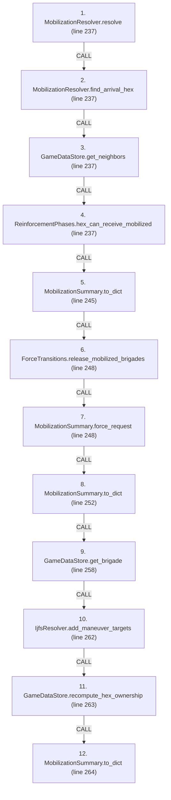
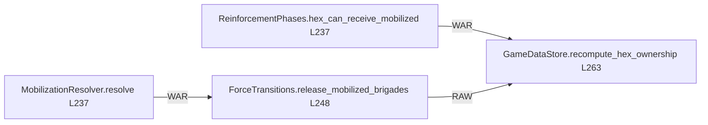

# Ordering: `ReinforcementPhases.resolve_mobilization_turn`

> **Reading aid, not an execution contract.** No detected edge is not permission to reorder.
> GDScript reads and writes are conservative source analysis; transition writes are also
> checked against the mutation manifest. Potential conflicts may refer to different object
> instances or conditional branches.

Generator format v1; scan scope `scripts/**/*.gd` plus `project.godot` autoload aliases.
Generated from commit `7bbf08693b44`; input SHA-256 `c879af92cf7693c7df1119a11083764377c92a9410144e7b95f361f509613378`;
tool/manifest/fixture SHA-256 `ea366ecafdb8f5cc7ecae22bb7554cd8802d1ed3433c5a903ecc07bbb7230f6c`; stable generation time `2026-08-02T17:09:31-04:00`.
Unresolved-analysis diagnostics on this page: **29**.

Source: `scripts/phases/ReinforcementPhases.gd:236`

## Lexical call-site map (CALL edges)

> Source order is not an execution count: loop calls repeat, branch calls may be skipped
> or mutually exclusive, and nested arguments execute before their outer call.

## State and RNG constraints

| Earlier node | Later node | Kinds | Shared evidence |
|---|---|---|---|
| `MobilizationResolver.resolve` (L237) | `MobilizationSummary.to_dict` (L245) | **RAW** | `MobilizationSummary.arrivals`, `MobilizationSummary.battalions_arrived`, `MobilizationSummary.deferred`, `MobilizationSummary.pending_battalions`, `MobilizationSummary.pending_brigades` |
| `MobilizationResolver.resolve` (L237) | `ForceTransitions.release_mobilized_brigades` (L248) | **WAR** | `MobilizationState.pending` |
| `MobilizationResolver.resolve` (L237) | `MobilizationSummary.force_request` (L248) | **RAW** | `MobilizationSummary.arrivals`, `MobilizationSummary.deferred` |
| `MobilizationResolver.resolve` (L237) | `MobilizationSummary.to_dict` (L252) | **RAW** | `MobilizationSummary.arrivals`, `MobilizationSummary.battalions_arrived`, `MobilizationSummary.deferred`, `MobilizationSummary.pending_battalions`, `MobilizationSummary.pending_brigades` |
| `MobilizationResolver.resolve` (L237) | `MobilizationSummary.to_dict` (L264) | **RAW** | `MobilizationSummary.arrivals`, `MobilizationSummary.battalions_arrived`, `MobilizationSummary.deferred`, `MobilizationSummary.pending_battalions`, `MobilizationSummary.pending_brigades` |
| `ReinforcementPhases.hex_can_receive_mobilized` (L237) | `GameDataStore.recompute_hex_ownership` (L263) | **WAR** | `HexState.hex_owner` |
| `ForceTransitions.release_mobilized_brigades` (L248) | `GameDataStore.recompute_hex_ownership` (L263) | **RAW** | `GameDataStore.brigades_by_hex` |

## Detected campaign-state/RNG overview

This compact diagram shows up to 40 detected RAW/WAR/WAW/RNG constraints involving protected
campaign fields. The table above remains the complete conservative evidence.

## Call-site detail

Effects include the called method and every statically resolved helper beneath it.

| # | Call site | Reads | Writes | RNG streams |
|---:|---|---|---|---|
| 1 | `MobilizationResolver.resolve` at `scripts/phases/ReinforcementPhases.gd:237` | `Brigade.composition`, `GameDataStore.brigades`, `GameStateData.mobilization_state`, `GameStateData.turn_number`, `MobilizationState.pending`, `MobilizationSummary.battalions_arrived` | `MobilizationSummary.arrivals`, `MobilizationSummary.battalions_arrived`, `MobilizationSummary.deferred`, `MobilizationSummary.pending_battalions`, `MobilizationSummary.pending_brigades` | — |
| 2 | `MobilizationResolver.find_arrival_hex` at `scripts/phases/ReinforcementPhases.gd:237` | — | — | — |
| 3 | `GameDataStore.get_neighbors` at `scripts/phases/ReinforcementPhases.gd:237` | `GameDataStore.neighbor_lookup` | — | — |
| 4 | `ReinforcementPhases.hex_can_receive_mobilized` at `scripts/phases/ReinforcementPhases.gd:237` | `GameDataStore.hex_lookup`, `GameDataStore.hex_states`, `GameDataStore.terrain_types`, `HexState.hex_owner`, `TerrainType.impassable` | — | — |
| 5 | `MobilizationSummary.to_dict` at `scripts/phases/ReinforcementPhases.gd:245` | `MobilizationSummary.arrivals`, `MobilizationSummary.battalions_arrived`, `MobilizationSummary.deferred`, `MobilizationSummary.pending_battalions`, `MobilizationSummary.pending_brigades` | — | — |
| 6 | `ForceTransitions.release_mobilized_brigades` at `scripts/phases/ReinforcementPhases.gd:248` | `Brigade.composition`, `Brigade.destroyed`, `Brigade.hex_id`, `Brigade.id`, `ForceMobilizationRequest.arrivals`, `ForceMobilizationRequest.deferred`, `ForceMobilizationRequest.turn_number`, `ForcePlacementRequest.brigade_id`, `ForcePlacementRequest.destination`, `ForcePlacementRequest.destination_hex`; _+11 more_ | `Brigade.entry_bearing`, `Brigade.hex_id`, `ForceMobilizationReceipt.arrived`, `ForceMobilizationReceipt.battalions_arrived`, `ForceMobilizationReceipt.deferred`, `ForceMobilizationReceipt.error`, `ForceMobilizationReceipt.placed_brigades`, `ForceMobilizationReceipt.placement_receipts`, `ForceMobilizationReceipt.success`, `ForcePlacementReceipt.brigade_id`; _+12 more_ | — |
| 7 | `MobilizationSummary.force_request` at `scripts/phases/ReinforcementPhases.gd:248` | `MobilizationSummary.arrivals`, `MobilizationSummary.deferred` | `ForceMobilizationRequest.arrivals`, `ForceMobilizationRequest.deferred`, `ForceMobilizationRequest.turn_number` | — |
| 8 | `MobilizationSummary.to_dict` at `scripts/phases/ReinforcementPhases.gd:252` | `MobilizationSummary.arrivals`, `MobilizationSummary.battalions_arrived`, `MobilizationSummary.deferred`, `MobilizationSummary.pending_battalions`, `MobilizationSummary.pending_brigades` | — | — |
| 9 | `GameDataStore.get_brigade` at `scripts/phases/ReinforcementPhases.gd:258` | `GameDataStore.brigades` | — | — |
| 10 | `IjfsResolver.add_maneuver_targets` at `scripts/phases/ReinforcementPhases.gd:262` | `Battalion.qty`, `Battalion.type`, `Brigade.composition`, `Brigade.id`, `Brigade.to_number`, `GameStateData._ijfs_day`, `GameStateData.ijfs_state`, `IjfsDailyState.targets`, `IjfsTarget.target_id` | `IjfsDailyState.targets`, `IjfsTarget.category`, `IjfsTarget.destroyed`, `IjfsTarget.detectability_active`, `IjfsTarget.detectability_hiding`, `IjfsTarget.detected_this_turn`, `IjfsTarget.hardness`, `IjfsTarget.instance_index`, `IjfsTarget.known_to_red`, `IjfsTarget.last_detected_day`; _+9 more_ | — |
| 11 | `GameDataStore.recompute_hex_ownership` at `scripts/phases/ReinforcementPhases.gd:263` | `Brigade.destroyed`, `Brigade.team`, `GameDataStore.brigades`, `GameDataStore.brigades_by_hex`, `GameDataStore.hex_lookup`, `GameDataStore.hex_states` | `HexState.hex_owner` | — |
| 12 | `MobilizationSummary.to_dict` at `scripts/phases/ReinforcementPhases.gd:264` | `MobilizationSummary.arrivals`, `MobilizationSummary.battalions_arrived`, `MobilizationSummary.deferred`, `MobilizationSummary.pending_battalions`, `MobilizationSummary.pending_brigades` | — | — |

## Analysis limits found here

Showing 29 of 29 diagnostics; class pages provide the narrower context.

| Kind | Source | Why it matters |
|---|---|---|
| `untyped_iteration` | `scripts/calc/ForceMobilizationValidation.gd:13` `for entry_value in state.pending:` | The collection element type could not be proven. |
| `untyped_iteration` | `scripts/calc/ForceMobilizationValidation.gd:19` `for arrival_value in request.arrivals:` | The collection element type could not be proven. |
| `untyped_iteration` | `scripts/calc/HexOwnershipCalculator.gd:27` `for brigade_id_value in data_store.get_brigades_in_hex(hex_id):` | The collection element type could not be proven. |
| `untyped_iteration` | `scripts/calc/MobilizationResolver.gd:33` `for entry_value in state.pending:` | The collection element type could not be proven. |
| `dynamic_dispatch` | `scripts/calc/MobilizationResolver.gd:45` `var arrival_hex := String(arrival_hex_for.call(garrison_hex))` | A string/dynamic call has no statically known target. |
| `untyped_alias` | `scripts/calc/MobilizationResolver.gd:50` `var battalions := brigade.get_battalion_count()` | The receiver type could not be proven. |
| `untyped_iteration` | `scripts/calc/MobilizationResolver.gd:73` `for entry_value in state.pending:` | The collection element type could not be proven. |
| `untyped_iteration` | `scripts/calc/MobilizationResolver.gd:85` `for entry_value in state.pending:` | The collection element type could not be proven. |
| `dynamic_dispatch` | `scripts/calc/MobilizationResolver.gd:105` `if bool(is_available.call(garrison_hex)):` | A string/dynamic call has no statically known target. |
| `dynamic_dispatch` | `scripts/calc/MobilizationResolver.gd:113` `for neighbor_value in neighbors_of.call(hex_id):` | A string/dynamic call has no statically known target. |
| `dynamic_dispatch` | `scripts/calc/MobilizationResolver.gd:121` `if bool(is_available.call(hex_id)):` | A string/dynamic call has no statically known target. |
| `multi_call_statement` | `scripts/interleaved/IjfsResolver.gd:157` `return IjfsTransitions.add_targets( ijfs_state, IjfsLoaders.build_maneuver_targets(brigades, maxi(1, current_day)))` | Multiple calls share one statement; the map preserves lexical sites, not nested evaluation order. |
| `untyped_alias` | `scripts/loaders/IjfsLoaders.gd:76` `var unit_type := String(battalion.type)` | The receiver type could not be proven. |
| `untyped_iteration` | `scripts/loaders/IjfsLoaders.gd:78` `for _i in range(battalion.qty):` | The collection element type could not be proven. |
| `untyped_alias` | `scripts/loaders/IjfsLoaders.gd:80` `var battalion_id := "%s-MU-%d" % [brigade.id, n]` | The receiver type could not be proven. |
| `untyped_alias` | `scripts/loaders/IjfsLoaders.gd:82` `var row := { "target_id": source_id, "category": "Maneuver Units", "subcategory": String(profile[0]), "quantity": 1, "mobility": String(profile[1]), "hardness": String(profile[2…` | The receiver type could not be proven. |
| `callable_or_lambda` | `scripts/loaders/IjfsLoaders.gd:99` `targets.sort_custom(func(a: IjfsTarget, b: IjfsTarget) -> bool: return a.target_id < b.target_id)` | Callable/lambda dataflow is outside this analyser. |
| `unresolved_receiver` | `scripts/loaders/IjfsLoaders.gd:99` `targets.sort_custom(func(a: IjfsTarget, b: IjfsTarget) -> bool: return a.target_id < b.target_id)` | A protected field name appeared on an unresolved receiver. |
| `unresolved_receiver` | `scripts/model/Brigade.gd:60` `total += battalion.qty` | A protected field name appeared on an unresolved receiver. |
| `callable_or_lambda` | `scripts/phases/ReinforcementPhases.gd:237` `var summary := MobilizationResolver.resolve( state.mobilization_state, state.turn_number, GameData.brigades, func(garrison_hex: String) -> String: return MobilizationResolver.fi…` | Callable/lambda dataflow is outside this analyser. |
| `multi_call_statement` | `scripts/phases/ReinforcementPhases.gd:237` `var summary := MobilizationResolver.resolve( state.mobilization_state, state.turn_number, GameData.brigades, func(garrison_hex: String) -> String: return MobilizationResolver.fi…` | Multiple calls share one statement; the map preserves lexical sites, not nested evaluation order. |
| `multi_call_statement` | `scripts/phases/ReinforcementPhases.gd:248` `var receipt := ForceTransitions.release_mobilized_brigades( GameData, state.mobilization_state, summary.force_request(state.turn_number))` | Multiple calls share one statement; the map preserves lexical sites, not nested evaluation order. |
| `untyped_iteration` | `scripts/transitions/ForceTransitions.gd:233` `for arrival_value in request.arrivals:` | The collection element type could not be proven. |
| `nested_index_unanalysed` | `scripts/transitions/ForceTransitions.gd:235` `arrivals_by_id[String(arrival["brigade_id"])] = arrival` | Nested collection indexes exceed the balanced-chain subset; this statement contributes no field effects. |
| `untyped_iteration` | `scripts/transitions/ForceTransitions.gd:240` `for entry_value in mob_state.pending:` | The collection element type could not be proven. |
| `multi_call_statement` | `scripts/transitions/ForceTransitions.gd:247` `var receipt := place_brigade(data_store, ForcePlacementRequest.ashore( brigade_id, String(arrival["hex_id"]), "mobilization"))` | Multiple calls share one statement; the map preserves lexical sites, not nested evaluation order. |
| `callable_or_lambda` | `scripts/transitions/ForceTransitions.gd:605` `data_store.brigades_by_hex[old_hex] = (data_store.brigades_by_hex[old_hex] as Array).filter( func(id: String) -> bool: return id != brigade.id)` | Callable/lambda dataflow is outside this analyser. |
| `untyped_alias` | `scripts/transitions/ForceTransitions.gd:619` `var violations := data_store.validate_runtime_indexes()` | The receiver type could not be proven. |
| `untyped_alias` | `scripts/transitions/MapTransitions.gd:98` `var state_value: Variant = data_store.hex_states.get(hex_id)` | The receiver type could not be proven. |
