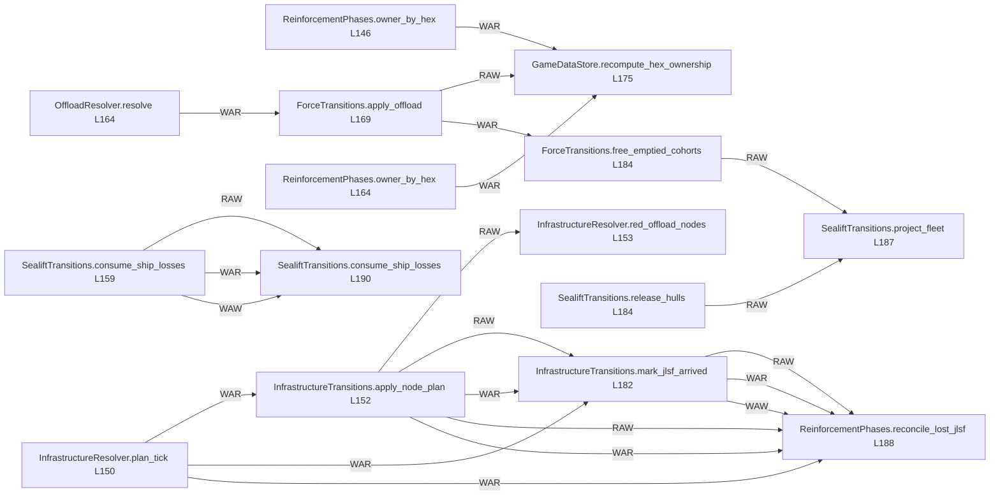

# Ordering: `ReinforcementPhases.resolve_offload_turn`

> **Reading aid, not an execution contract.** No detected edge is not permission to reorder.
> GDScript reads and writes are conservative source analysis; transition writes are also
> checked against the mutation manifest. Potential conflicts may refer to different object
> instances or conditional branches.

Generator format v1; scan scope `scripts/**/*.gd` plus `project.godot` autoload aliases.
Generated from commit `8829181ae4b6`; input SHA-256 `1c5ff5483615f0cca5b2767540c56e9a13e1387c4c1a3c66db909a97ad2e94fb`;
tool/manifest/fixture SHA-256 `ea366ecafdb8f5cc7ecae22bb7554cd8802d1ed3433c5a903ecc07bbb7230f6c`; stable generation time `2026-08-02T09:03:12-04:00`.
Unresolved-analysis diagnostics on this page: **56**.

Source: `scripts/phases/ReinforcementPhases.gd:139`

## Lexical call-site map (CALL edges)

> Source order is not an execution count: loop calls repeat, branch calls may be skipped
> or mutually exclusive, and nested arguments execute before their outer call.

```mermaid
flowchart TD
  n_0139ea2c02a7["1. ReinforcementPhases.owner_by_hex (line 146)"]
  n_f2b6ebe75552["2. InfrastructureResolver.plan_tick (line 150)"]
  n_dee963c5b52a["3. InfrastructureTransitions.apply_node_plan (line 152)"]
  n_10b8274da429["4. InfrastructureResolver.red_offload_nodes (line 153)"]
  n_99bf3c0dde81["5. OffloadResolver.empty_manifest (line 156)"]
  n_2f502a752787["6. SealiftTransitions.consume_ship_losses (line 159)"]
  n_0fdc1cae5280["7. OffloadResolver.resolve (line 164)"]
  n_f49d327d1aa9["8. ReinforcementPhases.owner_by_hex (line 164)"]
  n_85290159439c["9. ForceTransitions.apply_offload (line 169)"]
  n_5c7ea80a43ec["10. GameDataStore.recompute_hex_ownership (line 175)"]
  n_3718f0aa6e43["11. InfrastructureTransitions.mark_jlsf_arrived (line 182)"]
  n_e7672a894558["12. SealiftTransitions.release_hulls (line 184)"]
  n_cc2b2bba7275["13. ForceTransitions.free_emptied_cohorts (line 184)"]
  n_cdfac4417ad4["14. SealiftTransitions.project_fleet (line 187)"]
  n_61e699f66ff9["15. ReinforcementPhases.reconcile_lost_jlsf (line 188)"]
  n_a7fa79d67597["16. SealiftTransitions.consume_ship_losses (line 190)"]
  n_0139ea2c02a7 -->|CALL| n_f2b6ebe75552
  n_f2b6ebe75552 -->|CALL| n_dee963c5b52a
  n_dee963c5b52a -->|CALL| n_10b8274da429
  n_10b8274da429 -->|CALL| n_99bf3c0dde81
  n_99bf3c0dde81 -->|CALL| n_2f502a752787
  n_2f502a752787 -->|CALL| n_0fdc1cae5280
  n_0fdc1cae5280 -->|CALL| n_f49d327d1aa9
  n_f49d327d1aa9 -->|CALL| n_85290159439c
  n_85290159439c -->|CALL| n_5c7ea80a43ec
  n_5c7ea80a43ec -->|CALL| n_3718f0aa6e43
  n_3718f0aa6e43 -->|CALL| n_e7672a894558
  n_e7672a894558 -->|CALL| n_cc2b2bba7275
  n_cc2b2bba7275 -->|CALL| n_cdfac4417ad4
  n_cdfac4417ad4 -->|CALL| n_61e699f66ff9
  n_61e699f66ff9 -->|CALL| n_a7fa79d67597
```

## State and RNG constraints

| Earlier node | Later node | Kinds | Shared evidence |
|---|---|---|---|
| `ReinforcementPhases.owner_by_hex` (L146) | `GameDataStore.recompute_hex_ownership` (L175) | **WAR** | `HexState.hex_owner` |
| `InfrastructureResolver.plan_tick` (L150) | `InfrastructureTransitions.apply_node_plan` (L152) | **RAW**, **WAR** | `InfrastructureNodeState.node_status`, `InfrastructureNodeState.repair_turns_remaining`, `InfrastructureTickPlan.node_states` |
| `InfrastructureResolver.plan_tick` (L150) | `InfrastructureTransitions.mark_jlsf_arrived` (L182) | **WAR** | `InfrastructureNodeState.jlsf` |
| `InfrastructureResolver.plan_tick` (L150) | `ReinforcementPhases.reconcile_lost_jlsf` (L188) | **WAR** | `InfrastructureNodeState.jlsf` |
| `InfrastructureTransitions.apply_node_plan` (L152) | `InfrastructureResolver.red_offload_nodes` (L153) | **RAW** | `InfrastructureNodeState.node_status` |
| `InfrastructureTransitions.apply_node_plan` (L152) | `InfrastructureTransitions.mark_jlsf_arrived` (L182) | **RAW**, **WAR** | `InfrastructureNodeState.jlsf`, `InfrastructureNodeState.node_status`, `InfrastructureNodeState.repair_turns_remaining` |
| `InfrastructureTransitions.apply_node_plan` (L152) | `ReinforcementPhases.reconcile_lost_jlsf` (L188) | **RAW**, **WAR** | `InfrastructureNodeState.jlsf`, `InfrastructureNodeState.node_status`, `InfrastructureNodeState.repair_turns_remaining` |
| `SealiftTransitions.consume_ship_losses` (L159) | `SealiftTransitions.consume_ship_losses` (L190) | **RAW**, **WAR**, **WAW** | `GameStateData.pending_lost_at_sea` |
| `OffloadResolver.resolve` (L164) | `ForceTransitions.apply_offload` (L169) | **RAW**, **WAR** | `Brigade.hex_id`, `ForceOffloadRequest.cargo_arrivals`, `ForceOffloadRequest.landings` |
| `ReinforcementPhases.owner_by_hex` (L164) | `GameDataStore.recompute_hex_ownership` (L175) | **WAR** | `HexState.hex_owner` |
| `ForceTransitions.apply_offload` (L169) | `GameDataStore.recompute_hex_ownership` (L175) | **RAW** | `GameDataStore.brigades_by_hex` |
| `ForceTransitions.apply_offload` (L169) | `ForceTransitions.free_emptied_cohorts` (L184) | **WAR** | `SealiftState.cohorts` |
| `InfrastructureTransitions.mark_jlsf_arrived` (L182) | `ReinforcementPhases.reconcile_lost_jlsf` (L188) | **RAW**, **WAR**, **WAW** | `InfrastructureNodeState.jlsf` |
| `SealiftTransitions.release_hulls` (L184) | `SealiftTransitions.project_fleet` (L187) | **RAW** | `SealiftState.return_pipeline` |
| `ForceTransitions.free_emptied_cohorts` (L184) | `SealiftTransitions.project_fleet` (L187) | **RAW** | `SealiftState.cohorts` |

## Detected campaign-state/RNG overview

This compact diagram shows up to 40 detected RAW/WAR/WAW/RNG constraints involving protected
campaign fields. The table above remains the complete conservative evidence.

## Call-site detail

Effects include the called method and every statically resolved helper beneath it.

| # | Call site | Reads | Writes | RNG streams |
|---:|---|---|---|---|
| 1 | `ReinforcementPhases.owner_by_hex` at `scripts/phases/ReinforcementPhases.gd:146` | `GameDataStore.hex_states`, `HexState.hex_owner` | — | — |
| 2 | `InfrastructureResolver.plan_tick` at `scripts/phases/ReinforcementPhases.gd:150` | `GameDataStore.infrastructure`, `GameStateData.infrastructure_state`, `InfrastructureDef.hex_id`, `InfrastructureNodeState.jlsf`, `InfrastructureNodeState.node_status`, `InfrastructureNodeState.repair_turns_remaining`, `InfrastructureState.nodes`, `InfrastructureTickPlan.events` | `InfrastructureTickPlan.events`, `InfrastructureTickPlan.node_states` | — |
| 3 | `InfrastructureTransitions.apply_node_plan` at `scripts/phases/ReinforcementPhases.gd:152` | `GameStateData.infrastructure_state`, `InfrastructureNodeState.jlsf`, `InfrastructureNodeState.node_status`, `InfrastructureNodeState.repair_turns_remaining`, `InfrastructureState.nodes`, `InfrastructureTickPlan.node_states` | `InfrastructureNodeState.node_status`, `InfrastructureNodeState.repair_turns_remaining` | — |
| 4 | `InfrastructureResolver.red_offload_nodes` at `scripts/phases/ReinforcementPhases.gd:153` | `GameDataStore.infrastructure`, `GameStateData.infrastructure_state`, `InfrastructureDef.hex_id`, `InfrastructureDef.kind`, `InfrastructureDef.to_number`, `InfrastructureNodeState.node_status`, `InfrastructureState.nodes` | — | — |
| 5 | `OffloadResolver.empty_manifest` at `scripts/phases/ReinforcementPhases.gd:156` | — | — | — |
| 6 | `SealiftTransitions.consume_ship_losses` at `scripts/phases/ReinforcementPhases.gd:159` | `GameStateData.pending_lost_at_sea` | `GameStateData.pending_lost_at_sea` | — |
| 7 | `OffloadResolver.resolve` at `scripts/phases/ReinforcementPhases.gd:164` | `BeachDef.depth`, `BeachDef.floating_piers`, `BeachDef.hex_id`, `BeachDef.jackup_barge`, `BeachDef.offload_rate`, `Brigade.destroyed`, `Brigade.hex_id`, `Brigade.team`, `GameDataStore.beach_to_to`, `GameDataStore.beaches`; _+3 more_ | `ForceOffloadRequest.cargo_arrivals`, `ForceOffloadRequest.landings` | — |
| 8 | `ReinforcementPhases.owner_by_hex` at `scripts/phases/ReinforcementPhases.gd:164` | `GameDataStore.hex_states`, `HexState.hex_owner` | — | — |
| 9 | `ForceTransitions.apply_offload` at `scripts/phases/ReinforcementPhases.gd:169` | `Brigade.composition`, `Brigade.destroyed`, `Brigade.hex_id`, `Brigade.id`, `ForceOffloadRequest.cargo_arrivals`, `ForceOffloadRequest.destination`, `ForceOffloadRequest.landings`, `ForceOffloadRequest.source`, `ForcePlacementRequest.brigade_id`, `ForcePlacementRequest.destination`; _+11 more_ | `Brigade.entry_bearing`, `Brigade.hex_id`, `ForceOffloadReceipt.bn_ids_landed`, `ForceOffloadReceipt.error`, `ForceOffloadReceipt.landed_brigade_ids`, `ForceOffloadReceipt.landings`, `ForceOffloadReceipt.placement_receipts`, `ForceOffloadReceipt.success`, `ForcePlacementReceipt.brigade_id`, `ForcePlacementReceipt.destination`; _+9 more_ | — |
| 10 | `GameDataStore.recompute_hex_ownership` at `scripts/phases/ReinforcementPhases.gd:175` | `Brigade.destroyed`, `Brigade.team`, `GameDataStore.brigades`, `GameDataStore.brigades_by_hex`, `GameDataStore.hex_lookup`, `GameDataStore.hex_states` | `HexState.hex_owner` | — |
| 11 | `InfrastructureTransitions.mark_jlsf_arrived` at `scripts/phases/ReinforcementPhases.gd:182` | `GameStateData.infrastructure_state`, `InfrastructureNodeState.jlsf`, `InfrastructureNodeState.node_status`, `InfrastructureNodeState.repair_turns_remaining`, `InfrastructureState.nodes` | `InfrastructureNodeState.jlsf` | — |
| 12 | `SealiftTransitions.release_hulls` at `scripts/phases/ReinforcementPhases.gd:184` | `GameDataStore.amphibious_return_time_turns`, `GameStateData.sealift_state`, `SealiftHullReleasePlan.batches`, `SealiftState.cohorts`, `SealiftState.escort_reload`, `SealiftState.escort_sam`, `SealiftState.escort_sam_max`, `SealiftState.escort_sam_threshold`, `SealiftState.mainland_pool`, `SealiftState.return_pipeline` | `SealiftState.return_pipeline` | — |
| 13 | `ForceTransitions.free_emptied_cohorts` at `scripts/phases/ReinforcementPhases.gd:184` | `SealiftHullReleasePlan.batches`, `SealiftState.cohorts` | `SealiftHullReleasePlan.batches`, `SealiftState.cohorts` | — |
| 14 | `SealiftTransitions.project_fleet` at `scripts/phases/ReinforcementPhases.gd:187` | `GameStateData.fleet`, `GameStateData.sealift_state`, `SealiftState.cohorts`, `SealiftState.escort_reload`, `SealiftState.escort_sam`, `SealiftState.escort_sam_max`, `SealiftState.escort_sam_threshold`, `SealiftState.mainland_pool`, `SealiftState.return_pipeline`, `ShipState.destroyed`; _+7 more_ | `ShipState.offloading`, `ShipState.ready`, `ShipState.returning`, `ShipState.surviving_sent` | — |
| 15 | `ReinforcementPhases.reconcile_lost_jlsf` at `scripts/phases/ReinforcementPhases.gd:188` | `GameStateData.infrastructure_state`, `GameStateData.sealift_state`, `GameStateData.ship_reserve`, `InfrastructureNodeState.jlsf`, `InfrastructureNodeState.node_status`, `InfrastructureNodeState.repair_turns_remaining`, `InfrastructureState.nodes`, `SealiftState.mainland_pool` | `InfrastructureNodeState.jlsf` | — |
| 16 | `SealiftTransitions.consume_ship_losses` at `scripts/phases/ReinforcementPhases.gd:190` | `GameStateData.pending_lost_at_sea` | `GameStateData.pending_lost_at_sea` | — |

## Analysis limits found here

Showing 30 of 56 diagnostics; class pages provide the narrower context.

| Kind | Source | Why it matters |
|---|---|---|
| `untyped_alias` | `scripts/OffloadCalculator.gd:113` `var bid := String(brigade.get("brigade_id", ""))` | The receiver type could not be proven. |
| `untyped_alias` | `scripts/OffloadCalculator.gd:124` `var bid := String(brigade.get("brigade_id", ""))` | The receiver type could not be proven. |
| `untyped_alias` | `scripts/OffloadCalculator.gd:170` `var locked := int(brigade.get("locked_beach", 0))` | The receiver type could not be proven. |
| `untyped_alias` | `scripts/OffloadCalculator.gd:180` `var locked := int(brigade.get("locked_beach", 0))` | The receiver type could not be proven. |
| `untyped_iteration` | `scripts/OffloadCalculator.gd:248` `for bn in brigade.get("bns", []):` | The collection element type could not be proven. |
| `untyped_iteration` | `scripts/calc/ForceValidationHelper.gd:122` `for landing_value in request.landings:` | The collection element type could not be proven. |
| `untyped_iteration` | `scripts/calc/ForceValidationHelper.gd:127` `for arrival_value in request.cargo_arrivals:` | The collection element type could not be proven. |
| `unresolved_receiver` | `scripts/calc/ForceValidationHelper.gd:232` `if String(battalion_value.type) == battalion_type and int(battalion_value.qty) > 0:` | A protected field name appeared on an unresolved receiver. |
| `unresolved_receiver` | `scripts/calc/ForceValidationHelper.gd:253` `if cohort.cohort_state != state_label:` | A protected field name appeared on an unresolved receiver. |
| `unresolved_receiver` | `scripts/calc/ForceValidationHelper.gd:255` `for id_value in cohort.bn_ids:` | A protected field name appeared on an unresolved receiver. |
| `untyped_iteration` | `scripts/calc/ForceValidationHelper.gd:255` `for id_value in cohort.bn_ids:` | The collection element type could not be proven. |
| `untyped_iteration` | `scripts/calc/HexOwnershipCalculator.gd:27` `for brigade_id_value in data_store.get_brigades_in_hex(hex_id):` | The collection element type could not be proven. |
| `untyped_alias` | `scripts/calc/InfrastructureResolver.gd:38` `var def_val: Variant = infra_defs.get(id)` | The receiver type could not be proven. |
| `untyped_alias` | `scripts/calc/InfrastructureResolver.gd:44` `var is_red := String(owner_by_hex.get(def_data.hex_id, "")) == HexOwner.RED` | The receiver type could not be proven. |
| `untyped_alias` | `scripts/calc/InfrastructureResolver.gd:86` `var def_val: Variant = infra_defs.get(id)` | The receiver type could not be proven. |
| `multi_call_statement` | `scripts/calc/OffloadResolver.gd:78` `var manifest := OffloadCalculator.resolve_offload_day( turn_number, beach_capacity, troop_reserve, priority_order(troop_reserve), infra_nodes, cost_config, valve["occupancy"], v…` | Multiple calls share one statement; the map preserves lexical sites, not nested evaluation order. |
| `nested_index_unanalysed` | `scripts/calc/OffloadResolver.gd:191` `ids[brigade_id][String(landed["bn_id"])] = true` | Nested collection indexes exceed the balanced-chain subset; this statement contributes no field effects. |
| `untyped_alias` | `scripts/model/InfrastructureState.gd:43` `var node_val: Variant = nodes[id]` | The receiver type could not be proven. |
| `unresolved_receiver` | `scripts/model/SealiftState.gd:101` `if cohort.cohort_state != STATE_SENT and cohort.cohort_state != STATE_OFFLOADING:` | A protected field name appeared on an unresolved receiver. |
| `unresolved_receiver` | `scripts/model/SealiftState.gd:102` `push_error("SealiftState: cohort has illegal state %s" % cohort.cohort_state)` | A protected field name appeared on an unresolved receiver. |
| `unresolved_receiver` | `scripts/model/SealiftState.gd:104` `for count in cohort.hulls_by_type.values():` | A protected field name appeared on an unresolved receiver. |
| `untyped_iteration` | `scripts/model/SealiftState.gd:104` `for count in cohort.hulls_by_type.values():` | The collection element type could not be proven. |
| `multi_call_statement` | `scripts/phases/ReinforcementPhases.gd:164` `var outcome := OffloadResolver.resolve( state.turn_number, state.ship_reserve, GameData.beaches, GameData.brigades, infra_nodes, cost_config, GameData.beach_to_to, owner_by_hex())` | Multiple calls share one statement; the map preserves lexical sites, not nested evaluation order. |
| `multi_call_statement` | `scripts/phases/ReinforcementPhases.gd:184` `SealiftTransitions.release_hulls( state.sealift_state, ForceTransitions.free_emptied_cohorts(state.sealift_state), GameData.amphibious_return_time_turns)` | Multiple calls share one statement; the map preserves lexical sites, not nested evaluation order. |
| `untyped_iteration` | `scripts/phases/ReinforcementPhases.gd:203` `for hex_id in GameData.hex_states.keys():` | The collection element type could not be proven. |
| `multi_call_statement` | `scripts/phases/ReinforcementPhases.gd:214` `if not reserve_or_pool_has(state, JlsfCargo.brigade_id_for(port_id)):` | Multiple calls share one statement; the map preserves lexical sites, not nested evaluation order. |
| `untyped_iteration` | `scripts/phases/ReinforcementPhases.gd:219` `for entry_value in state.ship_reserve:` | The collection element type could not be proven. |
| `untyped_iteration` | `scripts/phases/ReinforcementPhases.gd:223` `for entry_value in state.sealift_state.mainland_pool:` | The collection element type could not be proven. |
| `untyped_iteration` | `scripts/transitions/ForceTransitions.gd:438` `for arrival_value in request.cargo_arrivals:` | The collection element type could not be proven. |
| `multi_call_statement` | `scripts/transitions/ForceTransitions.gd:444` `return ForceOffloadReceipt.ok( placement_result["brigade_ids"], placement_result["landings"], _typed_string_array(troop_ids.keys()), placement_result["receipts"])` | Multiple calls share one statement; the map preserves lexical sites, not nested evaluation order. |
| _…_ | _26 additional diagnostics omitted from this page_ | See the called class pages. |
