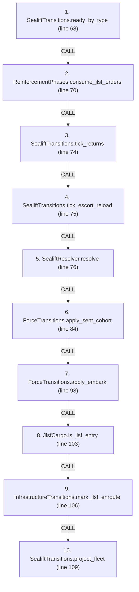
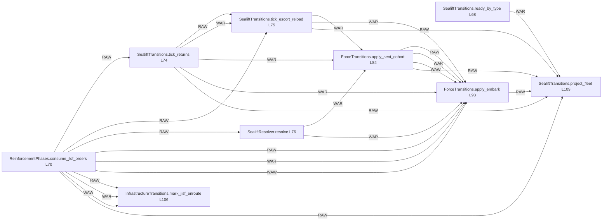

# Ordering: `ReinforcementPhases.resolve_sealift_turn`

> **Reading aid, not an execution contract.** No detected edge is not permission to reorder.
> GDScript reads and writes are conservative source analysis; transition writes are also
> checked against the mutation manifest. Potential conflicts may refer to different object
> instances or conditional branches.

Generator format v1; scan scope `scripts/**/*.gd` plus `project.godot` autoload aliases.
Generated from commit `8829181ae4b6`; input SHA-256 `1c5ff5483615f0cca5b2767540c56e9a13e1387c4c1a3c66db909a97ad2e94fb`;
tool/manifest/fixture SHA-256 `ea366ecafdb8f5cc7ecae22bb7554cd8802d1ed3433c5a903ecc07bbb7230f6c`; stable generation time `2026-08-02T09:03:12-04:00`.
Unresolved-analysis diagnostics on this page: **38**.

Source: `scripts/phases/ReinforcementPhases.gd:65`

## Lexical call-site map (CALL edges)

> Source order is not an execution count: loop calls repeat, branch calls may be skipped
> or mutually exclusive, and nested arguments execute before their outer call.

## State and RNG constraints

| Earlier node | Later node | Kinds | Shared evidence |
|---|---|---|---|
| `SealiftTransitions.ready_by_type` (L68) | `SealiftTransitions.project_fleet` (L109) | **WAR** | `ShipState.ready` |
| `ReinforcementPhases.consume_jlsf_orders` (L70) | `InfrastructureTransitions.mark_jlsf_enroute` (L106) | **RAW**, **WAR**, **WAW** | `InfrastructureNodeState.jlsf` |
| `ReinforcementPhases.consume_jlsf_orders` (L70) | `SealiftTransitions.project_fleet` (L109) | **RAW** | `SealiftState.mainland_pool` |
| `ReinforcementPhases.consume_jlsf_orders` (L70) | `SealiftTransitions.tick_returns` (L74) | **RAW** | `SealiftState.mainland_pool` |
| `ReinforcementPhases.consume_jlsf_orders` (L70) | `SealiftTransitions.tick_escort_reload` (L75) | **RAW** | `SealiftState.mainland_pool` |
| `ReinforcementPhases.consume_jlsf_orders` (L70) | `SealiftResolver.resolve` (L76) | **RAW** | `SealiftState.mainland_pool` |
| `ReinforcementPhases.consume_jlsf_orders` (L70) | `ForceTransitions.apply_embark` (L93) | **RAW**, **WAR**, **WAW** | `SealiftState.mainland_pool` |
| `SealiftTransitions.tick_returns` (L74) | `SealiftTransitions.project_fleet` (L109) | **RAW** | `SealiftState.return_pipeline` |
| `SealiftTransitions.tick_returns` (L74) | `SealiftTransitions.tick_escort_reload` (L75) | **RAW**, **WAR** | `SealiftState.escort_reload`, `SealiftState.escort_sam`, `SealiftState.return_pipeline` |
| `SealiftTransitions.tick_returns` (L74) | `ForceTransitions.apply_sent_cohort` (L84) | **WAR** | `SealiftState.cohorts` |
| `SealiftTransitions.tick_returns` (L74) | `ForceTransitions.apply_embark` (L93) | **WAR** | `SealiftState.cohorts`, `SealiftState.mainland_pool` |
| `SealiftTransitions.tick_escort_reload` (L75) | `SealiftTransitions.project_fleet` (L109) | **RAW** | `SealiftState.escort_reload`, `SealiftState.escort_sam` |
| `SealiftTransitions.tick_escort_reload` (L75) | `ForceTransitions.apply_sent_cohort` (L84) | **WAR** | `SealiftState.cohorts` |
| `SealiftTransitions.tick_escort_reload` (L75) | `ForceTransitions.apply_embark` (L93) | **WAR** | `SealiftState.cohorts`, `SealiftState.mainland_pool` |
| `SealiftResolver.resolve` (L76) | `ForceTransitions.apply_sent_cohort` (L84) | **WAR** | `SealiftState.cohorts` |
| `SealiftResolver.resolve` (L76) | `ForceTransitions.apply_embark` (L93) | **RAW**, **WAR** | `ForceEmbarkRequest.batch_bn_ids`, `ForceEmbarkRequest.batch_hulls_by_type`, `ForceEmbarkRequest.brigade_specs`, `ForceEmbarkRequest.ship_categories`, `SealiftState.cohorts`, `SealiftState.mainland_pool` |
| `ForceTransitions.apply_sent_cohort` (L84) | `SealiftTransitions.project_fleet` (L109) | **RAW** | `SealiftState.cohorts` |
| `ForceTransitions.apply_sent_cohort` (L84) | `ForceTransitions.apply_embark` (L93) | **RAW**, **WAR**, **WAW** | `ForceEmbarkReceipt.bn_ids_embarked`, `ForceEmbarkReceipt.brigade_id`, `ForceEmbarkReceipt.error`, `ForceEmbarkReceipt.success`, `SealiftCohort.bn_ids`, `SealiftCohort.cohort_state`, `SealiftCohort.hulls_by_type`, `SealiftState.cohorts` |
| `ForceTransitions.apply_embark` (L93) | `SealiftTransitions.project_fleet` (L109) | **RAW** | `SealiftState.cohorts`, `SealiftState.mainland_pool` |

## Detected campaign-state/RNG overview

This compact diagram shows up to 40 detected RAW/WAR/WAW/RNG constraints involving protected
campaign fields. The table above remains the complete conservative evidence.

## Call-site detail

Effects include the called method and every statically resolved helper beneath it.

| # | Call site | Reads | Writes | RNG streams |
|---:|---|---|---|---|
| 1 | `SealiftTransitions.ready_by_type` at `scripts/phases/ReinforcementPhases.gd:68` | `GameStateData.fleet`, `ShipState.ready` | — | — |
| 2 | `ReinforcementPhases.consume_jlsf_orders` at `scripts/phases/ReinforcementPhases.gd:70` | `GameDataStore.auto_jlsf`, `GameDataStore.beach_to_to`, `GameDataStore.beaches`, `GameDataStore.infrastructure`, `GameDataStore.jlsf_lift_bn_equiv`, `GameStateData.infrastructure_state`, `GameStateData.jlsf_orders`, `GameStateData.sealift_state`, `InfrastructureDef.hex_id`, `InfrastructureDef.id`; _+6 more_ | `GameStateData.jlsf_orders`, `InfrastructureNodeState.jlsf`, `SealiftState.mainland_pool` | — |
| 3 | `SealiftTransitions.tick_returns` at `scripts/phases/ReinforcementPhases.gd:74` | `GameStateData.sealift_state`, `SealiftState.cohorts`, `SealiftState.escort_reload`, `SealiftState.escort_sam`, `SealiftState.escort_sam_max`, `SealiftState.escort_sam_threshold`, `SealiftState.mainland_pool`, `SealiftState.return_pipeline` | `SealiftState.return_pipeline` | — |
| 4 | `SealiftTransitions.tick_escort_reload` at `scripts/phases/ReinforcementPhases.gd:75` | `GameStateData.sealift_state`, `SealiftState.cohorts`, `SealiftState.escort_reload`, `SealiftState.escort_sam`, `SealiftState.escort_sam_max`, `SealiftState.escort_sam_threshold`, `SealiftState.mainland_pool`, `SealiftState.return_pipeline` | `SealiftState.escort_reload`, `SealiftState.escort_sam` | — |
| 5 | `SealiftResolver.resolve` at `scripts/phases/ReinforcementPhases.gd:76` | `ForceEmbarkRequest.batch_bn_ids`, `GameDataStore.ship_defs`, `GameStateData.sealift_state`, `GameStateData.ship_reserve`, `SealiftState.cohorts`, `SealiftState.mainland_pool`, `ShipDef.carrying_capacity_bn_equiv`, `ShipDef.category`, `ShipDef.infrastructure`, `ShipDef.is_decoy`; _+1 more_ | `ForceEmbarkRequest.batch_bn_ids`, `ForceEmbarkRequest.batch_hulls_by_type`, `ForceEmbarkRequest.brigade_specs`, `ForceEmbarkRequest.ship_categories` | — |
| 6 | `ForceTransitions.apply_sent_cohort` at `scripts/phases/ReinforcementPhases.gd:84` | `ForceEmbarkReceipt.bn_ids_embarked`, `GameStateData.sealift_state`, `GameStateData.ship_reserve`, `SealiftState.cohorts` | `ForceEmbarkReceipt.bn_ids_embarked`, `ForceEmbarkReceipt.brigade_id`, `ForceEmbarkReceipt.error`, `ForceEmbarkReceipt.success`, `SealiftCohort.bn_ids`, `SealiftCohort.cohort_state`, `SealiftCohort.hulls_by_type`, `SealiftState.cohorts` | — |
| 7 | `ForceTransitions.apply_embark` at `scripts/phases/ReinforcementPhases.gd:93` | `ForceEmbarkReceipt.bn_ids_embarked`, `ForceEmbarkRequest.batch_bn_ids`, `ForceEmbarkRequest.batch_hulls_by_type`, `ForceEmbarkRequest.brigade_specs`, `ForceEmbarkRequest.destination`, `ForceEmbarkRequest.ship_categories`, `ForceEmbarkRequest.source`, `ForceValidationResult.error`, `GameStateData.sealift_state`, `GameStateData.ship_reserve`; _+2 more_ | `ForceEmbarkReceipt.bn_ids_embarked`, `ForceEmbarkReceipt.brigade_id`, `ForceEmbarkReceipt.error`, `ForceEmbarkReceipt.success`, `ForceValidationResult.error`, `SealiftCohort.bn_ids`, `SealiftCohort.cohort_state`, `SealiftCohort.hulls_by_type`, `SealiftState.cohorts`, `SealiftState.mainland_pool` | — |
| 8 | `JlsfCargo.is_jlsf_entry` at `scripts/phases/ReinforcementPhases.gd:103` | `GameStateData.infrastructure_state` | — | — |
| 9 | `InfrastructureTransitions.mark_jlsf_enroute` at `scripts/phases/ReinforcementPhases.gd:106` | `GameStateData.infrastructure_state`, `InfrastructureNodeState.jlsf`, `InfrastructureNodeState.node_status`, `InfrastructureNodeState.repair_turns_remaining`, `InfrastructureState.nodes` | `InfrastructureNodeState.jlsf` | — |
| 10 | `SealiftTransitions.project_fleet` at `scripts/phases/ReinforcementPhases.gd:109` | `GameStateData.fleet`, `GameStateData.sealift_state`, `SealiftState.cohorts`, `SealiftState.escort_reload`, `SealiftState.escort_sam`, `SealiftState.escort_sam_max`, `SealiftState.escort_sam_threshold`, `SealiftState.mainland_pool`, `SealiftState.return_pipeline`, `ShipState.destroyed`; _+7 more_ | `ShipState.offloading`, `ShipState.ready`, `ShipState.returning`, `ShipState.surviving_sent` | — |

## Analysis limits found here

Showing 30 of 38 diagnostics; class pages provide the narrower context.

| Kind | Source | Why it matters |
|---|---|---|
| `untyped_alias` | `scripts/calc/ForceValidationHelper.gd:20` `var batch_ids: Variant = _unique_ids(request.batch_bn_ids, "embark batch")` | The receiver type could not be proven. |
| `untyped_iteration` | `scripts/calc/ForceValidationHelper.gd:33` `for spec_value in request.brigade_specs:` | The collection element type could not be proven. |
| `unresolved_receiver` | `scripts/calc/ForceValidationHelper.gd:244` `for id_value in cohort.bn_ids:` | A protected field name appeared on an unresolved receiver. |
| `untyped_iteration` | `scripts/calc/ForceValidationHelper.gd:244` `for id_value in cohort.bn_ids:` | The collection element type could not be proven. |
| `multi_call_statement` | `scripts/calc/SealiftResolver.gd:111` `return { "bn_ids": _bn_ids(orphan_bns), "hulls_by_type": adopted_hulls, "ship_categories": _ship_category_stamps( orphan_bns, snapshot["bn_equiv_assigned"], ship_defs), }` | Multiple calls share one statement; the map preserves lexical sites, not nested evaluation order. |
| `untyped_alias` | `scripts/calc/SealiftResolver.gd:220` `var n := int(ready.get(ship_def.name, 0))` | The receiver type could not be proven. |
| `nested_index_unanalysed` | `scripts/calc/SealiftResolver.gd:251` `stamps[String((bns[idx] as Dictionary).get("id", ""))] = category` | Nested collection indexes exceed the balanced-chain subset; this statement contributes no field effects. |
| `unresolved_receiver` | `scripts/calc/SealiftResolver.gd:259` `for bn_id in cohort.bn_ids:` | A protected field name appeared on an unresolved receiver. |
| `untyped_iteration` | `scripts/calc/SealiftResolver.gd:259` `for bn_id in cohort.bn_ids:` | The collection element type could not be proven. |
| `callable_or_lambda` | `scripts/calc/ShipLoadingModel.gd:55` `sorted_carriers.sort_custom(func(a: Dictionary, b: Dictionary) -> bool: if not is_equal_approx(float(a["capacity"]), float(b["capacity"])): return float(a["capacity"]) > float(b…` | Callable/lambda dataflow is outside this analyser. |
| `callable_or_lambda` | `scripts/calc/ShipLoadingModel.gd:126` `sorted_carriers.sort_custom(func(a: Dictionary, b: Dictionary) -> bool: if not is_equal_approx(float(a["capacity"]), float(b["capacity"])): return float(a["capacity"]) > float(b…` | Callable/lambda dataflow is outside this analyser. |
| `untyped_alias` | `scripts/model/InfrastructureState.gd:43` `var node_val: Variant = nodes[id]` | The receiver type could not be proven. |
| `unresolved_receiver` | `scripts/model/SealiftState.gd:101` `if cohort.cohort_state != STATE_SENT and cohort.cohort_state != STATE_OFFLOADING:` | A protected field name appeared on an unresolved receiver. |
| `unresolved_receiver` | `scripts/model/SealiftState.gd:102` `push_error("SealiftState: cohort has illegal state %s" % cohort.cohort_state)` | A protected field name appeared on an unresolved receiver. |
| `unresolved_receiver` | `scripts/model/SealiftState.gd:104` `for count in cohort.hulls_by_type.values():` | A protected field name appeared on an unresolved receiver. |
| `untyped_iteration` | `scripts/model/SealiftState.gd:104` `for count in cohort.hulls_by_type.values():` | The collection element type could not be proven. |
| `untyped_iteration` | `scripts/transitions/ForceTransitions.gd:283` `for spec_value in request.brigade_specs:` | The collection element type could not be proven. |
| `untyped_iteration` | `scripts/transitions/ForceTransitions.gd:291` `for pool_entry_value in sealift_state.mainland_pool:` | The collection element type could not be proven. |
| `untyped_iteration` | `scripts/transitions/ForceTransitions.gd:313` `for pool_entry_value in sealift_state.mainland_pool:` | The collection element type could not be proven. |
| `unresolved_receiver` | `scripts/transitions/ForceTransitions.gd:406` `for bid in cohort.bn_ids:` | A protected field name appeared on an unresolved receiver. |
| `untyped_iteration` | `scripts/transitions/ForceTransitions.gd:406` `for bid in cohort.bn_ids:` | The collection element type could not be proven. |
| `untyped_alias` | `scripts/transitions/InfrastructureTransitions.gd:144` `var node_value: Variant = state.nodes.get(port_id)` | The receiver type could not be proven. |
| `untyped_iteration` | `scripts/transitions/SealiftTransitions.gd:130` `for ship_type in state.fleet.keys():` | The collection element type could not be proven. |
| `untyped_iteration` | `scripts/transitions/SealiftTransitions.gd:144` `for ship_type in state.return_pipeline.keys():` | The collection element type could not be proven. |
| `untyped_iteration` | `scripts/transitions/SealiftTransitions.gd:146` `for slot_value in (state.return_pipeline[ship_type] as Array):` | The collection element type could not be proven. |
| `untyped_iteration` | `scripts/transitions/SealiftTransitions.gd:215` `for ship_type in state.escort_reload.keys():` | The collection element type could not be proven. |
| `untyped_alias` | `scripts/transitions/SealiftTransitions.gd:216` `var remaining := int(state.escort_reload[ship_type]) - 1` | The receiver type could not be proven. |
| `untyped_iteration` | `scripts/transitions/SealiftTransitions.gd:313` `for ship_type in state.fleet.keys():` | The collection element type could not be proven. |
| `unresolved_receiver` | `scripts/transitions/SealiftTransitions.gd:347` `for ship_type in cohort.hulls_by_type.keys():` | A protected field name appeared on an unresolved receiver. |
| `untyped_iteration` | `scripts/transitions/SealiftTransitions.gd:347` `for ship_type in cohort.hulls_by_type.keys():` | The collection element type could not be proven. |
| _…_ | _8 additional diagnostics omitted from this page_ | See the called class pages. |
