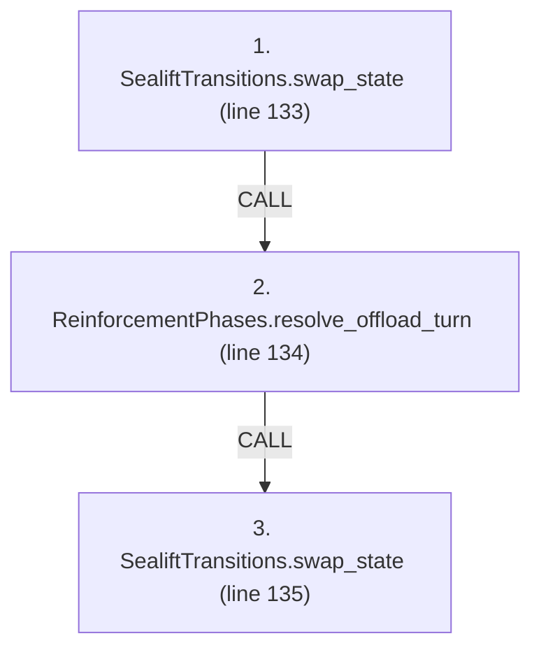
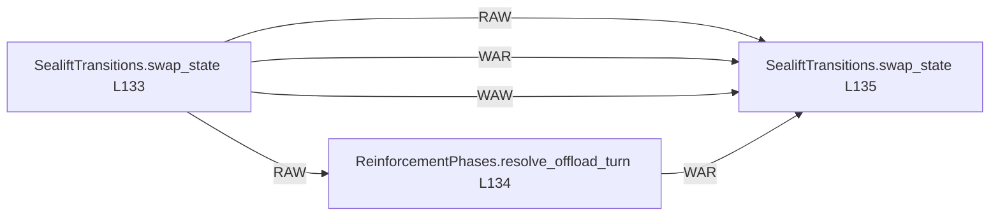

# Ordering: `ReinforcementPhases.resolve_unopposed_offload_turn`

> **Reading aid, not an execution contract.** No detected edge is not permission to reorder.
> GDScript reads and writes are conservative source analysis; transition writes are also
> checked against the mutation manifest. Potential conflicts may refer to different object
> instances or conditional branches.

Generator format v1; scan scope `scripts/**/*.gd` plus `project.godot` autoload aliases.
Generated from commit `8829181ae4b6`; input SHA-256 `1c5ff5483615f0cca5b2767540c56e9a13e1387c4c1a3c66db909a97ad2e94fb`;
tool/manifest/fixture SHA-256 `ea366ecafdb8f5cc7ecae22bb7554cd8802d1ed3433c5a903ecc07bbb7230f6c`; stable generation time `2026-08-02T09:03:12-04:00`.
Unresolved-analysis diagnostics on this page: **56**.

Source: `scripts/phases/ReinforcementPhases.gd:131`

## Lexical call-site map (CALL edges)

> Source order is not an execution count: loop calls repeat, branch calls may be skipped
> or mutually exclusive, and nested arguments execute before their outer call.

## State and RNG constraints

| Earlier node | Later node | Kinds | Shared evidence |
|---|---|---|---|
| `SealiftTransitions.swap_state` (L133) | `ReinforcementPhases.resolve_offload_turn` (L134) | **RAW** | `GameStateData.sealift_state` |
| `SealiftTransitions.swap_state` (L133) | `SealiftTransitions.swap_state` (L135) | **RAW**, **WAR**, **WAW** | `GameStateData.sealift_state` |
| `ReinforcementPhases.resolve_offload_turn` (L134) | `SealiftTransitions.swap_state` (L135) | **WAR** | `GameStateData.sealift_state` |

## Detected campaign-state/RNG overview

This compact diagram shows up to 40 detected RAW/WAR/WAW/RNG constraints involving protected
campaign fields. The table above remains the complete conservative evidence.

## Call-site detail

Effects include the called method and every statically resolved helper beneath it.

| # | Call site | Reads | Writes | RNG streams |
|---:|---|---|---|---|
| 1 | `SealiftTransitions.swap_state` at `scripts/phases/ReinforcementPhases.gd:133` | `GameStateData.sealift_state` | `GameStateData.sealift_state` | — |
| 2 | `ReinforcementPhases.resolve_offload_turn` at `scripts/phases/ReinforcementPhases.gd:134` | `BeachDef.depth`, `BeachDef.floating_piers`, `BeachDef.hex_id`, `BeachDef.jackup_barge`, `BeachDef.offload_rate`, `Brigade.composition`, `Brigade.destroyed`, `Brigade.hex_id`, `Brigade.id`, `Brigade.team`; _+55 more_ | `Brigade.entry_bearing`, `Brigade.hex_id`, `ForceOffloadReceipt.bn_ids_landed`, `ForceOffloadReceipt.error`, `ForceOffloadReceipt.landed_brigade_ids`, `ForceOffloadReceipt.landings`, `ForceOffloadReceipt.placement_receipts`, `ForceOffloadReceipt.success`, `ForceOffloadRequest.cargo_arrivals`, `ForceOffloadRequest.landings`; _+25 more_ | — |
| 3 | `SealiftTransitions.swap_state` at `scripts/phases/ReinforcementPhases.gd:135` | `GameStateData.sealift_state` | `GameStateData.sealift_state` | — |

## Analysis limits found here

Showing 30 of 56 diagnostics; class pages provide the narrower context.

| Kind | Source | Why it matters |
|---|---|---|
| `untyped_alias` | `scripts/OffloadCalculator.gd:113` `var bid := String(brigade.get("brigade_id", ""))` | The receiver type could not be proven. |
| `untyped_alias` | `scripts/OffloadCalculator.gd:124` `var bid := String(brigade.get("brigade_id", ""))` | The receiver type could not be proven. |
| `untyped_alias` | `scripts/OffloadCalculator.gd:170` `var locked := int(brigade.get("locked_beach", 0))` | The receiver type could not be proven. |
| `untyped_alias` | `scripts/OffloadCalculator.gd:180` `var locked := int(brigade.get("locked_beach", 0))` | The receiver type could not be proven. |
| `untyped_iteration` | `scripts/OffloadCalculator.gd:248` `for bn in brigade.get("bns", []):` | The collection element type could not be proven. |
| `untyped_iteration` | `scripts/calc/ForceValidationHelper.gd:122` `for landing_value in request.landings:` | The collection element type could not be proven. |
| `untyped_iteration` | `scripts/calc/ForceValidationHelper.gd:127` `for arrival_value in request.cargo_arrivals:` | The collection element type could not be proven. |
| `unresolved_receiver` | `scripts/calc/ForceValidationHelper.gd:232` `if String(battalion_value.type) == battalion_type and int(battalion_value.qty) > 0:` | A protected field name appeared on an unresolved receiver. |
| `unresolved_receiver` | `scripts/calc/ForceValidationHelper.gd:253` `if cohort.cohort_state != state_label:` | A protected field name appeared on an unresolved receiver. |
| `unresolved_receiver` | `scripts/calc/ForceValidationHelper.gd:255` `for id_value in cohort.bn_ids:` | A protected field name appeared on an unresolved receiver. |
| `untyped_iteration` | `scripts/calc/ForceValidationHelper.gd:255` `for id_value in cohort.bn_ids:` | The collection element type could not be proven. |
| `untyped_iteration` | `scripts/calc/HexOwnershipCalculator.gd:27` `for brigade_id_value in data_store.get_brigades_in_hex(hex_id):` | The collection element type could not be proven. |
| `untyped_alias` | `scripts/calc/InfrastructureResolver.gd:38` `var def_val: Variant = infra_defs.get(id)` | The receiver type could not be proven. |
| `untyped_alias` | `scripts/calc/InfrastructureResolver.gd:44` `var is_red := String(owner_by_hex.get(def_data.hex_id, "")) == HexOwner.RED` | The receiver type could not be proven. |
| `untyped_alias` | `scripts/calc/InfrastructureResolver.gd:86` `var def_val: Variant = infra_defs.get(id)` | The receiver type could not be proven. |
| `multi_call_statement` | `scripts/calc/OffloadResolver.gd:78` `var manifest := OffloadCalculator.resolve_offload_day( turn_number, beach_capacity, troop_reserve, priority_order(troop_reserve), infra_nodes, cost_config, valve["occupancy"], v…` | Multiple calls share one statement; the map preserves lexical sites, not nested evaluation order. |
| `nested_index_unanalysed` | `scripts/calc/OffloadResolver.gd:191` `ids[brigade_id][String(landed["bn_id"])] = true` | Nested collection indexes exceed the balanced-chain subset; this statement contributes no field effects. |
| `untyped_alias` | `scripts/model/InfrastructureState.gd:43` `var node_val: Variant = nodes[id]` | The receiver type could not be proven. |
| `unresolved_receiver` | `scripts/model/SealiftState.gd:101` `if cohort.cohort_state != STATE_SENT and cohort.cohort_state != STATE_OFFLOADING:` | A protected field name appeared on an unresolved receiver. |
| `unresolved_receiver` | `scripts/model/SealiftState.gd:102` `push_error("SealiftState: cohort has illegal state %s" % cohort.cohort_state)` | A protected field name appeared on an unresolved receiver. |
| `unresolved_receiver` | `scripts/model/SealiftState.gd:104` `for count in cohort.hulls_by_type.values():` | A protected field name appeared on an unresolved receiver. |
| `untyped_iteration` | `scripts/model/SealiftState.gd:104` `for count in cohort.hulls_by_type.values():` | The collection element type could not be proven. |
| `multi_call_statement` | `scripts/phases/ReinforcementPhases.gd:164` `var outcome := OffloadResolver.resolve( state.turn_number, state.ship_reserve, GameData.beaches, GameData.brigades, infra_nodes, cost_config, GameData.beach_to_to, owner_by_hex())` | Multiple calls share one statement; the map preserves lexical sites, not nested evaluation order. |
| `multi_call_statement` | `scripts/phases/ReinforcementPhases.gd:184` `SealiftTransitions.release_hulls( state.sealift_state, ForceTransitions.free_emptied_cohorts(state.sealift_state), GameData.amphibious_return_time_turns)` | Multiple calls share one statement; the map preserves lexical sites, not nested evaluation order. |
| `untyped_iteration` | `scripts/phases/ReinforcementPhases.gd:203` `for hex_id in GameData.hex_states.keys():` | The collection element type could not be proven. |
| `multi_call_statement` | `scripts/phases/ReinforcementPhases.gd:214` `if not reserve_or_pool_has(state, JlsfCargo.brigade_id_for(port_id)):` | Multiple calls share one statement; the map preserves lexical sites, not nested evaluation order. |
| `untyped_iteration` | `scripts/phases/ReinforcementPhases.gd:219` `for entry_value in state.ship_reserve:` | The collection element type could not be proven. |
| `untyped_iteration` | `scripts/phases/ReinforcementPhases.gd:223` `for entry_value in state.sealift_state.mainland_pool:` | The collection element type could not be proven. |
| `untyped_iteration` | `scripts/transitions/ForceTransitions.gd:438` `for arrival_value in request.cargo_arrivals:` | The collection element type could not be proven. |
| `multi_call_statement` | `scripts/transitions/ForceTransitions.gd:444` `return ForceOffloadReceipt.ok( placement_result["brigade_ids"], placement_result["landings"], _typed_string_array(troop_ids.keys()), placement_result["receipts"])` | Multiple calls share one statement; the map preserves lexical sites, not nested evaluation order. |
| _…_ | _26 additional diagnostics omitted from this page_ | See the called class pages. |
