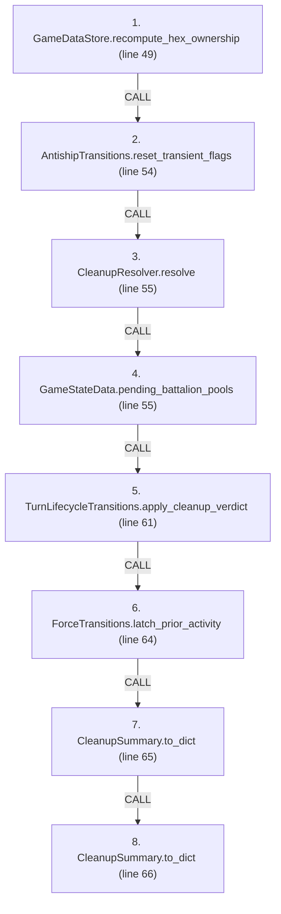
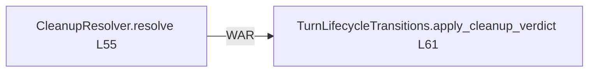

# Ordering: `TurnClosure.resolve_cleanup_phase`

> **Reading aid, not an execution contract.** No detected edge is not permission to reorder.
> GDScript reads and writes are conservative source analysis; transition writes are also
> checked against the mutation manifest. Potential conflicts may refer to different object
> instances or conditional branches.

Generator format v1; scan scope `scripts/**/*.gd` plus `project.godot` autoload aliases.
Generated from commit `8829181ae4b6`; input SHA-256 `1c5ff5483615f0cca5b2767540c56e9a13e1387c4c1a3c66db909a97ad2e94fb`;
tool/manifest/fixture SHA-256 `ea366ecafdb8f5cc7ecae22bb7554cd8802d1ed3433c5a903ecc07bbb7230f6c`; stable generation time `2026-08-02T09:03:12-04:00`.
Unresolved-analysis diagnostics on this page: **7**.

Source: `scripts/phases/TurnClosure.gd:48`

## Lexical call-site map (CALL edges)

> Source order is not an execution count: loop calls repeat, branch calls may be skipped
> or mutually exclusive, and nested arguments execute before their outer call.

## State and RNG constraints

| Earlier node | Later node | Kinds | Shared evidence |
|---|---|---|---|
| `CleanupResolver.resolve` (L55) | `TurnLifecycleTransitions.apply_cleanup_verdict` (L61) | **RAW**, **WAR** | `CleanupSummary.china_battalions_on_taiwan`, `CleanupSummary.game_over`, `CleanupSummary.winner`, `GameStateData._china_has_landed` |
| `CleanupResolver.resolve` (L55) | `CleanupSummary.to_dict` (L65) | **RAW** | `CleanupSummary.antiship_systems_reset`, `CleanupSummary.china_battalions_on_taiwan`, `CleanupSummary.game_over`, `CleanupSummary.taiwan_battalions_on_taiwan`, `CleanupSummary.victory_reason`, `CleanupSummary.winner` |
| `CleanupResolver.resolve` (L55) | `CleanupSummary.to_dict` (L66) | **RAW** | `CleanupSummary.antiship_systems_reset`, `CleanupSummary.china_battalions_on_taiwan`, `CleanupSummary.game_over`, `CleanupSummary.taiwan_battalions_on_taiwan`, `CleanupSummary.victory_reason`, `CleanupSummary.winner` |

## Detected campaign-state/RNG overview

This compact diagram shows up to 40 detected RAW/WAR/WAW/RNG constraints involving protected
campaign fields. The table above remains the complete conservative evidence.

## Call-site detail

Effects include the called method and every statically resolved helper beneath it.

| # | Call site | Reads | Writes | RNG streams |
|---:|---|---|---|---|
| 1 | `GameDataStore.recompute_hex_ownership` at `scripts/phases/TurnClosure.gd:49` | `Brigade.destroyed`, `Brigade.team`, `GameDataStore.brigades`, `GameDataStore.brigades_by_hex`, `GameDataStore.hex_lookup`, `GameDataStore.hex_states` | `HexState.hex_owner` | — |
| 2 | `AntishipTransitions.reset_transient_flags` at `scripts/phases/TurnClosure.gd:54` | `GameStateData.antiship_systems` | `AntishipSystem.active`, `AntishipSystem.destroyed_this_turn`, `AntishipSystem.fired`, `AntishipSystem.suppressed_now` | — |
| 3 | `CleanupResolver.resolve` at `scripts/phases/TurnClosure.gd:55` | `Brigade.composition`, `Brigade.hex_id`, `Brigade.id`, `Brigade.team`, `GameDataStore.brigades`, `GameDataStore.victory_config`, `GameStateData._china_has_landed`, `GameStateData.turn_number` | `CleanupSummary.antiship_systems_reset`, `CleanupSummary.china_battalions_on_taiwan`, `CleanupSummary.game_over`, `CleanupSummary.taiwan_battalions_on_taiwan`, `CleanupSummary.victory_reason`, `CleanupSummary.winner` | — |
| 4 | `GameStateData.pending_battalion_pools` at `scripts/phases/TurnClosure.gd:55` | `AirInsertionState.pool`, `GameStateData.air_insertion_state`, `GameStateData.sealift_state`, `GameStateData.ship_reserve`, `SealiftState.mainland_pool` | — | — |
| 5 | `TurnLifecycleTransitions.apply_cleanup_verdict` at `scripts/phases/TurnClosure.gd:61` | `CleanupSummary.china_battalions_on_taiwan`, `CleanupSummary.game_over`, `CleanupSummary.winner`, `GameStateData._china_has_landed`, `GameStateData.last_cleanup_summary` | `GameStateData._china_has_landed`, `GameStateData.game_over`, `GameStateData.winner` | — |
| 6 | `ForceTransitions.latch_prior_activity` at `scripts/phases/TurnClosure.gd:64` | `Brigade.fought_this_turn`, `Brigade.moved_admin_this_turn`, `Brigade.moved_this_turn`, `Brigade.organization`, `ForceActivityRequest.operation`, `GameDataStore.brigades` | `Brigade.fought_last_turn`, `Brigade.fought_this_turn`, `Brigade.moved_admin_this_turn`, `Brigade.moved_last_turn`, `Brigade.moved_this_turn`, `Brigade.organization`, `ForceActivityRequest.operation` | — |
| 7 | `CleanupSummary.to_dict` at `scripts/phases/TurnClosure.gd:65` | `CleanupSummary.antiship_systems_reset`, `CleanupSummary.china_battalions_on_taiwan`, `CleanupSummary.game_over`, `CleanupSummary.taiwan_battalions_on_taiwan`, `CleanupSummary.victory_reason`, `CleanupSummary.winner`, `GameStateData.last_cleanup_summary` | — | — |
| 8 | `CleanupSummary.to_dict` at `scripts/phases/TurnClosure.gd:66` | `CleanupSummary.antiship_systems_reset`, `CleanupSummary.china_battalions_on_taiwan`, `CleanupSummary.game_over`, `CleanupSummary.taiwan_battalions_on_taiwan`, `CleanupSummary.victory_reason`, `CleanupSummary.winner`, `GameStateData.last_cleanup_summary` | — | — |

## Analysis limits found here

Showing 7 of 7 diagnostics; class pages provide the narrower context.

| Kind | Source | Why it matters |
|---|---|---|
| `untyped_alias` | `scripts/calc/CleanupResolver.gd:35` `var counted: Variant = victory_config.get("taiwan_hexes", null)` | The receiver type could not be proven. |
| `untyped_alias` | `scripts/calc/CleanupResolver.gd:51` `var not_ashore := int(not_ashore_by_brigade.get(brigade.id, 0))` | The receiver type could not be proven. |
| `untyped_alias` | `scripts/calc/CleanupResolver.gd:52` `var bn := maxi(0, brigade.get_battalion_count() - not_ashore)` | The receiver type could not be proven. |
| `untyped_iteration` | `scripts/calc/HexOwnershipCalculator.gd:27` `for brigade_id_value in data_store.get_brigades_in_hex(hex_id):` | The collection element type could not be proven. |
| `unresolved_receiver` | `scripts/model/Brigade.gd:60` `total += battalion.qty` | A protected field name appeared on an unresolved receiver. |
| `multi_call_statement` | `scripts/phases/TurnClosure.gd:55` `var outcome := CleanupResolver.resolve( reset_count, GameData.brigades, state.pending_battalion_pools(), GameData.victory_config, state.turn_number, state._china_has_landed)` | Multiple calls share one statement; the map preserves lexical sites, not nested evaluation order. |
| `untyped_alias` | `scripts/transitions/MapTransitions.gd:98` `var state_value: Variant = data_store.hex_states.get(hex_id)` | The receiver type could not be proven. |
