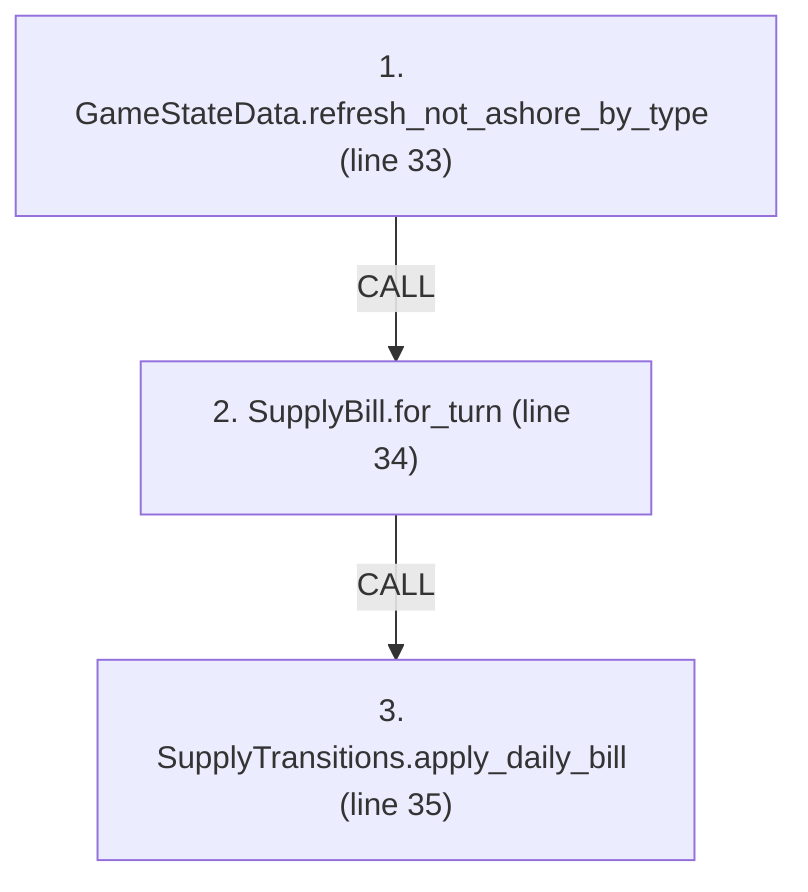
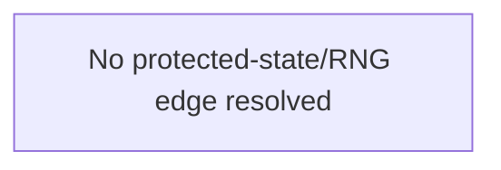

# Ordering: `TurnClosure.resolve_supply_turn`

> **Reading aid, not an execution contract.** No detected edge is not permission to reorder.
> GDScript reads and writes are conservative source analysis; transition writes are also
> checked against the mutation manifest. Potential conflicts may refer to different object
> instances or conditional branches.

Generator format v1; scan scope `scripts/**/*.gd` plus `project.godot` autoload aliases.
Generated from commit `8829181ae4b6`; input SHA-256 `1c5ff5483615f0cca5b2767540c56e9a13e1387c4c1a3c66db909a97ad2e94fb`;
tool/manifest/fixture SHA-256 `ea366ecafdb8f5cc7ecae22bb7554cd8802d1ed3433c5a903ecc07bbb7230f6c`; stable generation time `2026-08-02T09:03:12-04:00`.
Unresolved-analysis diagnostics on this page: **5**.

Source: `scripts/phases/TurnClosure.gd:26`

## Lexical call-site map (CALL edges)

> Source order is not an execution count: loop calls repeat, branch calls may be skipped
> or mutually exclusive, and nested arguments execute before their outer call.

## State and RNG constraints

| Earlier node | Later node | Kinds | Shared evidence |
|---|---|---|---|
| _No constraint edge resolved_ | | | This is not evidence that calls are reorderable. |

## Detected campaign-state/RNG overview

This compact diagram shows up to 40 detected RAW/WAR/WAW/RNG constraints involving protected
campaign fields. The table above remains the complete conservative evidence.

## Call-site detail

Effects include the called method and every statically resolved helper beneath it.

| # | Call site | Reads | Writes | RNG streams |
|---:|---|---|---|---|
| 1 | `GameStateData.refresh_not_ashore_by_type` at `scripts/phases/TurnClosure.gd:33` | `AirInsertionState.pool`, `GameStateData.air_insertion_state`, `GameStateData.not_ashore_by_type`, `GameStateData.sealift_state`, `GameStateData.ship_reserve`, `SealiftState.mainland_pool` | `GameStateData.not_ashore_by_type` | — |
| 2 | `SupplyBill.for_turn` at `scripts/phases/TurnClosure.gd:34` | `Battalion.qty`, `Battalion.type`, `Brigade.composition`, `Brigade.destroyed`, `Brigade.fought_this_turn`, `Brigade.hex_id`, `Brigade.id`, `Brigade.moved_this_turn`, `Brigade.nato_type`, `Brigade.team`; _+2 more_ | — | — |
| 3 | `SupplyTransitions.apply_daily_bill` at `scripts/phases/TurnClosure.gd:35` | `GameStateData.supply_state`, `SupplyState.current_dos_tons`, `SupplyState.day_history` | `SupplyState.current_dos_tons`, `SupplyState.day_history` | — |

## Analysis limits found here

Showing 5 of 5 diagnostics; class pages provide the narrower context.

| Kind | Source | Why it matters |
|---|---|---|
| `untyped_iteration` | `scripts/calc/SupplyBill.gd:22` `for brigade_value in store.brigades.values():` | The collection element type could not be proven. |
| `multi_call_statement` | `scripts/calc/SupplyBill.gd:30` `return DosConsumption.calculate_consumption( active_red_battalion_units(store, not_ashore), moved_ids, engaged_ids, turn_number)` | Multiple calls share one statement; the map preserves lexical sites, not nested evaluation order. |
| `untyped_iteration` | `scripts/calc/SupplyBill.gd:40` `for brigade_value in store.brigades.values():` | The collection element type could not be proven. |
| `multi_call_statement` | `scripts/model/GameStateData.gd:126` `not_ashore_by_type = PendingBattalions.by_brigade_and_type(pending_battalion_pools())` | Multiple calls share one statement; the map preserves lexical sites, not nested evaluation order. |
| `untyped_alias` | `scripts/phases/TurnClosure.gd:33` `var not_ashore := state.refresh_not_ashore_by_type()` | The receiver type could not be proven. |
