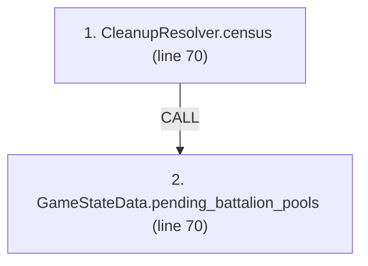
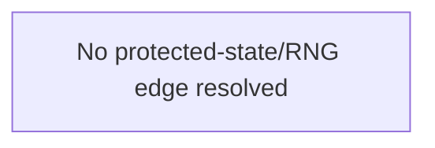

# Ordering: `TurnClosure.taiwan_battalion_census`

> **Reading aid, not an execution contract.** No detected edge is not permission to reorder.
> GDScript reads and writes are conservative source analysis; transition writes are also
> checked against the mutation manifest. Potential conflicts may refer to different object
> instances or conditional branches.

Generator format v1; scan scope `scripts/**/*.gd` plus `project.godot` autoload aliases.
Generated from commit `7bbf08693b44`; input SHA-256 `c879af92cf7693c7df1119a11083764377c92a9410144e7b95f361f509613378`;
tool/manifest/fixture SHA-256 `ea366ecafdb8f5cc7ecae22bb7554cd8802d1ed3433c5a903ecc07bbb7230f6c`; stable generation time `2026-08-02T17:09:31-04:00`.
Unresolved-analysis diagnostics on this page: **5**.

Source: `scripts/phases/TurnClosure.gd:69`

## Lexical call-site map (CALL edges)

> Source order is not an execution count: loop calls repeat, branch calls may be skipped
> or mutually exclusive, and nested arguments execute before their outer call.

## State and RNG constraints

| Earlier node | Later node | Kinds | Shared evidence |
|---|---|---|---|
| _No constraint edge resolved_ | | | This is not evidence that calls are reorderable. |

## Detected campaign-state/RNG overview

This compact diagram shows up to 40 detected RAW/WAR/WAW/RNG constraints involving protected
campaign fields. The table above remains the complete conservative evidence.

## Call-site detail

Effects include the called method and every statically resolved helper beneath it.

| # | Call site | Reads | Writes | RNG streams |
|---:|---|---|---|---|
| 1 | `CleanupResolver.census` at `scripts/phases/TurnClosure.gd:70` | `Brigade.composition`, `Brigade.hex_id`, `Brigade.id`, `Brigade.team`, `GameDataStore.brigades`, `GameDataStore.victory_config` | — | — |
| 2 | `GameStateData.pending_battalion_pools` at `scripts/phases/TurnClosure.gd:70` | `AirInsertionState.pool`, `GameStateData.air_insertion_state`, `GameStateData.sealift_state`, `GameStateData.ship_reserve`, `SealiftState.mainland_pool` | — | — |

## Analysis limits found here

Showing 5 of 5 diagnostics; class pages provide the narrower context.

| Kind | Source | Why it matters |
|---|---|---|
| `untyped_alias` | `scripts/calc/CleanupResolver.gd:35` `var counted: Variant = victory_config.get("taiwan_hexes", null)` | The receiver type could not be proven. |
| `untyped_alias` | `scripts/calc/CleanupResolver.gd:51` `var not_ashore := int(not_ashore_by_brigade.get(brigade.id, 0))` | The receiver type could not be proven. |
| `untyped_alias` | `scripts/calc/CleanupResolver.gd:52` `var bn := maxi(0, brigade.get_battalion_count() - not_ashore)` | The receiver type could not be proven. |
| `unresolved_receiver` | `scripts/model/Brigade.gd:60` `total += battalion.qty` | A protected field name appeared on an unresolved receiver. |
| `multi_call_statement` | `scripts/phases/TurnClosure.gd:70` `return CleanupResolver.census( GameData.brigades, state.pending_battalion_pools(), GameData.victory_config)` | Multiple calls share one statement; the map preserves lexical sites, not nested evaluation order. |
