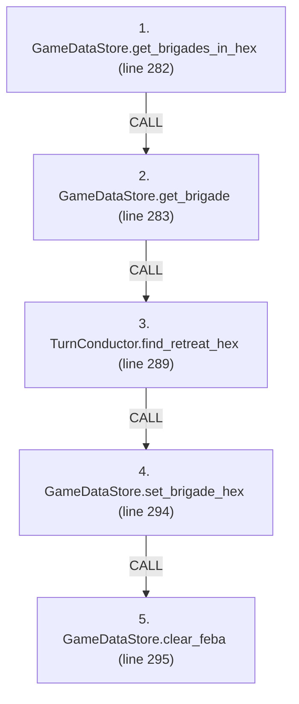
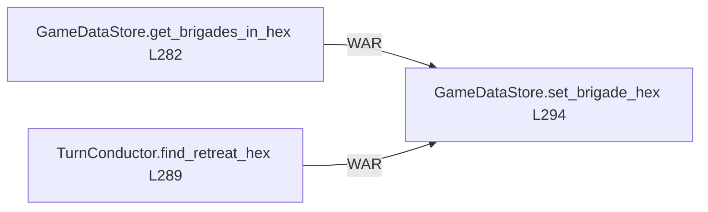

# Ordering: `TurnConductor.apply_feba_retreats`

> **Reading aid, not an execution contract.** No detected edge is not permission to reorder.
> GDScript reads and writes are conservative source analysis; transition writes are also
> checked against the mutation manifest. Potential conflicts may refer to different object
> instances or conditional branches.

Generator format v1; scan scope `scripts/**/*.gd` plus `project.godot` autoload aliases.
Generated from commit `7bbf08693b44`; input SHA-256 `c879af92cf7693c7df1119a11083764377c92a9410144e7b95f361f509613378`;
tool/manifest/fixture SHA-256 `ea366ecafdb8f5cc7ecae22bb7554cd8802d1ed3433c5a903ecc07bbb7230f6c`; stable generation time `2026-08-02T17:09:31-04:00`.
Unresolved-analysis diagnostics on this page: **6**.

Source: `scripts/phases/TurnConductor.gd:271`

## Lexical call-site map (CALL edges)

> Source order is not an execution count: loop calls repeat, branch calls may be skipped
> or mutually exclusive, and nested arguments execute before their outer call.

## State and RNG constraints

| Earlier node | Later node | Kinds | Shared evidence |
|---|---|---|---|
| `GameDataStore.get_brigades_in_hex` (L282) | `GameDataStore.set_brigade_hex` (L294) | **WAR** | `GameDataStore.brigades_by_hex` |
| `TurnConductor.find_retreat_hex` (L289) | `GameDataStore.set_brigade_hex` (L294) | **WAR** | `GameDataStore.brigades_by_hex` |

## Detected campaign-state/RNG overview

This compact diagram shows up to 40 detected RAW/WAR/WAW/RNG constraints involving protected
campaign fields. The table above remains the complete conservative evidence.

## Call-site detail

Effects include the called method and every statically resolved helper beneath it.

| # | Call site | Reads | Writes | RNG streams |
|---:|---|---|---|---|
| 1 | `GameDataStore.get_brigades_in_hex` at `scripts/phases/TurnConductor.gd:282` | `GameDataStore.brigades_by_hex` | — | — |
| 2 | `GameDataStore.get_brigade` at `scripts/phases/TurnConductor.gd:283` | `GameDataStore.brigades` | — | — |
| 3 | `TurnConductor.find_retreat_hex` at `scripts/phases/TurnConductor.gd:289` | `Brigade.destroyed`, `Brigade.team`, `GameDataStore.brigades`, `GameDataStore.brigades_by_hex`, `GameDataStore.hex_lookup`, `GameDataStore.hex_states`, `GameDataStore.neighbor_lookup`, `GameDataStore.terrain_types`, `TerrainType.impassable` | — | — |
| 4 | `GameDataStore.set_brigade_hex` at `scripts/phases/TurnConductor.gd:294` | `Brigade.hex_id`, `Brigade.id`, `ForcePlacementRequest.brigade_id`, `ForcePlacementRequest.destination`, `ForcePlacementRequest.destination_hex`, `ForcePlacementRequest.entry_bearing`, `ForcePlacementRequest.has_entry_bearing`, `ForcePlacementRequest.phase`, `GameDataStore.brigades`, `GameDataStore.brigades_by_hex`; _+1 more_ | `Brigade.entry_bearing`, `Brigade.hex_id`, `ForcePlacementReceipt.brigade_id`, `ForcePlacementReceipt.destination`, `ForcePlacementReceipt.new_hex`, `ForcePlacementReceipt.old_hex`, `ForcePlacementReceipt.phase`, `ForcePlacementRequest.brigade_id`, `ForcePlacementRequest.destination`, `ForcePlacementRequest.destination_hex`; _+2 more_ | — |
| 5 | `GameDataStore.clear_feba` at `scripts/phases/TurnConductor.gd:295` | `GameDataStore.hex_states` | `HexState.feba_km` | — |

## Analysis limits found here

Showing 6 of 6 diagnostics; class pages provide the narrower context.

| Kind | Source | Why it matters |
|---|---|---|
| `multi_call_statement` | `scripts/GameData.gd:559` `ForceTransitions.place_brigade(self, ForcePlacementRequest.ashore(brigade_id, hex_id, "GameData façade"))` | Multiple calls share one statement; the map preserves lexical sites, not nested evaluation order. |
| `untyped_alias` | `scripts/phases/TurnConductor.gd:320` `var owner := String(GameData.hex_states[neighbor_id].hex_owner)` | The receiver type could not be proven. |
| `multi_call_statement` | `scripts/transitions/ForceTransitions.gd:53` `return place_brigade(data_store, ForcePlacementRequest.off_map(brigade_id, "remove"))` | Multiple calls share one statement; the map preserves lexical sites, not nested evaluation order. |
| `callable_or_lambda` | `scripts/transitions/ForceTransitions.gd:605` `data_store.brigades_by_hex[old_hex] = (data_store.brigades_by_hex[old_hex] as Array).filter( func(id: String) -> bool: return id != brigade.id)` | Callable/lambda dataflow is outside this analyser. |
| `untyped_alias` | `scripts/transitions/ForceTransitions.gd:619` `var violations := data_store.validate_runtime_indexes()` | The receiver type could not be proven. |
| `untyped_alias` | `scripts/transitions/MapTransitions.gd:98` `var state_value: Variant = data_store.hex_states.get(hex_id)` | The receiver type could not be proven. |
