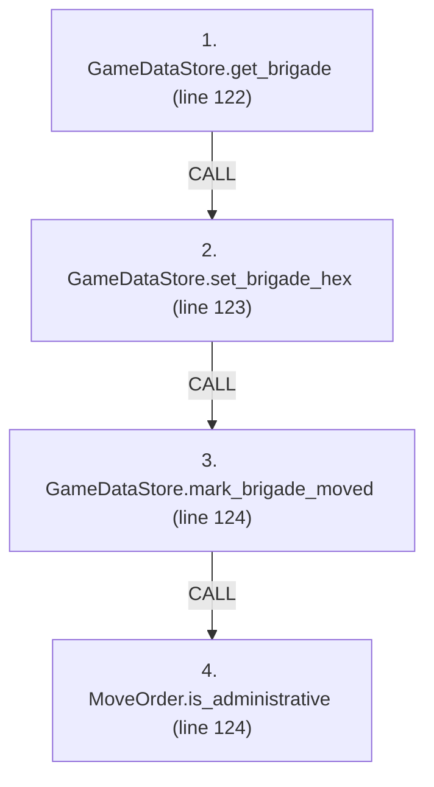
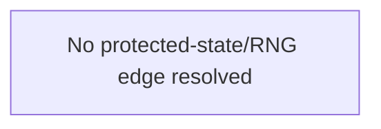

# Ordering: `TurnConductor.apply_move_orders`

> **Reading aid, not an execution contract.** No detected edge is not permission to reorder.
> GDScript reads and writes are conservative source analysis; transition writes are also
> checked against the mutation manifest. Potential conflicts may refer to different object
> instances or conditional branches.

Generator format v1; scan scope `scripts/**/*.gd` plus `project.godot` autoload aliases.
Generated from commit `7bbf08693b44`; input SHA-256 `c879af92cf7693c7df1119a11083764377c92a9410144e7b95f361f509613378`;
tool/manifest/fixture SHA-256 `ea366ecafdb8f5cc7ecae22bb7554cd8802d1ed3433c5a903ecc07bbb7230f6c`; stable generation time `2026-08-02T17:09:31-04:00`.
Unresolved-analysis diagnostics on this page: **7**.

Source: `scripts/phases/TurnConductor.gd:119`

## Lexical call-site map (CALL edges)

> Source order is not an execution count: loop calls repeat, branch calls may be skipped
> or mutually exclusive, and nested arguments execute before their outer call.

## State and RNG constraints

| Earlier node | Later node | Kinds | Shared evidence |
|---|---|---|---|
| _No constraint edge resolved_ | | | This is not evidence that calls are reorderable. |

## Detected campaign-state/RNG overview

This compact diagram shows up to 40 detected RAW/WAR/WAW/RNG constraints involving protected
campaign fields. The table above remains the complete conservative evidence.

## Call-site detail

Effects include the called method and every statically resolved helper beneath it.

| # | Call site | Reads | Writes | RNG streams |
|---:|---|---|---|---|
| 1 | `GameDataStore.get_brigade` at `scripts/phases/TurnConductor.gd:122` | `GameDataStore.brigades`, `MoveOrder.brigade_id` | — | — |
| 2 | `GameDataStore.set_brigade_hex` at `scripts/phases/TurnConductor.gd:123` | `Brigade.hex_id`, `Brigade.id`, `ForcePlacementRequest.brigade_id`, `ForcePlacementRequest.destination`, `ForcePlacementRequest.destination_hex`, `ForcePlacementRequest.entry_bearing`, `ForcePlacementRequest.has_entry_bearing`, `ForcePlacementRequest.phase`, `GameDataStore.brigades`, `GameDataStore.brigades_by_hex`; _+3 more_ | `Brigade.entry_bearing`, `Brigade.hex_id`, `ForcePlacementReceipt.brigade_id`, `ForcePlacementReceipt.destination`, `ForcePlacementReceipt.new_hex`, `ForcePlacementReceipt.old_hex`, `ForcePlacementReceipt.phase`, `ForcePlacementRequest.brigade_id`, `ForcePlacementRequest.destination`, `ForcePlacementRequest.destination_hex`; _+2 more_ | — |
| 3 | `GameDataStore.mark_brigade_moved` at `scripts/phases/TurnConductor.gd:124` | `Brigade.fought_this_turn`, `Brigade.moved_admin_this_turn`, `Brigade.moved_this_turn`, `Brigade.organization`, `ForceActivityRequest.operation` | `Brigade.fought_last_turn`, `Brigade.fought_this_turn`, `Brigade.moved_admin_this_turn`, `Brigade.moved_last_turn`, `Brigade.moved_this_turn`, `Brigade.organization`, `ForceActivityRequest.operation` | — |
| 4 | `MoveOrder.is_administrative` at `scripts/phases/TurnConductor.gd:124` | `MoveOrder.mode` | — | — |

## Analysis limits found here

Showing 7 of 7 diagnostics; class pages provide the narrower context.

| Kind | Source | Why it matters |
|---|---|---|
| `multi_call_statement` | `scripts/GameData.gd:559` `ForceTransitions.place_brigade(self, ForcePlacementRequest.ashore(brigade_id, hex_id, "GameData façade"))` | Multiple calls share one statement; the map preserves lexical sites, not nested evaluation order. |
| `multi_call_statement` | `scripts/GameData.gd:577` `ForceTransitions.apply_activity(brigade, ForceActivityRequest.make(operation))` | Multiple calls share one statement; the map preserves lexical sites, not nested evaluation order. |
| `untyped_iteration` | `scripts/phases/TurnConductor.gd:120` `for order in state.orders[team]:` | The collection element type could not be proven. |
| `multi_call_statement` | `scripts/phases/TurnConductor.gd:124` `GameData.mark_brigade_moved(brigade, move_order.is_administrative())` | Multiple calls share one statement; the map preserves lexical sites, not nested evaluation order. |
| `multi_call_statement` | `scripts/transitions/ForceTransitions.gd:53` `return place_brigade(data_store, ForcePlacementRequest.off_map(brigade_id, "remove"))` | Multiple calls share one statement; the map preserves lexical sites, not nested evaluation order. |
| `callable_or_lambda` | `scripts/transitions/ForceTransitions.gd:605` `data_store.brigades_by_hex[old_hex] = (data_store.brigades_by_hex[old_hex] as Array).filter( func(id: String) -> bool: return id != brigade.id)` | Callable/lambda dataflow is outside this analyser. |
| `untyped_alias` | `scripts/transitions/ForceTransitions.gd:619` `var violations := data_store.validate_runtime_indexes()` | The receiver type could not be proven. |
