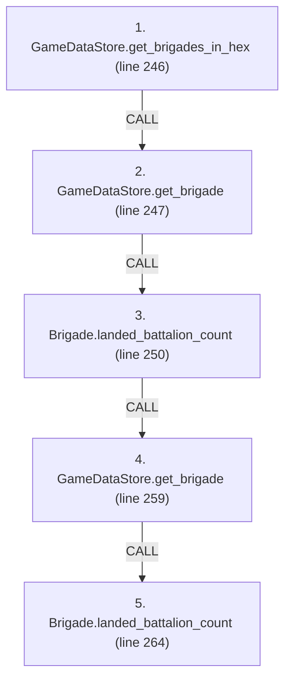
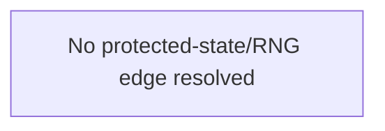

# Ordering: `TurnConductor.combat_contributors_for`

> **Reading aid, not an execution contract.** No detected edge is not permission to reorder.
> GDScript reads and writes are conservative source analysis; transition writes are also
> checked against the mutation manifest. Potential conflicts may refer to different object
> instances or conditional branches.

Generator format v1; scan scope `scripts/**/*.gd` plus `project.godot` autoload aliases.
Generated from commit `7bbf08693b44`; input SHA-256 `c879af92cf7693c7df1119a11083764377c92a9410144e7b95f361f509613378`;
tool/manifest/fixture SHA-256 `ea366ecafdb8f5cc7ecae22bb7554cd8802d1ed3433c5a903ecc07bbb7230f6c`; stable generation time `2026-08-02T17:09:31-04:00`.
Unresolved-analysis diagnostics on this page: **1**.

Source: `scripts/phases/TurnConductor.gd:242`

## Lexical call-site map (CALL edges)

> Source order is not an execution count: loop calls repeat, branch calls may be skipped
> or mutually exclusive, and nested arguments execute before their outer call.

## State and RNG constraints

| Earlier node | Later node | Kinds | Shared evidence |
|---|---|---|---|
| _No constraint edge resolved_ | | | This is not evidence that calls are reorderable. |

## Detected campaign-state/RNG overview

This compact diagram shows up to 40 detected RAW/WAR/WAW/RNG constraints involving protected
campaign fields. The table above remains the complete conservative evidence.

## Call-site detail

Effects include the called method and every statically resolved helper beneath it.

| # | Call site | Reads | Writes | RNG streams |
|---:|---|---|---|---|
| 1 | `GameDataStore.get_brigades_in_hex` at `scripts/phases/TurnConductor.gd:246` | `GameDataStore.brigades_by_hex` | — | — |
| 2 | `GameDataStore.get_brigade` at `scripts/phases/TurnConductor.gd:247` | `GameDataStore.brigades` | — | — |
| 3 | `Brigade.landed_battalion_count` at `scripts/phases/TurnConductor.gd:250` | `Battalion.qty`, `Battalion.type`, `Brigade.composition`, `Brigade.id` | — | — |
| 4 | `GameDataStore.get_brigade` at `scripts/phases/TurnConductor.gd:259` | `CommitOrder.brigade_id`, `GameDataStore.brigades` | — | — |
| 5 | `Brigade.landed_battalion_count` at `scripts/phases/TurnConductor.gd:264` | `Battalion.qty`, `Battalion.type`, `Brigade.composition`, `Brigade.id` | — | — |

## Analysis limits found here

Showing 1 of 1 diagnostics; class pages provide the narrower context.

| Kind | Source | Why it matters |
|---|---|---|
| `untyped_iteration` | `scripts/phases/TurnConductor.gd:255` `for commitment_value in state.commitments[team]:` | The collection element type could not be proven. |
