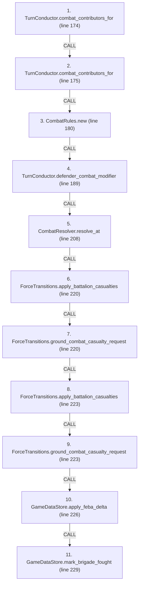
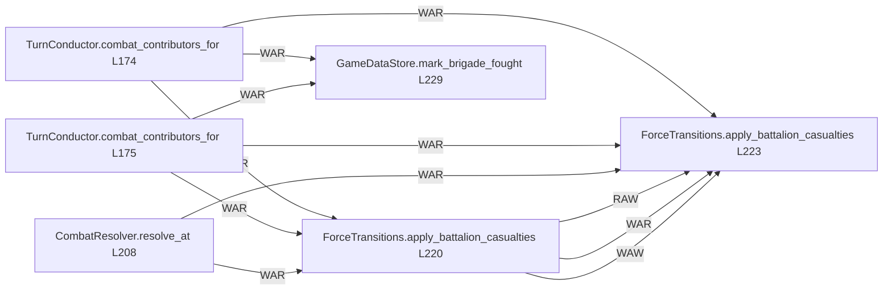

# Ordering: `TurnConductor.resolve_combat_at`

> **Reading aid, not an execution contract.** No detected edge is not permission to reorder.
> GDScript reads and writes are conservative source analysis; transition writes are also
> checked against the mutation manifest. Potential conflicts may refer to different object
> instances or conditional branches.

Generator format v1; scan scope `scripts/**/*.gd` plus `project.godot` autoload aliases.
Generated from commit `8829181ae4b6`; input SHA-256 `1c5ff5483615f0cca5b2767540c56e9a13e1387c4c1a3c66db909a97ad2e94fb`;
tool/manifest/fixture SHA-256 `ea366ecafdb8f5cc7ecae22bb7554cd8802d1ed3433c5a903ecc07bbb7230f6c`; stable generation time `2026-08-02T09:03:12-04:00`.
Unresolved-analysis diagnostics on this page: **21**.

Source: `scripts/phases/TurnConductor.gd:173`

## Lexical call-site map (CALL edges)

> Source order is not an execution count: loop calls repeat, branch calls may be skipped
> or mutually exclusive, and nested arguments execute before their outer call.

## State and RNG constraints

| Earlier node | Later node | Kinds | Shared evidence |
|---|---|---|---|
| `TurnConductor.combat_contributors_for` (L174) | `ForceTransitions.apply_battalion_casualties` (L220) | **WAR** | `Battalion.qty`, `Brigade.composition`, `Brigade.destroyed`, `GameDataStore.brigades_by_hex` |
| `TurnConductor.combat_contributors_for` (L174) | `ForceTransitions.apply_battalion_casualties` (L223) | **WAR** | `Battalion.qty`, `Brigade.composition`, `Brigade.destroyed`, `GameDataStore.brigades_by_hex` |
| `TurnConductor.combat_contributors_for` (L174) | `GameDataStore.mark_brigade_fought` (L229) | **WAR** | `Brigade.moved_admin_this_turn` |
| `TurnConductor.combat_contributors_for` (L175) | `ForceTransitions.apply_battalion_casualties` (L220) | **WAR** | `Battalion.qty`, `Brigade.composition`, `Brigade.destroyed`, `GameDataStore.brigades_by_hex` |
| `TurnConductor.combat_contributors_for` (L175) | `ForceTransitions.apply_battalion_casualties` (L223) | **WAR** | `Battalion.qty`, `Brigade.composition`, `Brigade.destroyed`, `GameDataStore.brigades_by_hex` |
| `TurnConductor.combat_contributors_for` (L175) | `GameDataStore.mark_brigade_fought` (L229) | **WAR** | `Brigade.moved_admin_this_turn` |
| `TurnConductor.defender_combat_modifier` (L189) | `CombatResolver.resolve_at` (L208) | **RAW** | `CombatRules.defender_terrain_modifier` |
| `CombatResolver.resolve_at` (L208) | `ForceTransitions.apply_battalion_casualties` (L220) | **WAR** | `Battalion.qty`, `Brigade.composition` |
| `CombatResolver.resolve_at` (L208) | `ForceTransitions.apply_battalion_casualties` (L223) | **WAR** | `Battalion.qty`, `Brigade.composition` |
| `CombatResolver.resolve_at` (L208) | `GameDataStore.apply_feba_delta` (L226) | **RAW** | `CombatResult.feba_movement_km` |
| `ForceTransitions.apply_battalion_casualties` (L220) | `ForceTransitions.apply_battalion_casualties` (L223) | **RAW**, **WAR**, **WAW** | `Battalion.qty`, `Brigade.composition`, `Brigade.destroyed`, `Brigade.hex_id`, `ForceCasualtyReceipt.applied`, `ForceCasualtyReceipt.battalion_type`, `ForceCasualtyReceipt.brigade_id`, `ForceCasualtyReceipt.cause`; _+5 more_ |
| `ForceTransitions.apply_battalion_casualties` (L220) | `ForceTransitions.ground_combat_casualty_request` (L223) | **WAR** | `ForceCasualtyRequest.battalion_type`, `ForceCasualtyRequest.brigade_id`, `ForceCasualtyRequest.cause`, `ForceCasualtyRequest.count`, `ForceCasualtyRequest.source_location` |
| `ForceTransitions.ground_combat_casualty_request` (L220) | `ForceTransitions.apply_battalion_casualties` (L223) | **RAW** | `ForceCasualtyRequest.battalion_type`, `ForceCasualtyRequest.brigade_id`, `ForceCasualtyRequest.cause`, `ForceCasualtyRequest.count`, `ForceCasualtyRequest.source_location` |
| `ForceTransitions.ground_combat_casualty_request` (L220) | `ForceTransitions.ground_combat_casualty_request` (L223) | **WAW** | `ForceCasualtyRequest.battalion_type`, `ForceCasualtyRequest.brigade_id`, `ForceCasualtyRequest.cause`, `ForceCasualtyRequest.count`, `ForceCasualtyRequest.source_location` |

## Detected campaign-state/RNG overview

This compact diagram shows up to 40 detected RAW/WAR/WAW/RNG constraints involving protected
campaign fields. The table above remains the complete conservative evidence.

## Call-site detail

Effects include the called method and every statically resolved helper beneath it.

| # | Call site | Reads | Writes | RNG streams |
|---:|---|---|---|---|
| 1 | `TurnConductor.combat_contributors_for` at `scripts/phases/TurnConductor.gd:174` | `Battalion.qty`, `Battalion.type`, `Brigade.composition`, `Brigade.destroyed`, `Brigade.id`, `Brigade.moved_admin_this_turn`, `Brigade.team`, `CommitOrder.brigade_id`, `CommitOrder.target_hex`, `GameDataStore.brigades`; _+3 more_ | — | — |
| 2 | `TurnConductor.combat_contributors_for` at `scripts/phases/TurnConductor.gd:175` | `Battalion.qty`, `Battalion.type`, `Brigade.composition`, `Brigade.destroyed`, `Brigade.id`, `Brigade.moved_admin_this_turn`, `Brigade.team`, `CommitOrder.brigade_id`, `CommitOrder.target_hex`, `GameDataStore.brigades`; _+3 more_ | — | — |
| 3 | `CombatRules.new` at `scripts/phases/TurnConductor.gd:180` | — | — | — |
| 4 | `TurnConductor.defender_combat_modifier` at `scripts/phases/TurnConductor.gd:189` | `GameDataStore.hex_lookup`, `GameDataStore.terrain_types`, `TerrainType.defender_modifier` | `CombatRules.defender_terrain_modifier` | — |
| 5 | `CombatResolver.resolve_at` at `scripts/phases/TurnConductor.gd:208` | `Battalion.qty`, `Battalion.type`, `Brigade.composition`, `Brigade.id`, `CombatResult.attacker_losses`, `CombatResult.combat_detail`, `CombatResult.defender_losses`, `CombatResult.feba_movement_km`, `CombatRules.combat_attacker_advantage_ratio`, `CombatRules.combat_attacker_ratio_slope`; _+24 more_ | `CombatResult.attacker_casualties`, `CombatResult.attacker_losses`, `CombatResult.attacker_maneuver_strength`, `CombatResult.attacker_strength`, `CombatResult.combat_detail`, `CombatResult.defender_casualties`, `CombatResult.defender_losses`, `CombatResult.defender_maneuver_strength`, `CombatResult.defender_strength`, `CombatResult.defender_terrain_modifier`; _+10 more_ | `dice` |
| 6 | `ForceTransitions.apply_battalion_casualties` at `scripts/phases/TurnConductor.gd:220` | `Battalion.qty`, `Battalion.type`, `Brigade.composition`, `Brigade.hex_id`, `Brigade.id`, `ForceCasualtyRequest.battalion_type`, `ForceCasualtyRequest.brigade_id`, `ForceCasualtyRequest.cause`, `ForceCasualtyRequest.count`, `ForceCasualtyRequest.source_location`; _+2 more_ | `Battalion.qty`, `Brigade.composition`, `Brigade.destroyed`, `Brigade.hex_id`, `ForceCasualtyReceipt.applied`, `ForceCasualtyReceipt.battalion_type`, `ForceCasualtyReceipt.brigade_id`, `ForceCasualtyReceipt.cause`, `ForceCasualtyReceipt.destroyed_brigade`, `ForceCasualtyReceipt.removed_from_hex`; _+3 more_ | — |
| 7 | `ForceTransitions.ground_combat_casualty_request` at `scripts/phases/TurnConductor.gd:220` | — | `ForceCasualtyRequest.battalion_type`, `ForceCasualtyRequest.brigade_id`, `ForceCasualtyRequest.cause`, `ForceCasualtyRequest.count`, `ForceCasualtyRequest.source_location` | — |
| 8 | `ForceTransitions.apply_battalion_casualties` at `scripts/phases/TurnConductor.gd:223` | `Battalion.qty`, `Battalion.type`, `Brigade.composition`, `Brigade.hex_id`, `Brigade.id`, `ForceCasualtyRequest.battalion_type`, `ForceCasualtyRequest.brigade_id`, `ForceCasualtyRequest.cause`, `ForceCasualtyRequest.count`, `ForceCasualtyRequest.source_location`; _+2 more_ | `Battalion.qty`, `Brigade.composition`, `Brigade.destroyed`, `Brigade.hex_id`, `ForceCasualtyReceipt.applied`, `ForceCasualtyReceipt.battalion_type`, `ForceCasualtyReceipt.brigade_id`, `ForceCasualtyReceipt.cause`, `ForceCasualtyReceipt.destroyed_brigade`, `ForceCasualtyReceipt.removed_from_hex`; _+3 more_ | — |
| 9 | `ForceTransitions.ground_combat_casualty_request` at `scripts/phases/TurnConductor.gd:223` | — | `ForceCasualtyRequest.battalion_type`, `ForceCasualtyRequest.brigade_id`, `ForceCasualtyRequest.cause`, `ForceCasualtyRequest.count`, `ForceCasualtyRequest.source_location` | — |
| 10 | `GameDataStore.apply_feba_delta` at `scripts/phases/TurnConductor.gd:226` | `CombatResult.feba_movement_km`, `GameDataStore.hex_states`, `HexState.feba_km` | `HexState.feba_km` | — |
| 11 | `GameDataStore.mark_brigade_fought` at `scripts/phases/TurnConductor.gd:229` | `Brigade.fought_this_turn`, `Brigade.moved_admin_this_turn`, `Brigade.moved_this_turn`, `Brigade.organization`, `ForceActivityRequest.operation` | `Brigade.fought_last_turn`, `Brigade.fought_this_turn`, `Brigade.moved_admin_this_turn`, `Brigade.moved_last_turn`, `Brigade.moved_this_turn`, `Brigade.organization`, `ForceActivityRequest.operation` | — |

## Analysis limits found here

Showing 21 of 21 diagnostics; class pages provide the narrower context.

| Kind | Source | Why it matters |
|---|---|---|
| `multi_call_statement` | `scripts/GameData.gd:581` `ForceTransitions.apply_activity( brigade, ForceActivityRequest.make(ForceActivityRequest.Operation.FOUGHT))` | Multiple calls share one statement; the map preserves lexical sites, not nested evaluation order. |
| `untyped_alias` | `scripts/calc/CombatCalculator.gd:16` `var defender_terrain_modifier = max(1.0, rules.defender_terrain_modifier)` | The receiver type could not be proven. |
| `multi_call_statement` | `scripts/calc/CombatCalculator.gd:49` `result.combat_detail = { "attacker": { "maneuver_unit_count": attacker_units.size(), "support_unit_count": attacker_support_units.size(), "unscreened": forces["attacker_unscreen…` | Multiple calls share one statement; the map preserves lexical sites, not nested evaluation order. |
| `untyped_alias` | `scripts/calc/CombatCalculator.gd:175` `var attacker_loss_rate := clampf( rules.combat_base_loss_rate - (ratio - 1.0) * rules.combat_attacker_ratio_slope + (attacker_loss_roll - rules.combat_loss_roll_midpoint) / rule…` | The receiver type could not be proven. |
| `untyped_alias` | `scripts/calc/CombatCalculator.gd:179` `var defender_loss_rate := clampf( rules.combat_base_loss_rate + (ratio - 1.0) * rules.combat_defender_ratio_slope + (defender_loss_roll - rules.combat_loss_roll_midpoint) / rule…` | The receiver type could not be proven. |
| `multi_call_statement` | `scripts/calc/CombatCalculator.gd:233` `return { "artillery": _to_count(raw_support.get("artillery")), "rocket_artillery": _to_count(raw_support.get("rocket_artillery")), "cas": _to_count(raw_support.get("cas")), "crb…` | Multiple calls share one statement; the map preserves lexical sites, not nested evaluation order. |
| `untyped_alias` | `scripts/calc/CombatCalculator.gd:269` `var multiplier := float(rules.support_multipliers.get(support_type, 0.0))` | The receiver type could not be proven. |
| `untyped_alias` | `scripts/calc/CombatCalculator.gd:278` `var multiplier := float(rules.support_multipliers.get(support_type, 0.0))` | The receiver type could not be proven. |
| `unresolved_receiver` | `scripts/model/Brigade.gd:60` `total += battalion.qty` | A protected field name appeared on an unresolved receiver. |
| `multi_call_statement` | `scripts/model/CombatForces.gd:16` `return UnitStats.has_tag(unit_type, "artillery") or UnitStats.has_tag(unit_type, "rotary_wing")` | Multiple calls share one statement; the map preserves lexical sites, not nested evaluation order. |
| `callee_body_unresolved` | `scripts/phases/TurnConductor.gd:180` `var rules := CombatRules.new()` | The declaration exists but its method body was not indexed. |
| `untyped_iteration` | `scripts/phases/TurnConductor.gd:219` `for casualty in result.attacker_casualties:` | The collection element type could not be proven. |
| `multi_call_statement` | `scripts/phases/TurnConductor.gd:220` `ForceTransitions.apply_battalion_casualties( GameData, ForceTransitions.ground_combat_casualty_request(casualty))` | Multiple calls share one statement; the map preserves lexical sites, not nested evaluation order. |
| `untyped_iteration` | `scripts/phases/TurnConductor.gd:222` `for casualty in result.defender_casualties:` | The collection element type could not be proven. |
| `multi_call_statement` | `scripts/phases/TurnConductor.gd:223` `ForceTransitions.apply_battalion_casualties( GameData, ForceTransitions.ground_combat_casualty_request(casualty))` | Multiple calls share one statement; the map preserves lexical sites, not nested evaluation order. |
| `untyped_iteration` | `scripts/phases/TurnConductor.gd:255` `for commitment_value in state.commitments[team]:` | The collection element type could not be proven. |
| `callable_or_lambda` | `scripts/transitions/ForceTransitions.gd:587` `data_store.brigades_by_hex[old_hex] = (data_store.brigades_by_hex[old_hex] as Array).filter( func(id: String) -> bool: return id != brigade.id)` | Callable/lambda dataflow is outside this analyser. |
| `untyped_alias` | `scripts/transitions/ForceTransitions.gd:601` `var violations := data_store.validate_runtime_indexes()` | The receiver type could not be proven. |
| `untyped_iteration` | `scripts/transitions/ForceTransitions.gd:618` `for index in range(brigade.composition.size() - 1, -1, -1):` | The collection element type could not be proven. |
| `untyped_alias` | `scripts/transitions/ForceTransitions.gd:622` `var take := mini(battalion.qty, remaining)` | The receiver type could not be proven. |
| `untyped_alias` | `scripts/transitions/MapTransitions.gd:98` `var state_value: Variant = data_store.hex_states.get(hex_id)` | The receiver type could not be proven. |
