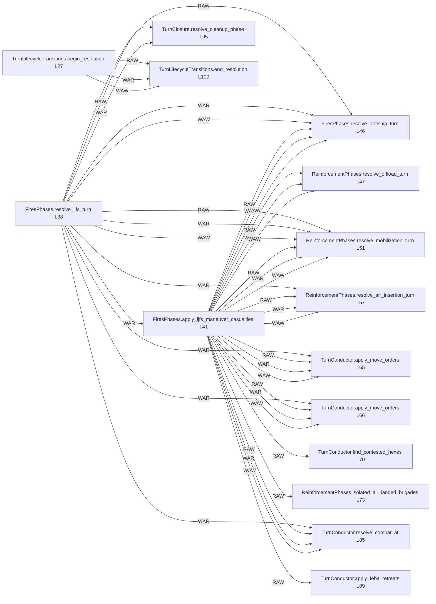

# Ordering: `TurnConductor.resolve_turn`

> **Reading aid, not an execution contract.** No detected edge is not permission to reorder.
> GDScript reads and writes are conservative source analysis; transition writes are also
> checked against the mutation manifest. Potential conflicts may refer to different object
> instances or conditional branches.

Generator format v1; scan scope `scripts/**/*.gd` plus `project.godot` autoload aliases.
Generated from commit `7bbf08693b44`; input SHA-256 `c879af92cf7693c7df1119a11083764377c92a9410144e7b95f361f509613378`;
tool/manifest/fixture SHA-256 `ea366ecafdb8f5cc7ecae22bb7554cd8802d1ed3433c5a903ecc07bbb7230f6c`; stable generation time `2026-08-02T17:09:31-04:00`.
Unresolved-analysis diagnostics on this page: **360**.

Source: `scripts/phases/TurnConductor.gd:24`

## Lexical call-site map (CALL edges)

> Source order is not an execution count: loop calls repeat, branch calls may be skipped
> or mutually exclusive, and nested arguments execute before their outer call.

```mermaid
flowchart TD
  n_2c3bc0ed790b["1. TurnLifecycleTransitions.begin_resolution (line 27)"]
  n_f53990255885["2. SeededDice.new (line 31)"]
  n_5db48ba4cb0e["3. FiresPhases.resolve_ijfs_turn (line 38)"]
  n_205650762e61["4. FiresPhases.apply_ijfs_maneuver_casualties (line 41)"]
  n_063065b51998["5. ReinforcementPhases.resolve_sealift_turn (line 45)"]
  n_a4548e4da602["6. FiresPhases.resolve_antiship_turn (line 46)"]
  n_457ded6b463d["7. ReinforcementPhases.resolve_offload_turn (line 47)"]
  n_c934bc9a1556["8. ReinforcementPhases.resolve_mobilization_turn (line 51)"]
  n_7a79c304e6f4["9. ReinforcementPhases.resolve_air_insertion_turn (line 57)"]
  n_29d19cc99c33["10. TurnConductor.apply_move_orders (line 65)"]
  n_5640bed7aa5a["11. TurnConductor.apply_move_orders (line 66)"]
  n_9eb66ccd1553["12. TurnConductor.find_contested_hexes (line 70)"]
  n_df3dbe7855dc["13. ReinforcementPhases.isolated_air_landed_brigades (line 73)"]
  n_e83dcbd59077["14. GameStateData.refresh_not_ashore_by_type (line 78)"]
  n_bb5e55121eaa["15. TurnConductor.resolve_combat_at (line 85)"]
  n_3bf87e8e379b["16. Dice.derive (line 85)"]
  n_9db85808bcb6["17. TurnConductor.apply_feba_retreats (line 89)"]
  n_902a64342c9f["18. GameDataStore.recompute_hex_ownership (line 90)"]
  n_71ed3a069002["19. TurnClosure.resolve_supply_turn (line 94)"]
  n_c729ad4ce925["20. TurnClosure.resolve_cleanup_phase (line 95)"]
  n_e216152b6e6c["21. GameDataStore.validate_runtime_indexes (line 102)"]
  n_6039f56c5c5c["22. ForceTransitions.pending_pool_roster_violations (line 104)"]
  n_a8eeb7b5ca64["23. TurnLifecycleTransitions.end_resolution (line 109)"]
  n_e216152b6e6c -->|CALL| n_6039f56c5c5c
  n_6039f56c5c5c -->|CALL| n_a8eeb7b5ca64
  n_2c3bc0ed790b -->|CALL| n_f53990255885
  n_f53990255885 -->|CALL| n_5db48ba4cb0e
  n_5db48ba4cb0e -->|CALL| n_205650762e61
  n_205650762e61 -->|CALL| n_063065b51998
  n_063065b51998 -->|CALL| n_a4548e4da602
  n_a4548e4da602 -->|CALL| n_457ded6b463d
  n_457ded6b463d -->|CALL| n_c934bc9a1556
  n_c934bc9a1556 -->|CALL| n_7a79c304e6f4
  n_7a79c304e6f4 -->|CALL| n_29d19cc99c33
  n_29d19cc99c33 -->|CALL| n_5640bed7aa5a
  n_5640bed7aa5a -->|CALL| n_9eb66ccd1553
  n_9eb66ccd1553 -->|CALL| n_df3dbe7855dc
  n_df3dbe7855dc -->|CALL| n_e83dcbd59077
  n_e83dcbd59077 -->|CALL| n_bb5e55121eaa
  n_bb5e55121eaa -->|CALL| n_3bf87e8e379b
  n_3bf87e8e379b -->|CALL| n_9db85808bcb6
  n_9db85808bcb6 -->|CALL| n_902a64342c9f
  n_902a64342c9f -->|CALL| n_71ed3a069002
  n_71ed3a069002 -->|CALL| n_c729ad4ce925
  n_c729ad4ce925 -->|CALL| n_e216152b6e6c
```

## State and RNG constraints

| Earlier node | Later node | Kinds | Shared evidence |
|---|---|---|---|
| `TurnLifecycleTransitions.begin_resolution` (L27) | `TurnLifecycleTransitions.end_resolution` (L109) | **RAW**, **WAR**, **WAW** | `GameStateData.phase` |
| `FiresPhases.resolve_ijfs_turn` (L38) | `FiresPhases.apply_ijfs_maneuver_casualties` (L41) | **RAW**, **WAR** | `Battalion.qty`, `Brigade.composition`, `Brigade.destroyed`, `GameStateData.last_ijfs_writeback`, `IjfsWriteback.maneuver_casualties` |
| `FiresPhases.resolve_ijfs_turn` (L38) | `FiresPhases.resolve_antiship_turn` (L46) | **RAW**, **WAR**, **WAW** | `AntishipSystem.detectability`, `AntishipSystem.ijfs_profile`, `AntishipSystem.original_quantity`, `AntishipSystem.quantity`, `AntishipSystem.special`, `AntishipSystem.to_number`, `AntishipSystem.type_id`, `AntishipSystem.type_name`; _+9 more_ |
| `FiresPhases.resolve_ijfs_turn` (L38) | `ReinforcementPhases.resolve_mobilization_turn` (L51) | **RAW**, **WAR**, **WAW** | `GameStateData._ijfs_day`, `GameStateData.ijfs_state`, `IjfsDailyState.targets`, `IjfsTarget.category`, `IjfsTarget.destroyed`, `IjfsTarget.detectability_active`, `IjfsTarget.detectability_hiding`, `IjfsTarget.detected_this_turn`; _+13 more_ |
| `FiresPhases.resolve_ijfs_turn` (L38) | `ReinforcementPhases.resolve_air_insertion_turn` (L57) | **RAW**, **WAR** | `Battalion.qty`, `Brigade.composition`, `Brigade.destroyed`, `GameStateData.last_ijfs_summary` |
| `FiresPhases.resolve_ijfs_turn` (L38) | `TurnConductor.apply_move_orders` (L65) | **WAR** | `Brigade.fought_last_turn`, `Brigade.moved_last_turn` |
| `FiresPhases.resolve_ijfs_turn` (L38) | `TurnConductor.apply_move_orders` (L66) | **WAR** | `Brigade.fought_last_turn`, `Brigade.moved_last_turn` |
| `FiresPhases.resolve_ijfs_turn` (L38) | `TurnConductor.resolve_combat_at` (L85) | **WAR** | `Battalion.qty`, `Brigade.composition`, `Brigade.destroyed`, `Brigade.fought_last_turn`, `Brigade.moved_last_turn` |
| `FiresPhases.resolve_ijfs_turn` (L38) | `TurnClosure.resolve_cleanup_phase` (L95) | **RAW**, **WAR** | `Brigade.fought_last_turn`, `Brigade.moved_last_turn`, `GameStateData.antiship_systems` |
| `FiresPhases.apply_ijfs_maneuver_casualties` (L41) | `GameDataStore.validate_runtime_indexes` (L102) | **RAW** | `Brigade.hex_id`, `GameDataStore.brigades_by_hex` |
| `FiresPhases.apply_ijfs_maneuver_casualties` (L41) | `ForceTransitions.pending_pool_roster_violations` (L104) | **RAW** | `Battalion.qty`, `Brigade.composition` |
| `FiresPhases.apply_ijfs_maneuver_casualties` (L41) | `FiresPhases.resolve_antiship_turn` (L46) | **RAW**, **WAR**, **WAW** | `Battalion.qty`, `Brigade.composition`, `Brigade.destroyed`, `Brigade.hex_id`, `ForceCasualtyReceipt.applied`, `ForceCasualtyReceipt.battalion_type`, `ForceCasualtyReceipt.brigade_id`, `ForceCasualtyReceipt.cause`; _+10 more_ |
| `FiresPhases.apply_ijfs_maneuver_casualties` (L41) | `ReinforcementPhases.resolve_offload_turn` (L47) | **RAW**, **WAR**, **WAW** | `Brigade.composition`, `Brigade.destroyed`, `Brigade.hex_id`, `GameDataStore.brigades_by_hex` |
| `FiresPhases.apply_ijfs_maneuver_casualties` (L41) | `ReinforcementPhases.resolve_mobilization_turn` (L51) | **RAW**, **WAR**, **WAW** | `Battalion.qty`, `Brigade.composition`, `Brigade.destroyed`, `Brigade.hex_id`, `GameDataStore.brigades_by_hex` |
| `FiresPhases.apply_ijfs_maneuver_casualties` (L41) | `ReinforcementPhases.resolve_air_insertion_turn` (L57) | **RAW**, **WAR**, **WAW** | `Battalion.qty`, `Brigade.composition`, `Brigade.destroyed`, `Brigade.hex_id`, `ForceCasualtyReceipt.applied`, `ForceCasualtyReceipt.battalion_type`, `ForceCasualtyReceipt.brigade_id`, `ForceCasualtyReceipt.cause`; _+10 more_ |
| `FiresPhases.apply_ijfs_maneuver_casualties` (L41) | `TurnConductor.apply_move_orders` (L65) | **RAW**, **WAR**, **WAW** | `Brigade.hex_id`, `GameDataStore.brigades_by_hex` |
| `FiresPhases.apply_ijfs_maneuver_casualties` (L41) | `TurnConductor.apply_move_orders` (L66) | **RAW**, **WAR**, **WAW** | `Brigade.hex_id`, `GameDataStore.brigades_by_hex` |
| `FiresPhases.apply_ijfs_maneuver_casualties` (L41) | `TurnConductor.find_contested_hexes` (L70) | **RAW** | `Brigade.destroyed`, `GameDataStore.brigades_by_hex` |
| `FiresPhases.apply_ijfs_maneuver_casualties` (L41) | `ReinforcementPhases.isolated_air_landed_brigades` (L73) | **RAW** | `Brigade.destroyed`, `Brigade.hex_id` |
| `FiresPhases.apply_ijfs_maneuver_casualties` (L41) | `TurnConductor.resolve_combat_at` (L85) | **RAW**, **WAR**, **WAW** | `Battalion.qty`, `Brigade.composition`, `Brigade.destroyed`, `Brigade.hex_id`, `ForceCasualtyReceipt.applied`, `ForceCasualtyReceipt.battalion_type`, `ForceCasualtyReceipt.brigade_id`, `ForceCasualtyReceipt.cause`; _+10 more_ |
| `FiresPhases.apply_ijfs_maneuver_casualties` (L41) | `TurnConductor.apply_feba_retreats` (L89) | **RAW**, **WAR**, **WAW** | `Brigade.destroyed`, `Brigade.hex_id`, `GameDataStore.brigades_by_hex` |
| `FiresPhases.apply_ijfs_maneuver_casualties` (L41) | `GameDataStore.recompute_hex_ownership` (L90) | **RAW** | `Brigade.destroyed`, `GameDataStore.brigades_by_hex` |
| `FiresPhases.apply_ijfs_maneuver_casualties` (L41) | `TurnClosure.resolve_supply_turn` (L94) | **RAW** | `Battalion.qty`, `Brigade.composition`, `Brigade.destroyed`, `Brigade.hex_id` |
| `FiresPhases.apply_ijfs_maneuver_casualties` (L41) | `TurnClosure.resolve_cleanup_phase` (L95) | **RAW** | `Brigade.composition`, `Brigade.destroyed`, `Brigade.hex_id`, `GameDataStore.brigades_by_hex` |
| `ReinforcementPhases.resolve_sealift_turn` (L45) | `ForceTransitions.pending_pool_roster_violations` (L104) | **RAW** | `SealiftState.mainland_pool` |
| `ReinforcementPhases.resolve_sealift_turn` (L45) | `FiresPhases.resolve_antiship_turn` (L46) | **RAW**, **WAR**, **WAW** | `GameStateData.last_sealift_sent_by_type`, `SealiftState.cohorts`, `SealiftState.escort_reload`, `SealiftState.escort_sam`, `SealiftState.mainland_pool`, `SealiftState.return_pipeline`, `ShipState.destroyed`, `ShipState.fleet_surviving_total`; _+4 more_ |
| `ReinforcementPhases.resolve_sealift_turn` (L45) | `ReinforcementPhases.resolve_offload_turn` (L47) | **RAW**, **WAR**, **WAW** | `ForceValidationResult.error`, `InfrastructureNodeState.jlsf`, `InfrastructureNodeState.node_status`, `InfrastructureNodeState.repair_turns_remaining`, `SealiftState.cohorts`, `SealiftState.escort_reload`, `SealiftState.escort_sam`, `SealiftState.mainland_pool`; _+5 more_ |
| `ReinforcementPhases.resolve_sealift_turn` (L45) | `ReinforcementPhases.resolve_mobilization_turn` (L51) | **RAW**, **WAR**, **WAW** | `ForceValidationResult.error` |
| `ReinforcementPhases.resolve_sealift_turn` (L45) | `ReinforcementPhases.resolve_air_insertion_turn` (L57) | **RAW**, **WAR**, **WAW** | `ForceValidationResult.error` |
| `ReinforcementPhases.resolve_sealift_turn` (L45) | `GameStateData.refresh_not_ashore_by_type` (L78) | **RAW** | `SealiftState.mainland_pool` |
| `ReinforcementPhases.resolve_sealift_turn` (L45) | `TurnClosure.resolve_supply_turn` (L94) | **RAW** | `SealiftState.mainland_pool` |
| `ReinforcementPhases.resolve_sealift_turn` (L45) | `TurnClosure.resolve_cleanup_phase` (L95) | **RAW** | `SealiftState.mainland_pool` |
| `FiresPhases.resolve_antiship_turn` (L46) | `GameDataStore.validate_runtime_indexes` (L102) | **RAW** | `Brigade.hex_id`, `GameDataStore.brigades_by_hex` |
| `FiresPhases.resolve_antiship_turn` (L46) | `ForceTransitions.pending_pool_roster_violations` (L104) | **RAW** | `Battalion.qty`, `Brigade.composition` |
| `FiresPhases.resolve_antiship_turn` (L46) | `ReinforcementPhases.resolve_offload_turn` (L47) | **RAW**, **WAR**, **WAW** | `Brigade.composition`, `Brigade.destroyed`, `Brigade.hex_id`, `GameDataStore.brigades_by_hex`, `GameStateData.pending_lost_at_sea`, `SealiftHullReleasePlan.batches`, `SealiftState.cohorts`, `SealiftState.escort_reload`; _+8 more_ |
| `FiresPhases.resolve_antiship_turn` (L46) | `ReinforcementPhases.resolve_mobilization_turn` (L51) | **RAW**, **WAR**, **WAW** | `Battalion.qty`, `Brigade.composition`, `Brigade.destroyed`, `Brigade.hex_id`, `GameDataStore.brigades_by_hex` |
| `FiresPhases.resolve_antiship_turn` (L46) | `ReinforcementPhases.resolve_air_insertion_turn` (L57) | **RAW**, **WAR**, **WAW** | `Battalion.qty`, `Brigade.composition`, `Brigade.destroyed`, `Brigade.hex_id`, `ForceCasualtyReceipt.applied`, `ForceCasualtyReceipt.battalion_type`, `ForceCasualtyReceipt.brigade_id`, `ForceCasualtyReceipt.cause`; _+10 more_ |
| `FiresPhases.resolve_antiship_turn` (L46) | `TurnConductor.apply_move_orders` (L65) | **RAW**, **WAR**, **WAW** | `Brigade.hex_id`, `GameDataStore.brigades_by_hex` |
| `FiresPhases.resolve_antiship_turn` (L46) | `TurnConductor.apply_move_orders` (L66) | **RAW**, **WAR**, **WAW** | `Brigade.hex_id`, `GameDataStore.brigades_by_hex` |
| `FiresPhases.resolve_antiship_turn` (L46) | `TurnConductor.find_contested_hexes` (L70) | **RAW** | `Brigade.destroyed`, `GameDataStore.brigades_by_hex` |
| `FiresPhases.resolve_antiship_turn` (L46) | `ReinforcementPhases.isolated_air_landed_brigades` (L73) | **RAW** | `Brigade.destroyed`, `Brigade.hex_id` |
| `FiresPhases.resolve_antiship_turn` (L46) | `TurnConductor.resolve_combat_at` (L85) | **RAW**, **WAR**, **WAW** | `Battalion.qty`, `Brigade.composition`, `Brigade.destroyed`, `Brigade.hex_id`, `ForceCasualtyReceipt.applied`, `ForceCasualtyReceipt.battalion_type`, `ForceCasualtyReceipt.brigade_id`, `ForceCasualtyReceipt.cause`; _+10 more_ |
| `FiresPhases.resolve_antiship_turn` (L46) | `TurnConductor.apply_feba_retreats` (L89) | **RAW**, **WAR**, **WAW** | `Brigade.destroyed`, `Brigade.hex_id`, `GameDataStore.brigades_by_hex` |
| `FiresPhases.resolve_antiship_turn` (L46) | `GameDataStore.recompute_hex_ownership` (L90) | **RAW** | `Brigade.destroyed`, `GameDataStore.brigades_by_hex` |
| `FiresPhases.resolve_antiship_turn` (L46) | `TurnClosure.resolve_supply_turn` (L94) | **RAW** | `Battalion.qty`, `Brigade.composition`, `Brigade.destroyed`, `Brigade.hex_id` |
| `FiresPhases.resolve_antiship_turn` (L46) | `TurnClosure.resolve_cleanup_phase` (L95) | **RAW**, **WAR**, **WAW** | `AntishipSystem.active`, `AntishipSystem.destroyed_this_turn`, `AntishipSystem.fired`, `AntishipSystem.suppressed_now`, `Brigade.composition`, `Brigade.destroyed`, `Brigade.hex_id`, `GameDataStore.brigades_by_hex`; _+1 more_ |
| `ReinforcementPhases.resolve_offload_turn` (L47) | `GameDataStore.validate_runtime_indexes` (L102) | **RAW** | `Brigade.hex_id`, `GameDataStore.brigades_by_hex` |
| `ReinforcementPhases.resolve_offload_turn` (L47) | `ReinforcementPhases.resolve_mobilization_turn` (L51) | **RAW**, **WAR**, **WAW** | `Brigade.entry_bearing`, `Brigade.hex_id`, `ForcePlacementReceipt.brigade_id`, `ForcePlacementReceipt.destination`, `ForcePlacementReceipt.new_hex`, `ForcePlacementReceipt.old_hex`, `ForcePlacementReceipt.phase`, `ForcePlacementRequest.brigade_id`; _+6 more_ |
| `ReinforcementPhases.resolve_offload_turn` (L47) | `ReinforcementPhases.resolve_air_insertion_turn` (L57) | **RAW**, **WAR**, **WAW** | `Brigade.composition`, `Brigade.destroyed`, `Brigade.entry_bearing`, `Brigade.hex_id`, `ForcePlacementReceipt.brigade_id`, `ForcePlacementReceipt.destination`, `ForcePlacementReceipt.new_hex`, `ForcePlacementReceipt.old_hex`; _+8 more_ |
| `ReinforcementPhases.resolve_offload_turn` (L47) | `TurnConductor.apply_move_orders` (L65) | **RAW**, **WAR**, **WAW** | `Brigade.entry_bearing`, `Brigade.hex_id`, `ForcePlacementReceipt.brigade_id`, `ForcePlacementReceipt.destination`, `ForcePlacementReceipt.new_hex`, `ForcePlacementReceipt.old_hex`, `ForcePlacementReceipt.phase`, `ForcePlacementRequest.brigade_id`; _+4 more_ |
| `ReinforcementPhases.resolve_offload_turn` (L47) | `TurnConductor.apply_move_orders` (L66) | **RAW**, **WAR**, **WAW** | `Brigade.entry_bearing`, `Brigade.hex_id`, `ForcePlacementReceipt.brigade_id`, `ForcePlacementReceipt.destination`, `ForcePlacementReceipt.new_hex`, `ForcePlacementReceipt.old_hex`, `ForcePlacementReceipt.phase`, `ForcePlacementRequest.brigade_id`; _+4 more_ |
| `ReinforcementPhases.resolve_offload_turn` (L47) | `TurnConductor.find_contested_hexes` (L70) | **RAW** | `GameDataStore.brigades_by_hex` |
| `ReinforcementPhases.resolve_offload_turn` (L47) | `ReinforcementPhases.isolated_air_landed_brigades` (L73) | **RAW** | `Brigade.hex_id`, `HexState.hex_owner`, `InfrastructureNodeState.node_status` |
| `ReinforcementPhases.resolve_offload_turn` (L47) | `TurnConductor.resolve_combat_at` (L85) | **RAW**, **WAR**, **WAW** | `Brigade.composition`, `Brigade.destroyed`, `Brigade.hex_id`, `GameDataStore.brigades_by_hex` |
| `ReinforcementPhases.resolve_offload_turn` (L47) | `TurnConductor.apply_feba_retreats` (L89) | **RAW**, **WAR**, **WAW** | `Brigade.entry_bearing`, `Brigade.hex_id`, `ForcePlacementReceipt.brigade_id`, `ForcePlacementReceipt.destination`, `ForcePlacementReceipt.new_hex`, `ForcePlacementReceipt.old_hex`, `ForcePlacementReceipt.phase`, `ForcePlacementRequest.brigade_id`; _+4 more_ |
| `ReinforcementPhases.resolve_offload_turn` (L47) | `GameDataStore.recompute_hex_ownership` (L90) | **RAW**, **WAR**, **WAW** | `GameDataStore.brigades_by_hex`, `HexState.hex_owner` |
| `ReinforcementPhases.resolve_offload_turn` (L47) | `TurnClosure.resolve_supply_turn` (L94) | **RAW** | `Brigade.hex_id` |
| `ReinforcementPhases.resolve_offload_turn` (L47) | `TurnClosure.resolve_cleanup_phase` (L95) | **RAW**, **WAR**, **WAW** | `Brigade.hex_id`, `GameDataStore.brigades_by_hex`, `HexState.hex_owner` |
| `ReinforcementPhases.resolve_mobilization_turn` (L51) | `GameDataStore.validate_runtime_indexes` (L102) | **RAW** | `Brigade.hex_id`, `GameDataStore.brigades_by_hex` |
| `ReinforcementPhases.resolve_mobilization_turn` (L51) | `ReinforcementPhases.resolve_air_insertion_turn` (L57) | **RAW**, **WAR**, **WAW** | `Battalion.qty`, `Brigade.composition`, `Brigade.destroyed`, `Brigade.entry_bearing`, `Brigade.hex_id`, `ForcePlacementReceipt.brigade_id`, `ForcePlacementReceipt.destination`, `ForcePlacementReceipt.new_hex`; _+9 more_ |
| `ReinforcementPhases.resolve_mobilization_turn` (L51) | `TurnConductor.apply_move_orders` (L65) | **RAW**, **WAR**, **WAW** | `Brigade.entry_bearing`, `Brigade.hex_id`, `ForcePlacementReceipt.brigade_id`, `ForcePlacementReceipt.destination`, `ForcePlacementReceipt.new_hex`, `ForcePlacementReceipt.old_hex`, `ForcePlacementReceipt.phase`, `ForcePlacementRequest.brigade_id`; _+4 more_ |
| `ReinforcementPhases.resolve_mobilization_turn` (L51) | `TurnConductor.apply_move_orders` (L66) | **RAW**, **WAR**, **WAW** | `Brigade.entry_bearing`, `Brigade.hex_id`, `ForcePlacementReceipt.brigade_id`, `ForcePlacementReceipt.destination`, `ForcePlacementReceipt.new_hex`, `ForcePlacementReceipt.old_hex`, `ForcePlacementReceipt.phase`, `ForcePlacementRequest.brigade_id`; _+4 more_ |
| `ReinforcementPhases.resolve_mobilization_turn` (L51) | `TurnConductor.find_contested_hexes` (L70) | **RAW** | `GameDataStore.brigades_by_hex` |
| `ReinforcementPhases.resolve_mobilization_turn` (L51) | `ReinforcementPhases.isolated_air_landed_brigades` (L73) | **RAW** | `Brigade.hex_id`, `HexState.hex_owner` |
| `ReinforcementPhases.resolve_mobilization_turn` (L51) | `TurnConductor.resolve_combat_at` (L85) | **RAW**, **WAR**, **WAW** | `Battalion.qty`, `Brigade.composition`, `Brigade.destroyed`, `Brigade.hex_id`, `GameDataStore.brigades_by_hex` |
| `ReinforcementPhases.resolve_mobilization_turn` (L51) | `TurnConductor.apply_feba_retreats` (L89) | **RAW**, **WAR**, **WAW** | `Brigade.entry_bearing`, `Brigade.hex_id`, `ForcePlacementReceipt.brigade_id`, `ForcePlacementReceipt.destination`, `ForcePlacementReceipt.new_hex`, `ForcePlacementReceipt.old_hex`, `ForcePlacementReceipt.phase`, `ForcePlacementRequest.brigade_id`; _+4 more_ |
| `ReinforcementPhases.resolve_mobilization_turn` (L51) | `GameDataStore.recompute_hex_ownership` (L90) | **RAW**, **WAR**, **WAW** | `GameDataStore.brigades_by_hex`, `HexState.hex_owner` |
| `ReinforcementPhases.resolve_mobilization_turn` (L51) | `TurnClosure.resolve_supply_turn` (L94) | **RAW** | `Brigade.hex_id` |
| `ReinforcementPhases.resolve_mobilization_turn` (L51) | `TurnClosure.resolve_cleanup_phase` (L95) | **RAW**, **WAR**, **WAW** | `Brigade.hex_id`, `GameDataStore.brigades_by_hex`, `HexState.hex_owner` |
| `ReinforcementPhases.resolve_air_insertion_turn` (L57) | `GameDataStore.validate_runtime_indexes` (L102) | **RAW** | `Brigade.hex_id`, `GameDataStore.brigades_by_hex` |
| `ReinforcementPhases.resolve_air_insertion_turn` (L57) | `ForceTransitions.pending_pool_roster_violations` (L104) | **RAW** | `AirInsertionState.pool`, `Battalion.qty`, `Brigade.composition` |
| `ReinforcementPhases.resolve_air_insertion_turn` (L57) | `TurnConductor.apply_move_orders` (L65) | **RAW**, **WAR**, **WAW** | `Brigade.entry_bearing`, `Brigade.hex_id`, `ForcePlacementReceipt.brigade_id`, `ForcePlacementReceipt.destination`, `ForcePlacementReceipt.new_hex`, `ForcePlacementReceipt.old_hex`, `ForcePlacementReceipt.phase`, `ForcePlacementRequest.brigade_id`; _+4 more_ |
| `ReinforcementPhases.resolve_air_insertion_turn` (L57) | `TurnConductor.apply_move_orders` (L66) | **RAW**, **WAR**, **WAW** | `Brigade.entry_bearing`, `Brigade.hex_id`, `ForcePlacementReceipt.brigade_id`, `ForcePlacementReceipt.destination`, `ForcePlacementReceipt.new_hex`, `ForcePlacementReceipt.old_hex`, `ForcePlacementReceipt.phase`, `ForcePlacementRequest.brigade_id`; _+4 more_ |
| `ReinforcementPhases.resolve_air_insertion_turn` (L57) | `TurnConductor.find_contested_hexes` (L70) | **RAW** | `Brigade.destroyed`, `GameDataStore.brigades_by_hex` |
| `ReinforcementPhases.resolve_air_insertion_turn` (L57) | `ReinforcementPhases.isolated_air_landed_brigades` (L73) | **RAW** | `AirInsertionState.landed`, `Brigade.destroyed`, `Brigade.hex_id`, `HexState.hex_owner` |
| `ReinforcementPhases.resolve_air_insertion_turn` (L57) | `GameStateData.refresh_not_ashore_by_type` (L78) | **RAW** | `AirInsertionState.pool` |
| `ReinforcementPhases.resolve_air_insertion_turn` (L57) | `TurnConductor.resolve_combat_at` (L85) | **RAW**, **WAR**, **WAW** | `Battalion.qty`, `Brigade.composition`, `Brigade.destroyed`, `Brigade.hex_id`, `ForceCasualtyReceipt.applied`, `ForceCasualtyReceipt.battalion_type`, `ForceCasualtyReceipt.brigade_id`, `ForceCasualtyReceipt.cause`; _+10 more_ |
| `ReinforcementPhases.resolve_air_insertion_turn` (L57) | `TurnConductor.apply_feba_retreats` (L89) | **RAW**, **WAR**, **WAW** | `Brigade.destroyed`, `Brigade.entry_bearing`, `Brigade.hex_id`, `ForcePlacementReceipt.brigade_id`, `ForcePlacementReceipt.destination`, `ForcePlacementReceipt.new_hex`, `ForcePlacementReceipt.old_hex`, `ForcePlacementReceipt.phase`; _+5 more_ |
| `ReinforcementPhases.resolve_air_insertion_turn` (L57) | `GameDataStore.recompute_hex_ownership` (L90) | **RAW**, **WAW** | `Brigade.destroyed`, `GameDataStore.brigades_by_hex`, `HexState.hex_owner` |
| `ReinforcementPhases.resolve_air_insertion_turn` (L57) | `TurnClosure.resolve_supply_turn` (L94) | **RAW** | `AirInsertionState.pool`, `Battalion.qty`, `Brigade.composition`, `Brigade.destroyed`, `Brigade.hex_id` |
| `ReinforcementPhases.resolve_air_insertion_turn` (L57) | `TurnClosure.resolve_cleanup_phase` (L95) | **RAW**, **WAW** | `AirInsertionState.pool`, `Brigade.composition`, `Brigade.destroyed`, `Brigade.hex_id`, `GameDataStore.brigades_by_hex`, `HexState.hex_owner` |
| `TurnConductor.apply_move_orders` (L65) | `GameDataStore.validate_runtime_indexes` (L102) | **RAW** | `Brigade.hex_id`, `GameDataStore.brigades_by_hex` |
| `TurnConductor.apply_move_orders` (L65) | `TurnConductor.apply_move_orders` (L66) | **RAW**, **WAR**, **WAW** | `Brigade.entry_bearing`, `Brigade.fought_last_turn`, `Brigade.fought_this_turn`, `Brigade.hex_id`, `Brigade.moved_admin_this_turn`, `Brigade.moved_last_turn`, `Brigade.moved_this_turn`, `Brigade.organization`; _+11 more_ |
| `TurnConductor.apply_move_orders` (L65) | `TurnConductor.find_contested_hexes` (L70) | **RAW** | `GameDataStore.brigades_by_hex` |
| `TurnConductor.apply_move_orders` (L65) | `ReinforcementPhases.isolated_air_landed_brigades` (L73) | **RAW** | `Brigade.hex_id` |
| `TurnConductor.apply_move_orders` (L65) | `TurnConductor.resolve_combat_at` (L85) | **RAW**, **WAR**, **WAW** | `Brigade.fought_last_turn`, `Brigade.fought_this_turn`, `Brigade.hex_id`, `Brigade.moved_admin_this_turn`, `Brigade.moved_last_turn`, `Brigade.moved_this_turn`, `Brigade.organization`, `ForceActivityRequest.operation`; _+1 more_ |
| `TurnConductor.apply_move_orders` (L65) | `TurnConductor.apply_feba_retreats` (L89) | **RAW**, **WAR**, **WAW** | `Brigade.entry_bearing`, `Brigade.hex_id`, `ForcePlacementReceipt.brigade_id`, `ForcePlacementReceipt.destination`, `ForcePlacementReceipt.new_hex`, `ForcePlacementReceipt.old_hex`, `ForcePlacementReceipt.phase`, `ForcePlacementRequest.brigade_id`; _+4 more_ |
| `TurnConductor.apply_move_orders` (L65) | `GameDataStore.recompute_hex_ownership` (L90) | **RAW** | `GameDataStore.brigades_by_hex` |
| `TurnConductor.apply_move_orders` (L65) | `TurnClosure.resolve_supply_turn` (L94) | **RAW** | `Brigade.fought_this_turn`, `Brigade.hex_id`, `Brigade.moved_this_turn` |
| `TurnConductor.apply_move_orders` (L65) | `TurnClosure.resolve_cleanup_phase` (L95) | **RAW**, **WAR**, **WAW** | `Brigade.fought_last_turn`, `Brigade.fought_this_turn`, `Brigade.hex_id`, `Brigade.moved_admin_this_turn`, `Brigade.moved_last_turn`, `Brigade.moved_this_turn`, `Brigade.organization`, `ForceActivityRequest.operation`; _+1 more_ |
| `TurnConductor.apply_move_orders` (L66) | `GameDataStore.validate_runtime_indexes` (L102) | **RAW** | `Brigade.hex_id`, `GameDataStore.brigades_by_hex` |
| `TurnConductor.apply_move_orders` (L66) | `TurnConductor.find_contested_hexes` (L70) | **RAW** | `GameDataStore.brigades_by_hex` |
| `TurnConductor.apply_move_orders` (L66) | `ReinforcementPhases.isolated_air_landed_brigades` (L73) | **RAW** | `Brigade.hex_id` |
| `TurnConductor.apply_move_orders` (L66) | `TurnConductor.resolve_combat_at` (L85) | **RAW**, **WAR**, **WAW** | `Brigade.fought_last_turn`, `Brigade.fought_this_turn`, `Brigade.hex_id`, `Brigade.moved_admin_this_turn`, `Brigade.moved_last_turn`, `Brigade.moved_this_turn`, `Brigade.organization`, `ForceActivityRequest.operation`; _+1 more_ |
| `TurnConductor.apply_move_orders` (L66) | `TurnConductor.apply_feba_retreats` (L89) | **RAW**, **WAR**, **WAW** | `Brigade.entry_bearing`, `Brigade.hex_id`, `ForcePlacementReceipt.brigade_id`, `ForcePlacementReceipt.destination`, `ForcePlacementReceipt.new_hex`, `ForcePlacementReceipt.old_hex`, `ForcePlacementReceipt.phase`, `ForcePlacementRequest.brigade_id`; _+4 more_ |
| `TurnConductor.apply_move_orders` (L66) | `GameDataStore.recompute_hex_ownership` (L90) | **RAW** | `GameDataStore.brigades_by_hex` |
| `TurnConductor.apply_move_orders` (L66) | `TurnClosure.resolve_supply_turn` (L94) | **RAW** | `Brigade.fought_this_turn`, `Brigade.hex_id`, `Brigade.moved_this_turn` |
| `TurnConductor.apply_move_orders` (L66) | `TurnClosure.resolve_cleanup_phase` (L95) | **RAW**, **WAR**, **WAW** | `Brigade.fought_last_turn`, `Brigade.fought_this_turn`, `Brigade.hex_id`, `Brigade.moved_admin_this_turn`, `Brigade.moved_last_turn`, `Brigade.moved_this_turn`, `Brigade.organization`, `ForceActivityRequest.operation`; _+1 more_ |
| `TurnConductor.find_contested_hexes` (L70) | `TurnConductor.resolve_combat_at` (L85) | **WAR** | `Brigade.destroyed`, `GameDataStore.brigades_by_hex` |
| `TurnConductor.find_contested_hexes` (L70) | `TurnConductor.apply_feba_retreats` (L89) | **RAW**, **WAR** | `GameDataStore.brigades_by_hex`, `GameStateData.last_contested_hexes` |
| `ReinforcementPhases.isolated_air_landed_brigades` (L73) | `TurnConductor.resolve_combat_at` (L85) | **RAW**, **WAR** | `Brigade.destroyed`, `Brigade.hex_id`, `GameStateData.isolated_air_landed_brigades` |
| `ReinforcementPhases.isolated_air_landed_brigades` (L73) | `TurnConductor.apply_feba_retreats` (L89) | **WAR** | `Brigade.hex_id` |
| `ReinforcementPhases.isolated_air_landed_brigades` (L73) | `GameDataStore.recompute_hex_ownership` (L90) | **WAR** | `HexState.hex_owner` |
| `ReinforcementPhases.isolated_air_landed_brigades` (L73) | `TurnClosure.resolve_cleanup_phase` (L95) | **WAR** | `HexState.hex_owner` |
| `GameStateData.refresh_not_ashore_by_type` (L78) | `ForceTransitions.pending_pool_roster_violations` (L104) | **RAW**, **WAR**, **WAW** | `GameStateData.not_ashore_by_type` |
| `GameStateData.refresh_not_ashore_by_type` (L78) | `TurnConductor.resolve_combat_at` (L85) | **RAW** | `GameStateData.not_ashore_by_type` |
| `GameStateData.refresh_not_ashore_by_type` (L78) | `TurnClosure.resolve_supply_turn` (L94) | **RAW**, **WAR**, **WAW** | `GameStateData.not_ashore_by_type` |
| `TurnConductor.resolve_combat_at` (L85) | `GameDataStore.validate_runtime_indexes` (L102) | **RAW** | `Brigade.hex_id`, `GameDataStore.brigades_by_hex` |
| `TurnConductor.resolve_combat_at` (L85) | `ForceTransitions.pending_pool_roster_violations` (L104) | **RAW**, **WAR** | `Battalion.qty`, `Brigade.composition`, `GameStateData.not_ashore_by_type` |
| `TurnConductor.resolve_combat_at` (L85) | `TurnConductor.apply_feba_retreats` (L89) | **RAW**, **WAR**, **WAW** | `Brigade.destroyed`, `Brigade.hex_id`, `GameDataStore.brigades_by_hex`, `HexState.feba_km` |
| `TurnConductor.resolve_combat_at` (L85) | `GameDataStore.recompute_hex_ownership` (L90) | **RAW** | `Brigade.destroyed`, `GameDataStore.brigades_by_hex` |
| `TurnConductor.resolve_combat_at` (L85) | `TurnClosure.resolve_supply_turn` (L94) | **RAW**, **WAR** | `Battalion.qty`, `Brigade.composition`, `Brigade.destroyed`, `Brigade.fought_this_turn`, `Brigade.hex_id`, `Brigade.moved_this_turn`, `GameStateData.not_ashore_by_type`, `SupplyState.current_dos_tons` |
| `TurnConductor.resolve_combat_at` (L85) | `TurnClosure.resolve_cleanup_phase` (L95) | **RAW**, **WAR**, **WAW** | `Brigade.composition`, `Brigade.destroyed`, `Brigade.fought_last_turn`, `Brigade.fought_this_turn`, `Brigade.hex_id`, `Brigade.moved_admin_this_turn`, `Brigade.moved_last_turn`, `Brigade.moved_this_turn`; _+3 more_ |
| `TurnConductor.apply_feba_retreats` (L89) | `GameDataStore.validate_runtime_indexes` (L102) | **RAW** | `Brigade.hex_id`, `GameDataStore.brigades_by_hex` |
| `TurnConductor.apply_feba_retreats` (L89) | `GameDataStore.recompute_hex_ownership` (L90) | **RAW** | `GameDataStore.brigades_by_hex` |
| `TurnConductor.apply_feba_retreats` (L89) | `TurnClosure.resolve_supply_turn` (L94) | **RAW** | `Brigade.hex_id` |
| `TurnConductor.apply_feba_retreats` (L89) | `TurnClosure.resolve_cleanup_phase` (L95) | **RAW** | `Brigade.hex_id`, `GameDataStore.brigades_by_hex` |
| `GameDataStore.recompute_hex_ownership` (L90) | `TurnClosure.resolve_cleanup_phase` (L95) | **WAW** | `HexState.hex_owner` |
| `TurnClosure.resolve_supply_turn` (L94) | `ForceTransitions.pending_pool_roster_violations` (L104) | **RAW**, **WAR**, **WAW** | `GameStateData.not_ashore_by_type` |
| `TurnClosure.resolve_supply_turn` (L94) | `TurnClosure.resolve_cleanup_phase` (L95) | **WAR** | `Brigade.fought_this_turn`, `Brigade.moved_this_turn` |

## Detected campaign-state/RNG overview

This compact diagram shows up to 40 detected RAW/WAR/WAW/RNG constraints involving protected
campaign fields. The table above remains the complete conservative evidence.

_176 additional visual edges are kept in the table above._

## Call-site detail

Effects include the called method and every statically resolved helper beneath it.

| # | Call site | Reads | Writes | RNG streams |
|---:|---|---|---|---|
| 1 | `TurnLifecycleTransitions.begin_resolution` at `scripts/phases/TurnConductor.gd:27` | `GameStateData.phase` | `GameStateData.phase` | — |
| 2 | `SeededDice.new` at `scripts/phases/TurnConductor.gd:31` | `GameStateData.turn_number` | — | — |
| 3 | `FiresPhases.resolve_ijfs_turn` at `scripts/phases/TurnConductor.gd:38` | `AntishipSystem.quantity`, `Battalion.qty`, `Battalion.type`, `Brigade.composition`, `Brigade.destroyed`, `Brigade.fought_last_turn`, `Brigade.id`, `Brigade.moved_last_turn`, `Brigade.team`, `Brigade.to_number`; _+101 more_ | `AntishipSystem.detectability`, `AntishipSystem.ijfs_profile`, `AntishipSystem.original_quantity`, `AntishipSystem.quantity`, `AntishipSystem.special`, `AntishipSystem.to_number`, `AntishipSystem.type_id`, `AntishipSystem.type_name`, `GameStateData._antiship_built`, `GameStateData._ijfs_day`; _+105 more_ | `_derive_day_dice(dice, turn_number, 0)`, `ctx.air_engagement_dice`, `ijfs_dice` |
| 4 | `FiresPhases.apply_ijfs_maneuver_casualties` at `scripts/phases/TurnConductor.gd:41` | `Battalion.qty`, `Battalion.type`, `Brigade.composition`, `Brigade.hex_id`, `Brigade.id`, `ForceCasualtyRequest.battalion_type`, `ForceCasualtyRequest.brigade_id`, `ForceCasualtyRequest.cause`, `ForceCasualtyRequest.count`, `ForceCasualtyRequest.source_location`; _+4 more_ | `Battalion.qty`, `Brigade.composition`, `Brigade.destroyed`, `Brigade.hex_id`, `ForceCasualtyReceipt.applied`, `ForceCasualtyReceipt.battalion_type`, `ForceCasualtyReceipt.brigade_id`, `ForceCasualtyReceipt.cause`, `ForceCasualtyReceipt.destroyed_brigade`, `ForceCasualtyReceipt.removed_from_hex`; _+8 more_ | — |
| 5 | `ReinforcementPhases.resolve_sealift_turn` at `scripts/phases/TurnConductor.gd:45` | `ForceEmbarkReceipt.bn_ids_embarked`, `ForceEmbarkReceipt.error`, `ForceEmbarkReceipt.success`, `ForceEmbarkRequest.batch_bn_ids`, `ForceEmbarkRequest.batch_hulls_by_type`, `ForceEmbarkRequest.brigade_specs`, `ForceEmbarkRequest.destination`, `ForceEmbarkRequest.ship_categories`, `ForceEmbarkRequest.source`, `ForceValidationResult.error`; _+38 more_ | `ForceEmbarkReceipt.bn_ids_embarked`, `ForceEmbarkReceipt.brigade_id`, `ForceEmbarkReceipt.error`, `ForceEmbarkReceipt.success`, `ForceEmbarkRequest.batch_bn_ids`, `ForceEmbarkRequest.batch_hulls_by_type`, `ForceEmbarkRequest.brigade_specs`, `ForceEmbarkRequest.ship_categories`, `ForceValidationResult.error`, `GameStateData.jlsf_orders`; _+14 more_ | — |
| 6 | `FiresPhases.resolve_antiship_turn` at `scripts/phases/TurnConductor.gd:46` | `AntishipCrossingContext.active_tos`, `AntishipCrossingContext.combat_catalog`, `AntishipCrossingContext.crossing_config`, `AntishipCrossingContext.escort_sam`, `AntishipCrossingContext.ship_snapshots`, `AntishipCrossingContext.systems_fired`, `AntishipCrossingContext.target_tos`, `AntishipCrossingContext.to_adjacency`, `AntishipLaunchOutcome.attempted`, `AntishipLaunchOutcome.launched`; _+101 more_ | `AntishipCrossingContext.active_tos`, `AntishipCrossingContext.combat_catalog`, `AntishipCrossingContext.crossing_config`, `AntishipCrossingContext.escort_sam`, `AntishipCrossingContext.ship_snapshots`, `AntishipCrossingContext.systems_fired`, `AntishipCrossingContext.target_tos`, `AntishipCrossingContext.to_adjacency`, `AntishipLaunchOutcome.attempted`, `AntishipLaunchOutcome.launched`; _+97 more_ | `as_dice` |
| 7 | `ReinforcementPhases.resolve_offload_turn` at `scripts/phases/TurnConductor.gd:47` | `BeachDef.depth`, `BeachDef.floating_piers`, `BeachDef.hex_id`, `BeachDef.jackup_barge`, `BeachDef.offload_rate`, `Brigade.composition`, `Brigade.destroyed`, `Brigade.hex_id`, `Brigade.id`, `Brigade.team`; _+56 more_ | `Brigade.entry_bearing`, `Brigade.hex_id`, `ForceOffloadReceipt.bn_ids_landed`, `ForceOffloadReceipt.error`, `ForceOffloadReceipt.landed_brigade_ids`, `ForceOffloadReceipt.landings`, `ForceOffloadReceipt.placement_receipts`, `ForceOffloadReceipt.success`, `ForceOffloadRequest.cargo_arrivals`, `ForceOffloadRequest.landings`; _+27 more_ | — |
| 8 | `ReinforcementPhases.resolve_mobilization_turn` at `scripts/phases/TurnConductor.gd:51` | `Battalion.qty`, `Battalion.type`, `Brigade.composition`, `Brigade.destroyed`, `Brigade.hex_id`, `Brigade.id`, `Brigade.team`, `Brigade.to_number`, `ForceMobilizationReceipt.error`, `ForceMobilizationReceipt.placed_brigades`; _+32 more_ | `Brigade.entry_bearing`, `Brigade.hex_id`, `ForceMobilizationReceipt.arrived`, `ForceMobilizationReceipt.battalions_arrived`, `ForceMobilizationReceipt.deferred`, `ForceMobilizationReceipt.error`, `ForceMobilizationReceipt.placed_brigades`, `ForceMobilizationReceipt.placement_receipts`, `ForceMobilizationReceipt.success`, `ForceMobilizationRequest.arrivals`; _+41 more_ | — |
| 9 | `ReinforcementPhases.resolve_air_insertion_turn` at `scripts/phases/TurnConductor.gd:57` | `AirInsertionResolutionPlan.budget`, `AirInsertionResolutionPlan.caps_after`, `AirInsertionResolutionPlan.config`, `AirInsertionResolutionPlan.dice`, `AirInsertionResolutionPlan.hex_can_receive`, `AirInsertionResolutionPlan.landings`, `AirInsertionResolutionPlan.orders`, `AirInsertionResolutionPlan.pool_sent`, `AirInsertionResolutionPlan.state`, `AirInsertionResolutionPlan.substream`; _+53 more_ | `AirInsertionResolutionPlan.budget`, `AirInsertionResolutionPlan.caps_after`, `AirInsertionResolutionPlan.config`, `AirInsertionResolutionPlan.dice`, `AirInsertionResolutionPlan.hex_can_receive`, `AirInsertionResolutionPlan.landings`, `AirInsertionResolutionPlan.orders`, `AirInsertionResolutionPlan.pool_sent`, `AirInsertionResolutionPlan.state`, `AirInsertionResolutionPlan.substream`; _+60 more_ | `plan.substream` |
| 10 | `TurnConductor.apply_move_orders` at `scripts/phases/TurnConductor.gd:65` | `Brigade.fought_this_turn`, `Brigade.hex_id`, `Brigade.id`, `Brigade.moved_admin_this_turn`, `Brigade.moved_this_turn`, `Brigade.organization`, `ForceActivityRequest.operation`, `ForcePlacementRequest.brigade_id`, `ForcePlacementRequest.destination`, `ForcePlacementRequest.destination_hex`; _+10 more_ | `Brigade.entry_bearing`, `Brigade.fought_last_turn`, `Brigade.fought_this_turn`, `Brigade.hex_id`, `Brigade.moved_admin_this_turn`, `Brigade.moved_last_turn`, `Brigade.moved_this_turn`, `Brigade.organization`, `ForceActivityRequest.operation`, `ForcePlacementReceipt.brigade_id`; _+9 more_ | — |
| 11 | `TurnConductor.apply_move_orders` at `scripts/phases/TurnConductor.gd:66` | `Brigade.fought_this_turn`, `Brigade.hex_id`, `Brigade.id`, `Brigade.moved_admin_this_turn`, `Brigade.moved_this_turn`, `Brigade.organization`, `ForceActivityRequest.operation`, `ForcePlacementRequest.brigade_id`, `ForcePlacementRequest.destination`, `ForcePlacementRequest.destination_hex`; _+10 more_ | `Brigade.entry_bearing`, `Brigade.fought_last_turn`, `Brigade.fought_this_turn`, `Brigade.hex_id`, `Brigade.moved_admin_this_turn`, `Brigade.moved_last_turn`, `Brigade.moved_this_turn`, `Brigade.organization`, `ForceActivityRequest.operation`, `ForcePlacementReceipt.brigade_id`; _+9 more_ | — |
| 12 | `TurnConductor.find_contested_hexes` at `scripts/phases/TurnConductor.gd:70` | `Brigade.destroyed`, `Brigade.team`, `GameDataStore.brigades`, `GameDataStore.brigades_by_hex`, `GameDataStore.hex_lookup` | `GameStateData.last_contested_hexes` | — |
| 13 | `ReinforcementPhases.isolated_air_landed_brigades` at `scripts/phases/TurnConductor.gd:73` | `AirInsertionState.landed`, `Brigade.destroyed`, `Brigade.hex_id`, `Brigade.id`, `GameDataStore.brigades`, `GameDataStore.hex_states`, `GameDataStore.infrastructure`, `GameDataStore.neighbor_lookup`, `GameDataStore.red_ship_reserve`, `GameStateData.air_insertion_state`; _+7 more_ | `GameStateData.isolated_air_landed_brigades` | — |
| 14 | `GameStateData.refresh_not_ashore_by_type` at `scripts/phases/TurnConductor.gd:78` | `AirInsertionState.pool`, `GameStateData.air_insertion_state`, `GameStateData.not_ashore_by_type`, `GameStateData.sealift_state`, `GameStateData.ship_reserve`, `SealiftState.mainland_pool` | `GameStateData.not_ashore_by_type` | — |
| 15 | `TurnConductor.resolve_combat_at` at `scripts/phases/TurnConductor.gd:85` | `Battalion.qty`, `Battalion.type`, `Brigade.composition`, `Brigade.destroyed`, `Brigade.fought_this_turn`, `Brigade.hex_id`, `Brigade.id`, `Brigade.moved_admin_this_turn`, `Brigade.moved_this_turn`, `Brigade.organization`; _+76 more_ | `Battalion.qty`, `Brigade.composition`, `Brigade.destroyed`, `Brigade.fought_last_turn`, `Brigade.fought_this_turn`, `Brigade.hex_id`, `Brigade.moved_admin_this_turn`, `Brigade.moved_last_turn`, `Brigade.moved_this_turn`, `Brigade.organization`; _+63 more_ | `derived stream at scripts/phases/TurnConductor.gd:85` |
| 16 | `Dice.derive` at `scripts/phases/TurnConductor.gd:85` | — | — | — |
| 17 | `TurnConductor.apply_feba_retreats` at `scripts/phases/TurnConductor.gd:89` | `Brigade.destroyed`, `Brigade.hex_id`, `Brigade.id`, `Brigade.team`, `ForcePlacementRequest.brigade_id`, `ForcePlacementRequest.destination`, `ForcePlacementRequest.destination_hex`, `ForcePlacementRequest.entry_bearing`, `ForcePlacementRequest.has_entry_bearing`, `ForcePlacementRequest.phase`; _+8 more_ | `Brigade.entry_bearing`, `Brigade.hex_id`, `ForcePlacementReceipt.brigade_id`, `ForcePlacementReceipt.destination`, `ForcePlacementReceipt.new_hex`, `ForcePlacementReceipt.old_hex`, `ForcePlacementReceipt.phase`, `ForcePlacementRequest.brigade_id`, `ForcePlacementRequest.destination`, `ForcePlacementRequest.destination_hex`; _+3 more_ | — |
| 18 | `GameDataStore.recompute_hex_ownership` at `scripts/phases/TurnConductor.gd:90` | `Brigade.destroyed`, `Brigade.team`, `GameDataStore.brigades`, `GameDataStore.brigades_by_hex`, `GameDataStore.hex_lookup`, `GameDataStore.hex_states` | `HexState.hex_owner` | — |
| 19 | `TurnClosure.resolve_supply_turn` at `scripts/phases/TurnConductor.gd:94` | `AirInsertionState.pool`, `Battalion.qty`, `Battalion.type`, `Brigade.composition`, `Brigade.destroyed`, `Brigade.fought_this_turn`, `Brigade.hex_id`, `Brigade.id`, `Brigade.moved_this_turn`, `Brigade.nato_type`; _+11 more_ | `GameStateData.not_ashore_by_type`, `SupplyState.current_dos_tons`, `SupplyState.day_history` | — |
| 20 | `TurnClosure.resolve_cleanup_phase` at `scripts/phases/TurnConductor.gd:95` | `AirInsertionState.pool`, `Brigade.composition`, `Brigade.destroyed`, `Brigade.fought_this_turn`, `Brigade.hex_id`, `Brigade.id`, `Brigade.moved_admin_this_turn`, `Brigade.moved_this_turn`, `Brigade.organization`, `Brigade.team`; _+20 more_ | `AntishipSystem.active`, `AntishipSystem.destroyed_this_turn`, `AntishipSystem.fired`, `AntishipSystem.suppressed_now`, `Brigade.fought_last_turn`, `Brigade.fought_this_turn`, `Brigade.moved_admin_this_turn`, `Brigade.moved_last_turn`, `Brigade.moved_this_turn`, `Brigade.organization`; _+12 more_ | — |
| 21 | `GameDataStore.validate_runtime_indexes` at `scripts/phases/TurnConductor.gd:102` | `Brigade.hex_id`, `Brigade.id`, `GameDataStore.brigades`, `GameDataStore.brigades_by_hex` | — | — |
| 22 | `ForceTransitions.pending_pool_roster_violations` at `scripts/phases/TurnConductor.gd:104` | `AirInsertionState.pool`, `Battalion.qty`, `Battalion.type`, `Brigade.composition`, `GameDataStore.brigades`, `GameStateData.air_insertion_state`, `GameStateData.not_ashore_by_type`, `GameStateData.sealift_state`, `GameStateData.ship_reserve`, `SealiftState.mainland_pool` | `GameStateData.not_ashore_by_type` | — |
| 23 | `TurnLifecycleTransitions.end_resolution` at `scripts/phases/TurnConductor.gd:109` | `GameStateData.phase` | `GameStateData.phase` | — |

## Analysis limits found here

Showing 30 of 360 diagnostics; class pages provide the narrower context.

| Kind | Source | Why it matters |
|---|---|---|
| `multi_call_statement` | `scripts/GameData.gd:559` `ForceTransitions.place_brigade(self, ForcePlacementRequest.ashore(brigade_id, hex_id, "GameData façade"))` | Multiple calls share one statement; the map preserves lexical sites, not nested evaluation order. |
| `multi_call_statement` | `scripts/GameData.gd:577` `ForceTransitions.apply_activity(brigade, ForceActivityRequest.make(operation))` | Multiple calls share one statement; the map preserves lexical sites, not nested evaluation order. |
| `multi_call_statement` | `scripts/GameData.gd:581` `ForceTransitions.apply_activity( brigade, ForceActivityRequest.make(ForceActivityRequest.Operation.FOUGHT))` | Multiple calls share one statement; the map preserves lexical sites, not nested evaluation order. |
| `multi_call_statement` | `scripts/builders/AntishipSystemsBuilder.gd:19` `return { "systems": AntishipLoaders.load_systems(GROUPING_PATH, types), "containers": AntishipLoaders.load_containers(GROUPING_PATH, types), }` | Multiple calls share one statement; the map preserves lexical sites, not nested evaluation order. |
| `multi_call_statement` | `scripts/builders/IjfsStateBuilder.gd:40` `state.squadron_force = IjfsLoaders.expand_oob_to_squadrons(IjfsLoaders.load_oob(OOB_PATH))` | Multiple calls share one statement; the map preserves lexical sites, not nested evaluation order. |
| `multi_call_statement` | `scripts/builders/IjfsStateBuilder.gd:41` `IjfsLoaders.enrich_sam_scores(state.targets, IjfsLoaders.load_sam_capabilities(SAM_CAPS_PATH))` | Multiple calls share one statement; the map preserves lexical sites, not nested evaluation order. |
| `dynamic_dispatch` | `scripts/calc/AirInsertionResolver.gd:60` `if connected.has(source_hex) or not bool(is_red_hex.call(source_hex)):` | A string/dynamic call has no statically known target. |
| `dynamic_dispatch` | `scripts/calc/AirInsertionResolver.gd:66` `for neighbor_value in neighbors_of.call(hex_id):` | A string/dynamic call has no statically known target. |
| `dynamic_dispatch` | `scripts/calc/AirInsertionResolver.gd:68` `if connected.has(neighbor) or not bool(is_red_hex.call(neighbor)):` | A string/dynamic call has no statically known target. |
| `dynamic_dispatch` | `scripts/calc/AirInsertionResolver.gd:80` `for neighbor_value in neighbors_of.call(hex_id):` | A string/dynamic call has no statically known target. |
| `untyped_iteration` | `scripts/calc/AirInsertionResolver.gd:157` `for order_value in plan.orders:` | The collection element type could not be proven. |
| `untyped_alias` | `scripts/calc/AirInsertionResolver.gd:164` `var entry := plan.state.entry_for(brigade_id)` | The receiver type could not be proven. |
| `dynamic_dispatch` | `scripts/calc/AirInsertionResolver.gd:168` `if not bool(plan.hex_can_receive.call(target_hex)):` | A string/dynamic call has no statically known target. |
| `untyped_alias` | `scripts/calc/AirInsertionResolver.gd:172` `var remaining := int(plan.budget.get(lift_class, 0))` | The receiver type could not be proven. |
| `untyped_alias` | `scripts/calc/AirInsertionResolver.gd:214` `var first := not landed.is_empty() and not plan.state.landed.has(brigade_id)` | The receiver type could not be proven. |
| `untyped_iteration` | `scripts/calc/AirInsertionResolver.gd:237` `for entry_value in state.pool:` | The collection element type could not be proven. |
| `callable_or_lambda` | `scripts/calc/AntishipCalculator.gd:59` `order.sort_custom(func(a: int, b: int) -> bool: var ra: float = raw[a] - float(floors[a]) var rb: float = raw[b] - float(floors[b]) if ra != rb: return ra > rb return a < b)` | Callable/lambda dataflow is outside this analyser. |
| `nested_index_unanalysed` | `scripts/calc/AntishipCalculator.gd:66` `floors[order[i]] += 1` | Nested collection indexes exceed the balanced-chain subset; this statement contributes no field effects. |
| `untyped_alias` | `scripts/calc/AntishipCalculator.gd:102` `var truly_available := maxi(0, system.quantity)` | The receiver type could not be proven. |
| `multi_call_statement` | `scripts/calc/AntishipCalculator.gd:159` `return _build_attrition_reports(_sorted_report_keys(meta), meta, grouped, destroyed_firing_plan)` | Multiple calls share one statement; the map preserves lexical sites, not nested evaluation order. |
| `callable_or_lambda` | `scripts/calc/AntishipCalculator.gd:232` `sorted_keys.sort_custom(func(a: String, b: String) -> bool: var meta_a: Array = meta[a] var meta_b: Array = meta[b] if int(meta_a[0]) != int(meta_b[0]): return int(meta_a[0]) < …` | Callable/lambda dataflow is outside this analyser. |
| `untyped_alias` | `scripts/calc/AntishipCalculator.gd:310` `var type_key: Variant = int(type_part) if type_part.is_valid_int() else type_part` | The receiver type could not be proven. |
| `untyped_alias` | `scripts/calc/AntishipCrossing.gd:76` `var store_group: Variant = munitions[name].get("store_group")` | The receiver type could not be proven. |
| `untyped_iteration` | `scripts/calc/AntishipCrossing.gd:101` `for row in _sorted_firing_rows(context.systems_fired):` | The collection element type could not be proven. |
| `callable_or_lambda` | `scripts/calc/AntishipCrossing.gd:129` `rows.sort_custom(func(a: Dictionary, b: Dictionary) -> bool: var la := str(a.get("location", a.get("to", ""))) var lb := str(b.get("location", b.get("to", ""))) if la != lb: ret…` | Callable/lambda dataflow is outside this analyser. |
| `untyped_alias` | `scripts/calc/AntishipCrossing.gd:165` `var source_to: Variant = _parse_source_to(row.get("location", row.get("to")))` | The receiver type could not be proven. |
| `untyped_alias` | `scripts/calc/AntishipCrossing.gd:205` `var group: Variant = munition_to_group[munition]` | The receiver type could not be proven. |
| `multi_call_statement` | `scripts/calc/AntishipCrossing.gd:247` `defenders.append({ "ship_type": ship_type, "attempts": int(_cfg_num(cfg, "attempts", 0)), "success_prob": _cfg_num(cfg, "success_prob", 0.0), })` | Multiple calls share one statement; the map preserves lexical sites, not nested evaluation order. |
| `nested_index_unanalysed` | `scripts/calc/AntishipCrossing.gd:374` `decoy_types[snap["ship_type"]] = true` | Nested collection indexes exceed the balanced-chain subset; this statement contributes no field effects. |
| `nested_index_unanalysed` | `scripts/calc/AntishipCrossing.gd:467` `surviving_sent[snap["ship_type"]] = int(snap["surviving_sent"])` | Nested collection indexes exceed the balanced-chain subset; this statement contributes no field effects. |
| _…_ | _330 additional diagnostics omitted from this page_ | See the called class pages. |
