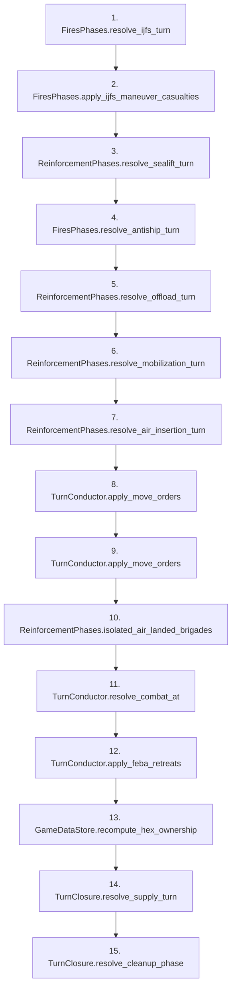

# Turn resolution pipeline

> **Reading aid, not an execution contract.** No detected edge is not permission to reorder.
> GDScript reads and writes are conservative source analysis; transition writes are also
> checked against the mutation manifest. Potential conflicts may refer to different object
> instances or conditional branches.

Generator format v1; scan scope `scripts/**/*.gd` plus `project.godot` autoload aliases.
Generated from commit `7bbf08693b44`; input SHA-256 `c879af92cf7693c7df1119a11083764377c92a9410144e7b95f361f509613378`;
tool/manifest/fixture SHA-256 `ea366ecafdb8f5cc7ecae22bb7554cd8802d1ed3433c5a903ecc07bbb7230f6c`; stable generation time `2026-08-02T17:09:31-04:00`.
Unresolved-analysis diagnostics on this page: **1**.

This page is the high-level lexical call-site map. Loop calls repeat; conditional calls may
be skipped. Open linked ordering/class pages to zoom in, or use the
[state transition dictionary](state_transitions.md) to look up mutation verbs.

## Ordered call sites

| # | Call | Source |
|---:|---|---|
| 1 | [`FiresPhases.resolve_ijfs_turn`](ordering_FiresPhases_resolve_ijfs_turn.md) | `scripts/phases/TurnConductor.gd:38` |
| 2 | [`FiresPhases.apply_ijfs_maneuver_casualties`](ordering_FiresPhases_apply_ijfs_maneuver_casualties.md) | `scripts/phases/TurnConductor.gd:41` |
| 3 | [`ReinforcementPhases.resolve_sealift_turn`](ordering_ReinforcementPhases_resolve_sealift_turn.md) | `scripts/phases/TurnConductor.gd:45` |
| 4 | [`FiresPhases.resolve_antiship_turn`](ordering_FiresPhases_resolve_antiship_turn.md) | `scripts/phases/TurnConductor.gd:46` |
| 5 | [`ReinforcementPhases.resolve_offload_turn`](ordering_ReinforcementPhases_resolve_offload_turn.md) | `scripts/phases/TurnConductor.gd:47` |
| 6 | [`ReinforcementPhases.resolve_mobilization_turn`](ordering_ReinforcementPhases_resolve_mobilization_turn.md) | `scripts/phases/TurnConductor.gd:51` |
| 7 | [`ReinforcementPhases.resolve_air_insertion_turn`](ordering_ReinforcementPhases_resolve_air_insertion_turn.md) | `scripts/phases/TurnConductor.gd:57` |
| 8 | [`TurnConductor.apply_move_orders`](ordering_TurnConductor_apply_move_orders.md) | `scripts/phases/TurnConductor.gd:65` |
| 9 | [`TurnConductor.apply_move_orders`](ordering_TurnConductor_apply_move_orders.md) | `scripts/phases/TurnConductor.gd:66` |
| 10 | [`ReinforcementPhases.isolated_air_landed_brigades`](ordering_ReinforcementPhases_isolated_air_landed_brigades.md) | `scripts/phases/TurnConductor.gd:73` |
| 11 | [`TurnConductor.resolve_combat_at`](ordering_TurnConductor_resolve_combat_at.md) | `scripts/phases/TurnConductor.gd:85` |
| 12 | [`TurnConductor.apply_feba_retreats`](ordering_TurnConductor_apply_feba_retreats.md) | `scripts/phases/TurnConductor.gd:89` |
| 13 | [`GameDataStore.recompute_hex_ownership`](../systems/turn-engine/turn-engine.md#4-resolve_turn-stage-order-turnconductorgd) | `scripts/phases/TurnConductor.gd:90` |
| 14 | [`TurnClosure.resolve_supply_turn`](ordering_TurnClosure_resolve_supply_turn.md) | `scripts/phases/TurnConductor.gd:94` |
| 15 | [`TurnClosure.resolve_cleanup_phase`](ordering_TurnClosure_resolve_cleanup_phase.md) | `scripts/phases/TurnConductor.gd:95` |

Lifecycle guards, RNG construction, combat-loop snapshots, and debug-only tripwires are
kept out of this designer overview. The detailed lexical view retains them:
[`ordering_TurnConductor_resolve_turn.md`](ordering_TurnConductor_resolve_turn.md).

Transitive uncertainty is reported on the linked phase/class pages; this page's count is
limited to the conductor's own source statements.

## Analysis limits found here

Showing 1 of 1 diagnostics; class pages provide the narrower context.

| Kind | Source | Why it matters |
|---|---|---|
| `multi_call_statement` | `scripts/phases/TurnConductor.gd:85` `var summary := resolve_combat_at(state, hex_id, dice.derive("combat:%d:%s" % [state.turn_number, hex_id]))` | Multiple calls share one statement; the map preserves lexical sites, not nested evaluation order. |
