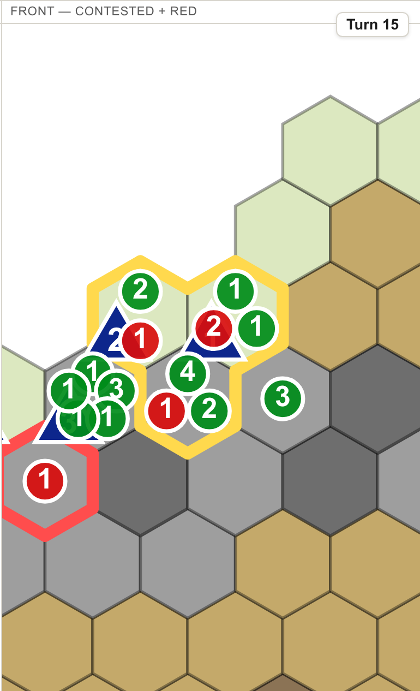
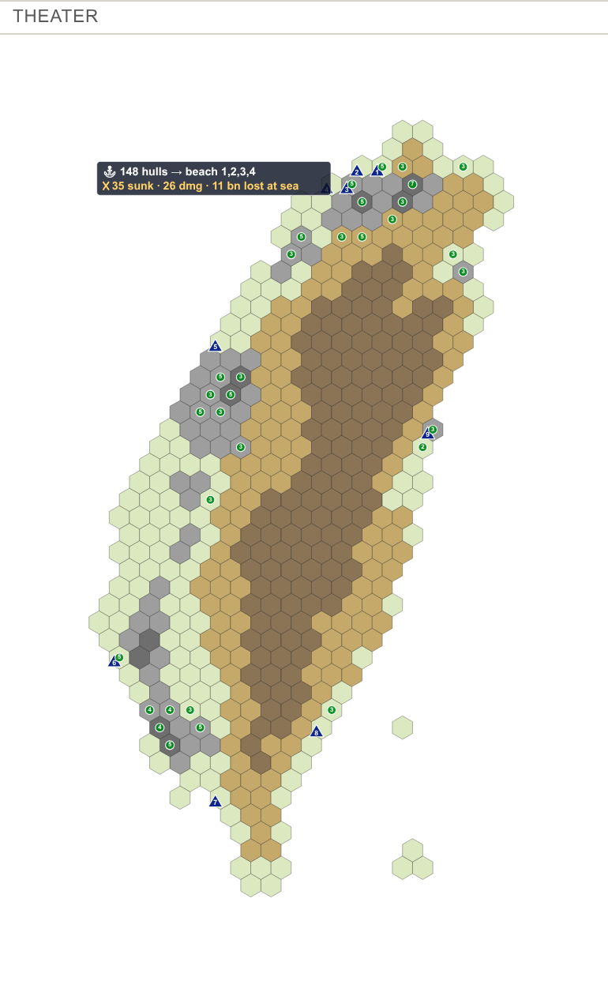
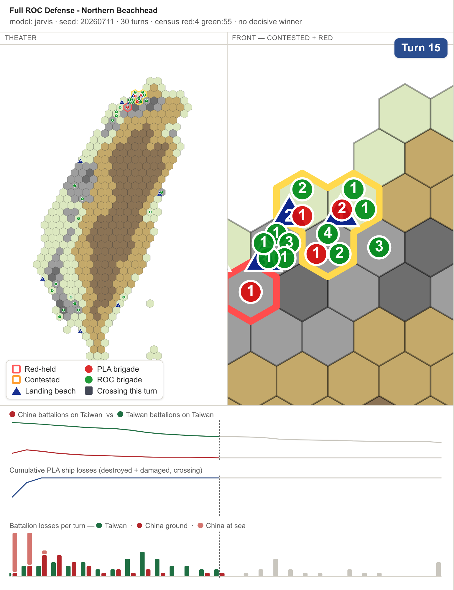

# Plan 0023 — presentation visuals: visual log (2026-07-23)

Screenshots approved at each phase boundary, from `reports/llm/game_20260711` (Full ROC Defense,
seed 20260711, 30 turns). Captured headless via Playwright (Chromium) over a rebuilt `game.html`,
device scale ×2. This is the deliverable that replaces the draft's `track_d_visual_log.md`.

## P1 — Front view frames the largest red/contested cluster (turn 15)

Turn 15 has two connected components: a 3-hex contested beachhead (framed, yellow border) and a
separate 1-hex red cluster. The Front view now crops to the larger cluster (+ its neighbors,
viewBox ≈ 102×108) instead of a bbox spanning the gap between them, so it frames the fight, not
the water. Brigade counts read at reduced size. The secondary red hex (bottom-left, red border) is
a frame neighbor and stays in the theater view. Regression-tested by
`node tools/viewer/test_clustering.mjs`.

> Note (USER call): the precondition scan found only small, tight multi-cluster turns like this —
> never two beachheads across the ocean. A per-beachhead pager for the ocean-spanning case is
> deferred to plan 0027, to build only if the sim ever produces that state and a talk needs it.

## P2 — Ship crossing annotation from the `ship_stats` block (turn 1)

Turn 1's opening wave: the map card reads **⚓ 148 hulls → beach 1,2,3,4** and
**✖ 35 sunk · 26 dmg · 11 bn lost at sea**, anchored seaward of the target beaches. The numbers
come from the new canonical root `ship_stats` block (per-turn + cumulative), the single home the
future click-through stats view will also read; it is gate-guarded against drift from the source
digests by `tools/validate_make_game_bundle.py`.

## P3 — Projector header + ownership/glyph legend (turn 15)

Full map pane: a large high-contrast **Turn 15** header (top-right; turns amber "X wins" on the
game-over turn) and a baked-in legend (Red-held / Contested / PLA brigade / ROC brigade / landing
beach / crossing-this-turn) so a projected still is self-explanatory across a room. Theater +
Front viewports side by side, charts below.
